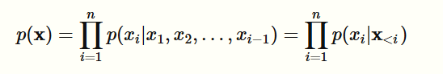
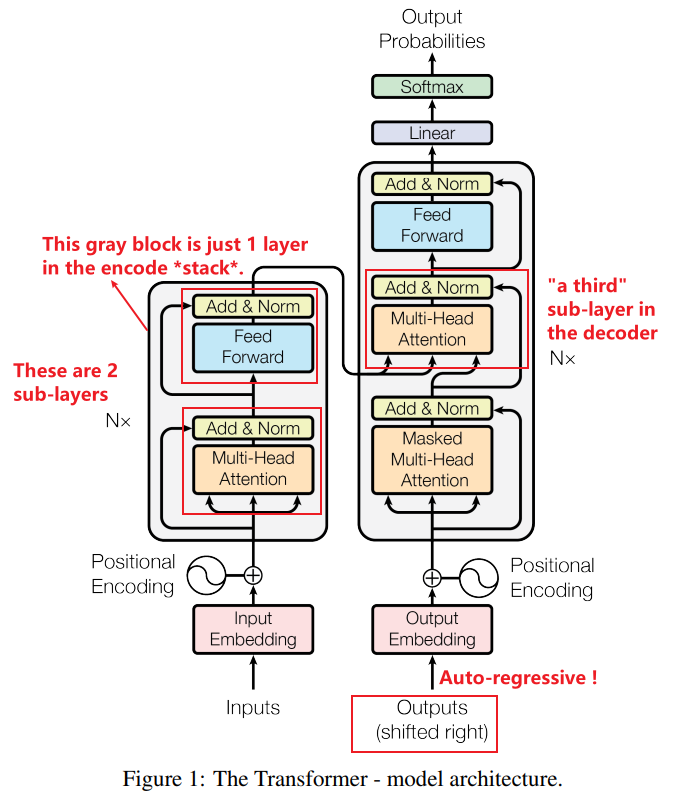
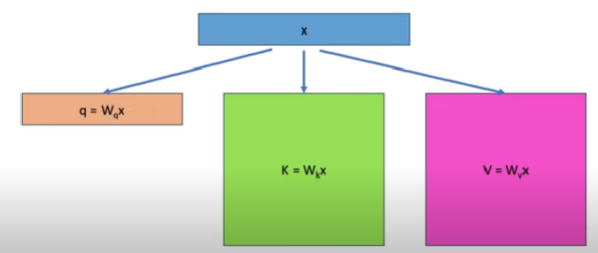
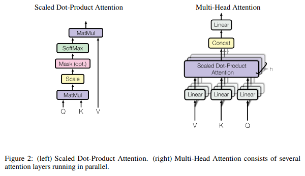
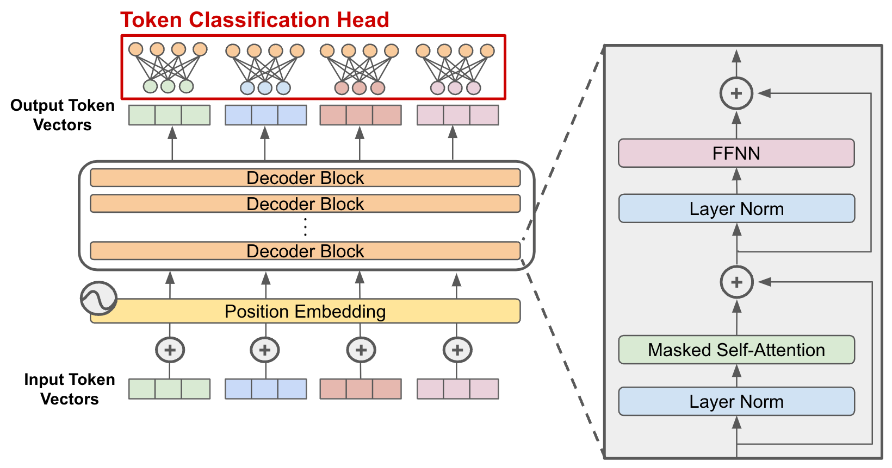
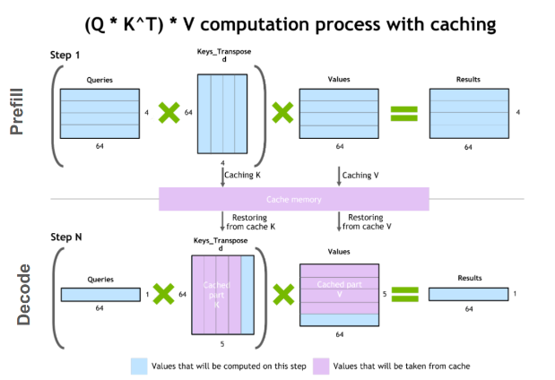

# Background

[TOC]


## Transformer

The dominant **sequence transduction models** are based on complex recurrent or convolutional neural networks that include an encoder and a decoder. The best performing models also connect the encoder and decoder through an attention mechanism. **We propose a new simple network architecture, the Transformer, based solely on attention mechanisms, dispensing with recurrence and convolutions entirely.**

### Model architecture 

 Here the **encoder** maps an input sequence of symbol representations (x1, ..., xn) to a sequence of continuous representations z = (z1, ..., zn). Given z, the **decoder** then generates an output sequence (y1, ..., ym) of symbols **one element at a time**. At each step the model is **auto-regressive**, consuming the previously generated symbols as additional input when generating the next.

The Transformer follows this overall architecture using **stacked self-attention** and **point-wise, fully connected layers** for both the encoder and decoder.

- **Encoder**: The encoder is composed of a stack of N = 6 identical layers. Each layer has two sub-layers. The first is a multi-head self-attention mechanism, and the second is a simple, position-wise fully connected feed-forward network. 

  > Extract useful information from the input symbol representations (e.g. the original language in the case of machine translation) and map them to word embedding (some high dimensional vector z).

- **Decoder**: The decoder is also composed of a stack of N = 6 identical layers. In addition to the two sub-layers in each encoder layer, the decoder inserts a third sub-layer, which performs multi-head attention over the output of the encoder stack.

  > Use the vector representation to generate output sequence (y1, ..., ym) of symbols (e.g. the target language in the case of machine translation)

- **Attention**: Attention mechanisms have become an integral part of compelling sequence modeling and transduction models in various tasks, allowing **modeling of dependencies** without regard to their distance in the input or output sequences.

  > "Attention" helps to *understand* the **context and relationship** within the text.

- **Auto-regressive generation**: Given a dataset D of n-dimensional datapoints x. By the chain rule of probability, we can factorize the joint distribution over the n-dimensions as:

  

  where x_(<i) = [x1,x2,…,xi−1] denotes the vector of random variables with index less than i. The chain rule factorization can be expressed graphically as a Bayesian network:

  

  Such a Bayesian network that makes no conditional independence assumptions is said to obey the **autoregressive** property. The term *autoregressive* originates from the literature on **time-series models** where **observations from the previous time-steps are used to predict the value at the current time step**. Here, we fix an ordering of the variables x1,x2,…,xn and the distribution for the i-th random variable depends on the values of **all the preceeding** random variables in the chosen ordering x1,x2,…,xi−1.

  A demonstration of the auto-regressive generation process:

  

- **Positional Encoding**: Since our model contains no recurrence and no convolution, **in order for the model to make use of the order of the sequence**, we must **inject some information about the relative or absolute position of the tokens in the sequence**. To this end, we add "**positional encodings**" to the input embeddings at the bottoms of the encoder and decoder stacks. 




Note that the only part of the model where the current token interact with the previous token is the self attention layer. So when we are using the KV cache, we only need to do a constant amount of work for each new token, and this work doesn't get bigger as the sequence get longer.

### Details of the attention mechanisms

**(1) Self-attention**

As we can see from the model structure, in the inference workflow we need to calculate "attention vector" for every token.
$$
\text{Attention}(Q,K,V)=\operatorname{softmax}\!\bigl(\tfrac{QK^{\top}}{\sqrt{d_k}}\bigr)V
$$


Token x (an word embedding vector)

- Q(Query) = W_q * x

  The query vector represents the new token in the decoding step. Since there is only one token, this is a vector instead of a matrix. **It only contains information about the last token we have seen.**

- K(Key) = W_k * x

  The K matrix represents all the previous context that the model should pay attention to. It **contains information about the entire sequence**.

- V(Value) = W_v * x.

  Once the attention scores are computed and masked, the value matrix comes into play. For each word, we **take a weighted sum of the value vectors of all other words**, where the weights are the normalized attention scores. In essence, this allows relevant words to “pass” their information to the word being processed. 

> W_q, W_k and W_v are initially random and are learned from data.

Step-by-step visualization of the scaled dot-product attention in the decoder:


Since the decoder is causal (i.e., the attention of a token only depends on its preceeding tokens), **at each generation step** we are **recalculating** the same previous token attention, when we actually just want to calculate the attention for the **new token**.

> Huge **redundant** calculation !
>
> **Analogy: Re-writing the whole novel for every new sentence**
>  You’re an author handwriting a 300-page novel.
>  Every time you think of **one more sentence** for page 301, you:
>
> 1.  *Start at page 1,* painstakingly re-copy every single word you’ve already written,
> 2.  reach the blank spot at the end,
> 3.  finally jot down that brand-new sentence,
> 4.  put the stack aside… and then do the **exact same thing again** when the next idea pops up.


**(2) Multi-Head Attention**

Instead of performing a single attention function with d_model-dimensional keys, values and queries, we found it beneficial to **linearly project the queries, keys and values h times with different, learned linear projections to dk, dk and dv dimensions**, respectively. On each of these projected versions of queries, keys and values we then perform the attention function in parallel, yielding dv-dimensional output values. These are concatenated and once again projected, resulting in the final values

> This allows the model to **capture different aspects of context simultaneously**. For instance, one head might focus on grammatical relationships, while another might focus on semantic connections. The outputs of all heads are then combined to produce a richer, more nuanced contextualized embedding.




**(3) From Word Embeddings to Contextualized Embeddings**

The final step in self-attention involves **adding the weighted sum of value vectors to the original word embedding**. **This updated embedding now incorporates contextual information**, reflecting the word’s meaning within the sentence. The formula for this transformation can be summarized as:

> Contextualized Embedding = Original Embedding + Weighted Sum of Value Vectors (weighted by attention scores)

## Transformer-based language model

| Year | Milestone                 | Structure                                                    | reference                                                    |
| ---- | ------------------------- | ------------------------------------------------------------ | ------------------------------------------------------------ |
| 2017 | Attention Is All You Need | Encoder + Decoder (6 layers each), every block uses **Self-Attention** + Feed-Forward | [link](https://proceedings.neurips.cc/paper_files/paper/2017/file/3f5ee243547dee91fbd053c1c4a845aa-Paper.pdf) |
| 2018 | OpenAI GPT-1              | Encoder removed, keep masked Self-Attention stack → **Decoder-only** | [link](https://www.mikecaptain.com/resources/pdf/GPT-1.pdf)  |
| 2018 | BERT                      | Decoder removed, use only bidirectional Self-Attention stack → **Encoder-only** | [link](https://aclanthology.org/N19-1423.pdf)                |
| 2019 | BART                      | Encoder + Decoder                                            | [link](https://arxiv.org/pdf/1910.13461)                     |

> Here we only list out the developing timeline of Transformer **related to NLP**, but it is also widely used in other fields like vision, speech etc.

```
              ┌──(remove Decoder)──► Encoder-only (BERT)
Full Transformer─(standard)────────► BART
(Encoder + Decoder)
              └──(remove Encoder)──► Decoder-only (GPT)──► Large Language Model(LLM)
```

> see details in https://en.wikipedia.org/wiki/List_of_large_language_models

## GPT-like Large Language Model

GPT = **G**enerative **P**re-trained **T**ransformer

- **Autoregressive token generation**
- **Transformer (attention layer)**

- **Decoder-only**

  > Why we choose Decoder-only architecture ?
  >
  > https://www.zhihu.com/question/588325646
  >
  > https://zhuanlan.zhihu.com/p/625184011

This figure demonstrates the architecture of **decoder-only transformer**.



Once we have passed our input sequence through the model’s body, **we receive as output a same-size sequence of token vectors**. To generate text or perform next token prediction, we **convert each token vector into a probability distribution** over potential next tokens. To do this, we can add one extra linear layer with input dimension `d` and output dimension `V` (i.e., size of the vocabulary), which serves as a **classification head**, to the end of the model.

From the probability distribution over tokens, we can perform:

- Next token prediction: the LLM pretraining objective that trains the model to predict the next token for every token within the input sequence using a cross entropy loss function.
- **Inference**: autoregressively sample the best next token to generate based upon the token distribution generated by the model.

> see details in https://cameronrwolfe.substack.com/p/decoder-only-transformers-the-workhorse

## LLM Inference workflow

Here's your completed, clearly articulated note on the **LLM inference workflow**, structured fluently in academic English, and aligned closely with your intended logical sequence:

### From ML model inference to LLM inference 

**Model inference**, in the context of machine learning, refers to the process of applying a trained model to new input data to generate predictions or outputs. Inference contrasts with training, as it does not involve adjusting the model's parameters but rather using existing, learned weights to produce meaningful results for previously unseen data.

When we specifically discuss **LLM inference**, we typically focus on the **autoregressive token-generation process** employed by **decoder-only Transformer models** such as GPT, LLaMA, and DeepSeek. This approach is distinguished by two critical characteristics: the use of self-attention mechanisms, and sequential, token-by-token generation.

Due to their **autoregressive** nature, these models generate tokens sequentially—each newly produced token depends explicitly on all preceding tokens. Consequently, at every generation step, attention calculations must incorporate all previously generated tokens. Without further optimization, this implies **repeatedly recalculating attention scores for historical tokens at each inference step**, leading to significant redundant computation and performance bottlenecks.

### Use KV cache to speed up LLM inference

To address and mitigate these computational inefficiencies caused by repeated recalculation, the concept of **KV-cache** (Key-Value cache) was introduced. The essential idea behind the KV-cache is straightforward yet powerful: **rather than recomputing attention results from scratch at every step, we store the previously computed Key and Value matrices (representing attention information of past tokens) in memory.** When generating each new token, these stored matrices can be efficiently retrieved from GPU memory, eliminating the need to reprocess prior tokens entirely.

Here is a comparison of scaled dot-product attention **with and without KV caching.**


As you can see, without KV-cache, each step requires recalculating the Key and Value matrices, meaning revisiting all previously processed tokens repeatedly. With KV-cache, only the attention computation for the newly generated token is necessary, dramatically reducing computational redundancy. 

**How big is KV cache ?**

While this optimization significantly accelerates the token-generation phase, it shifts the primary performance bottleneck from computation to **memory management**, as maintaining and accessing the KV-cache imposes substantial memory bandwidth requirements on GPU hardware. 

For **example**: 

```
Memory Usage = 2 * precision * n_layers * d_model * seqlen * batch
```

- 2 = two matrices for K and V
- precision = bytes per parameter (eg: 4 for fp32)
- n_layers = layers in the model
- d_model = dimension of embeddings
- seqlen = length of context in tokens
- batch = batch size

Consider a 30B model `OPT-30B`, we have:

- 2 = two matrices for K and V
- precision = 2 (use fp16 inference)
- n_layers = 48
- d_model = 7168
- seqlen = 1024
- batch = 128

As you can see, the total KV cache we need for inferencing is 180 GB, and the model itself only takes 2*30B = 60 GB. Thus, KV cache tends to be the dominant factor of memory usage during LLM inference.

Therefore, KV-cache usage transforms LLM inference from a computationally bound process into one that is **memory-bound**.

> In order to address this problem, people propose different optimization strategies, such as better attention mechanisms like:
>
>  *Efficient Memory Management for Large Language Model Serving with PagedAttention*

### Two stages of LLM inference

Given these considerations, the inference process in decoder-only Transformer models is commonly segmented into two distinct phases: **Prefill** and **Decode**. 

- **Prefill**: During this stage, the model processes the entire initial prompt or input sequence simultaneously, computing attention scores and populating the KV-cache accordingly. This initial step involves intensive matrix operations and is computationally heavy. 

  > The prefill stage is typically more **computationally intensive** and can fully utilize the processing power of GPUs. It involves matrix operations that can be executed in parallel, leading to efficient use of resources.

- **Decode**: Subsequently, the **Decode** stage begins, involving iterative, token-by-token generation. At each decoding step, the model leverages the KV-cache for efficient retrieval of previously computed attention data, significantly accelerating the inference while simultaneously placing heightened demands on GPU memory bandwidth.

  > This stage is **memory-bound**.

