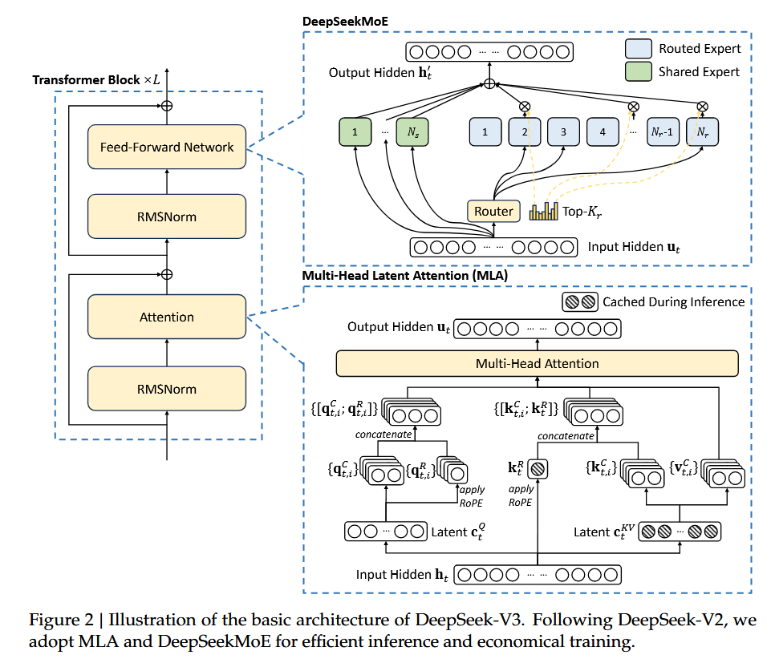
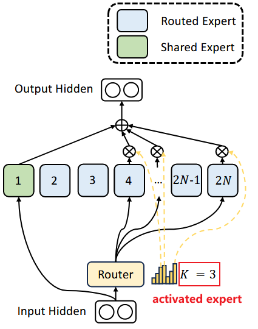
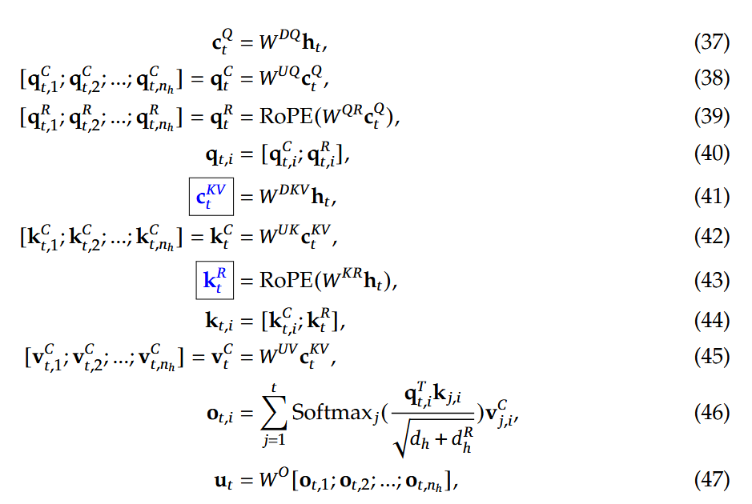

# DeepSeek architecture and analytical model

[TOC]

## Architecture



> L = 61
>
> 前三层：Dense-MLP
>
> 后面：FFN用MoE代替（结构如Fig2所示）

## `shallowsim.py` code analysis

### parameters and configuration

#### `ModelArgs`

> 该class描述 DeepSeek-v3 模型尺寸、MoE 规模、LoRA 排名等超参数。

一些general参数如下：

| ShallowSim 字段          | DeepSeek-v3 config 键     | 作用/含义                                                    | 在 shallowsim 是否实际用到              |
| ------------------------ | ------------------------- | ------------------------------------------------------------ | --------------------------------------- |
| `max_batch_size = 8`     | （无同名；模拟用）        | 预留：限定解码阶段一次最多几条序列                           | **未使用**（解码时动态计算）            |
| `max_seq_len = 4096 × 4` | （无；模拟用）            | 预留：单序列最大长度                                         | **未使用**（用 `Config.seq_len` 覆盖）  |
| `vocab_size = 129 280`   | `"vocab_size"`            | 词嵌入矩阵宽度；不会影响主干 FLOPs                           | **未使用**（logits GEMM 未纳入模拟）    |
| `dim = 7168`             | `"hidden_size"`           | Transformer 主隐层维度 **d_model**                           | ✔ 用于 MLA、MLP、MoE FLOPs 公式         |
| `inter_dim = 18432`      | `"intermediate_size"`     | Dense-MLP 的扩张维度 (≈ 2.57×d)                              | ✔ 用于 Dense-MLP 3 × GEMM 计算          |
| `moe_inter_dim = 2048`   | `"moe_intermediate_size"` | **单个专家** 的隐层扩张维度                                  | ✔ 用于 MoE-MLP GEMM 计算                |
| `n_layers = 61`          | `"num_hidden_layers"`     | Transformer block 总层数                                     | ✔ 直接决定循环次数                      |
| `n_dense_layers = 3`     | `"first_k_dense_replace"` | 前 K 层用 Dense-MLP 替代 MoE-MLP(DeepSeek-v3 做的 warm-up 设计) | ✔ 用于在前 3 层禁用 MoE 路由            |
| `n_heads = 128`          | `"num_attention_heads"`   | 多头注意力总头数                                             | ✔ 用于 MLA FLOPs（d_k = dim / n_heads） |

```python
class ModelArgs:
    max_batch_size: int = 8 # (unused)
    max_seq_len: int = 4096 * 4 # (unused)
    vocab_size: int = 129280 # vocab_size (unused)
    dim: int = 7168 # hidden_size
    inter_dim: int = 18432 # intermediate_size
    moe_inter_dim: int = 2048 # moe_intermediate_size
    n_layers: int = 61 # num_hidden_layers
    n_dense_layers: int = 3 # first_k_dense_replace
    n_heads: int = 128 # num_attention_heads
```

结构图：

Dense-MLP(FFN),**前三个**transformer block使用。
$$
\begin{aligned} \textbf{x} &\in \mathbb{R}^{7168} \\[4pt] \textbf{z} &= f\!\bigl(\,W_1\,\textbf{x} + \textbf{b}_1\bigr), & W_1 &\in \mathbb{R}^{18432 \times 7168}, & \textbf{b}_1 &\in \mathbb{R}^{18432} \\[6pt] \textbf{y} &= W_2\,\textbf{z} + \textbf{b}_2, & W_2 &\in \mathbb{R}^{7168 \times 18432}, & \textbf{b}_2 &\in \mathbb{R}^{7168} \end{aligned}
$$

- **第一步**：线性扩张 7168→18432
- **第二步**：激活f 可取 **GELU** 或 **SwiGLU**。
- **第三步**：线性压缩 18432→7168

```
           ┌──────────────────────────────────────┐
Input (dim)│             h = 7168                 │
x ∈ R^7168│                                      │
           │  Linear (W1)                         │
           │  W1 ∈ R^(18432×7168)                │
           └──────────────┬───────────────────────┘
                          ▼   ↑ weight =        (≈2.57×d)
                 z ∈ R^18432 │ inter_dim = 18432
                          │   │
                          │   │  (GELU / SwiGLU)
                          │   │            ┌───────────────┐
                          │   └──────────► │ Activation f()│
                          │                └───────────────┘
                          ▼
            ┌─────────────────────────────────────┐
            │  Linear (W2)                        │
            │  W2 ∈ R^(7168×18432)               │
Output      │  y = W2 · f(z)  ∈ R^7168           │
y ∈ R^7168 └─────────────────────────────────────┘

```

后面的transformer layer的FFN层由MoE层替代

```
          Input(dim)     ┌──────── Router (Top-k) ───────┐
          x ∈ R^7168 ──►│ 得分 g(x) ∈ R^N               │
                         └───────────┬──────┬────────────┘
                                     │      │
           (n_activated_experts = k=8)  (shared expert)
                                     │      │
          ┌──Expert_i (i=1…8) ───────┤      ├─────── Shared Expert ───┐
          │W1_e_i(2048×7168)         │      │W1_sh(2048×7168)         │ moe_inter_dim = 2048
          │Act │ W2_e_i(7168×2048)   │      │Act │ W2_sh(7168×2048)   │
          └──────────────────────────┘      └─────────────────────────┘
                   ▲      ▲
                   │      │
                  … k=8 路由到不同专家 …
                   │      │
                   ▼      ▼
         All-to-All   (跨 GPU 混洗/聚合)
                   │      │
                   └──────┴─────►  Output, y ∈ R^7168

```

`moe` 配置如下：

| 参数名                | 含义                                    | 作用                                                    |
| --------------------- | --------------------------------------- | ------------------------------------------------------- |
| `n_routed_experts`    | 总路由专家数（global expert pool）      | token 可被路由到的专家总数                              |
| `n_shared_experts`    | 所有 token 都会访问的“共享专家”数       | 类似 residual expert，处理所有 token，不参与 top-k 路由 |
| `n_activated_experts` | 每个 token 实际被路由到的专家数         | 模拟 MoE 的 top-k 路由效果                              |
| `n_expert_groups`     | expert 分组（如每组一个 GPU）（未启用） | 决定 all-to-all 通信单位                                |
| `n_limited_groups`    | 限制最大使用的 group 数（未启用）       | 当前未在模拟器中使用                                    |
| `route_scale`         | token→expert 的平均分布 scale 系数      | 模拟实际 load imbalance（非均匀路由）                   |



```python
# moe
n_routed_experts: int = 256 # n_routed_experts
n_shared_experts: int = 1 # n_shared_experts
n_activated_experts: int = 8 
n_expert_groups: int = 8 # n_group
n_limited_groups: int = 4 # (unused)
route_scale: float = 2.5 # routed_scaling_factor(unused)
```

`mla`配置如下。其中：

- **q_lora_rank (1536)**  表示用于查询（Q）投影的**低秩矩阵**的秩，用于降低计算复杂度。
- **kv_lora_rank (512)**  表示键值（K/V）投影中低秩矩阵的秩。
- **qk_nope_head_dim (128)**  表示在 Q/K 投影中不使用位置编码（NOPE）的那部分 head 的维度。
- **qk_rope_head_dim (64)**  表示在 Q/K 投影中使用 ROPE（Rotary Positional Embedding）位置编码的那部分 head 的维度。

> 回忆：为了让MLA与RoPE"兼容"

- **v_head_dim (128)**  表示 Value（V）投影中每个 head 的维度（d_v）

```python
# mla
q_lora_rank: int = 1536
kv_lora_rank: int = 512
qk_nope_head_dim: int = 128
qk_rope_head_dim: int = 64
v_head_dim: int = 128
```

`yarn` 配置是 **YaRN ( Yet another RoPE extensioN )** 的一组超参数，用来把 DeepSeek-v3 从原生 4 K 上下文扩展到十几万甚至更多 token，同时尽量保持短上下文的精度。

在自注意力机制中，Q·K 的内积控制了每个 token 该关注谁，但原始的 Q/K 并不“知道”词与词之间的距离；RoPE（Rotary Position Embedding）通过把 Query/Key 的偶数–奇数维看作复数，并乘上一个与位置相关的旋转因子，使得 Q·K 内积自然携带相对位置信息，无需额外矩阵、还能合并进一次矩阵乘法（GEMM），成为 LLaMA、Mistral 等主流 LLM 的标配——但它的频率序列是指数衰减的，高频维度像“转得飞快的小指针”，在输入超过训练窗口（如 4K tokens）后容易相位失控，造成注意力抖动、模型性能明显下降。

YaRN 对 RoPE 的改进在于通过对旋转位置编码频率进行分段重参数化与插值扩展，并引入 softmax 温度校准机制，使模型在保持原始短上下文性能的同时，能够稳定扩展至远超训练窗口的长上下文而无需重新训练。

```python
# yarn
original_seq_len: int = 4096 # original_max_position_embeddings
rope_theta: float = 10000.0 # rope_theta
rope_factor: float = 40 # factor
beta_fast: int = 32 # beta_fast
beta_slow: int = 1 # beta_slow
mscale: float = 1.# mscale
```

> 对应：https://huggingface.co/deepseek-ai/DeepSeek-V3-0324/blob/main/config.json

需要注意的是当前模拟器并未把 YaRN 的额外 FLOPs 或缓存开销纳入计算

#### `Config`

`Config`**给 ShallowSim 传入一组“场景参数”**，用来快速跑预填充（prefill）和解码（decode）两大阶段的批量实验。

| 字段            | 默认值                        | 主要用途                                                     | 在代码里的调用点                                             |
| --------------- | ----------------------------- | ------------------------------------------------------------ | ------------------------------------------------------------ |
| `seq_len`       | **4383**                      | 预填充阶段的 **Prompt 长度**（即一次性送进模型的 token 数）  | ① `prefill_mla` / `prefill_dense_mlp` / `prefill_moe`② `_prefill_time` 汇总各层耗时 |
| `decode_len`    | **1210**                      | 解码阶段要 **连续生成的 token 数**；脚本用它来算 “prefill+decode 总长度” 时延 | ① `_decode_time` 里 token⁻¹ TPS 计算② 显存估算 KV-cache      |
| `kv_cache_rate` | **0.563**                     | **KV-Cache 命中率**：`0`=完全不命中（prefill），`1`=全命中（解码）；预填充时有一部分 KV 先存进 cache，再被 Q 复用，因此要把 KV down-proj FLOPs 乘 `(1 - rate)` | 在 `mla_flops()` / `mla_matabsob_flops()` 等所有 MLA 公式中作乘法折扣 |
| `bs_list`       | `[16, 32, 64, 128, 256, 512]` | 扫描 **Batch Size** 的搜索列表；`decode_time_with_ep_list()` 会对每个 `bs` 跑一遍解码模拟，取最大 TPS | 解码批量性能曲线、可视化                                     |
| `eplist`        | `[8, 16, 36, 72, 144, 320]`   | 扫描 **EP（Expert Parallel）并行度 / GPU 张数**；同上函数把不同 EP 情况结果拼进 DataFrame | 找“最优专家分布”/“通信 vs 计算”拐点                          |

```python
class Config:
seq_len = 4383
decode_len = 1210
kv_cache_rate = 0.563
decode_len = 1210
bs_list = [16, 32, 64, 128, 256, 512]
eplist = [8, 16, 36, 72, 144, 320]
```

> **为什么 `seq_len = 4383` 不是四舍五入？**
>  这正好让总长度 `seq_len + decode_len ≈ 5593` 对应 DeepSeek 论文里公开的一个基准点，可在不修改 KV-Cache 率的情况下复现报告中的 TPS。

#### `GPU_perf`

抽象单卡算力/带宽（峰值×折扣），并提供 FP16/8/4 等有效 FLOPS、带宽接口

| 字段 (GPU_perf 属性) | **作用 / 含义**                                              | **常用单位**  |
| -------------------- | ------------------------------------------------------------ | ------------- |
| `gpu_type`           | GPU 型号标识（如 **DGX-B300**、**H800** 等），便于在模拟结果中区分不同硬件 | —（字符串）   |
| `sm`                 | **Streaming Multiprocessor** 个数；衡量并行核心数量，用于按比例折算可用于计算的 SM | **个**        |
| `comm_sm`            | 预留给通信（AllReduce / All-to-All 等）或 I/O 的 SM 数目；有效计算 FLOPs 会按 (sm−comm_sm)/sm(sm−comm\_sm)/sm 打折 | **个**        |
| `gpu_per_node`       | 单节点（服务器 / 机箱）内 GPU 数；决定 NVLink 拓扑、All-to-All 组大小 | **个 / node** |
| `fp16_flops`         | 峰值 **FP16**（半精度）矩阵乘 FLOPS；构造时以 **TFLOPS** 读入 | **TFLOPS**    |
| `fp8_flops`          | 峰值 **FP8** FLOPS；TensorCore 新指令，性能通常高于 FP16     | **TFLOPS**    |
| `fp4_flops`          | 峰值 **FP4** FLOPS；仅部分最新架构支持，DeepSeek-v3 解码阶段若开启 FP4 会用到 | **TFLOPS**    |
| `mem`                | 物理显存容量                                                 | **GB**        |
| `mem_bw`             | HBM / GDDR **显存带宽**（单卡总带宽）                        | **GB s⁻¹**    |
| `nvlink_bw`          | **NVLink** 或 **NVSwitch** 单卡对外聚合带宽；影响跨卡 All-Reduce / All-to-All | **GB s⁻¹**    |
| `pcie_bw`            | Host ↔ GPU **PCIe/E-link** 带宽；主要影响单机多卡与 CPU 通信 | **GB s⁻¹**    |
| `discount_rate`      | 将理论峰值折算为实际可用比例的经验系数（默认 0.85）；所有 `get_*` 方法都会乘它 | —（0–1 浮点） |

>  在 `gpuinfo.csv` 中，`DGX-B300` 的 `fp16=3375` 表示 3375 TFLOPS（FP16），1TFLOPS=10^12FLOPS
>
> ShallowSim 取值后再乘 `discount_rate × (sm−comm_sm)/sm` 得到“有效” FLOPS，用于推算单算子耗时。

方法：

| 方法                        | 返回                         | **一行作用说明**                                        |
| --------------------------- | ---------------------------- | ------------------------------------------------------- |
| `GPU_perf.get_fp16_flops()` | **有效 FP16 FLOPs** (TFLOPS) | 峰值 FP16 × 折扣 × 可用 SM 比例，得到真实可用半精度算力 |
| `GPU_perf.get_fp8_flops()`  | **有效 FP8 FLOPs**           | 同上，换成 FP8 峰值                                     |
| `GPU_perf.get_fp4_flops()`  | **有效 FP4 FLOPs**           | 同上，换成 FP4 峰值                                     |
| `GPU_perf.get_mem_bw()`     | **有效显存带宽** (GB/s)      | 把峰值 HBM 带宽再乘统一折扣                             |
| `GPU_perf.get_nvlink_bw()`  | **有效 NVLink 带宽** (GB/s)  | 峰值 NVLink 带宽 × 折扣                                 |
| `GPU_perf.get_pcie_bw()`    | **有效 PCIe 带宽** (GB/s)    | 峰值 PCIe 带宽 × 折扣                                   |
| `gpu_category_idx()`        | **dict<gpu_type → idx>**     | 给字典里的 GPU 型号依次编号，方便绘图配色或分组         |

### Some helper functions

| 函数 / 方法          | 输入                                                        | 返回                          | **一行作用说明**                                             |
| -------------------- | ----------------------------------------------------------- | ----------------------------- | ------------------------------------------------------------ |
| `get_gpu_info()`     | `csv路径`, `discount_rate`, `device_list`, `decoding_mode`… | **dict<gpu_type → GPU_perf>** | 读取 `gpuinfo.csv` → 构造每张卡的 `GPU_perf` 对象；可选解码模式（把 `comm_sm` 清零）与筛选设备 |
| `gpu_category_idx()` | `gpu_dict`                                                  | **dict<gpu_type → idx>**      | 给字典里的 GPU 型号依次编号，方便绘图配色或分组              |

> decode模式（把 `comm_sm` 清零）是因为在decode阶段，通信线程占用的 SM 可以忽略，不必再从计算 SM 里预留。
>
> | 场景                                          | 典型一次 **AllReduce / All-to-All** 规模                | NCCL 通信内核对 SM 的抢占                                    | ShallowSim 的建模做法                                        |
> | --------------------------------------------- | ------------------------------------------------------- | ------------------------------------------------------------ | ------------------------------------------------------------ |
> | **预填充**(一次喂完整 prompt，`seq_len` 上千) | 每层都要同步 **完整 Q·K·V or Expert 激活**，动辄几百 MB | NCCL Launch 的 AllReduce/All-to-All 会在大量 SM 上跑 copy+算子核；通信密集，常常与计算 **串行或半串行** | 预留 `comm_sm`（如 20），有效算力乘 (sm−comm_sm)/sm)(sm−comm\_sm)/sm) |
> | **解码**(逐 token 生成，`seq_len = 1`)        | 只传 1 token × hidden_dim，几百 KB 量级                 | NCCL copy 核运行时间 ≪ 计算核；往往能完全压到 **Copy Engine** 或极短 SM 时间，基本与计算重叠 | 把 `comm_sm` 置 0 → 认为通信对可用 SM 没影响                 |

### Simulation

#### Prefill

##### MLA (Comp + Comm)

| 函数名               | 主要输入                                           | 返回值                                           | 简要说明                                                     |
| -------------------- | -------------------------------------------------- | ------------------------------------------------ | ------------------------------------------------------------ |
| `mla_flops`          | `q_len`, `kv_len`, `args`, `kv_cache_rate`         | `(total_flops, fp8_gemm_flops, fp16_attn_flops)` | 计算 **非吸收版 MLA**（prefill用）的 FP8 GEMM 与 FP16 attention FLOPs；KV Down-Proj 部分按 `1−kv_cache_rate` 打折。 |
| `mla_matabsob_flops` | `q_len`, `kv_len`, `args`, `kv_cache_rate`         | `(total_flops, fp8_gemm_flops, fp16_attn_flops)` | 计算 **矩阵吸收版 MLA**（decode用）的 FLOPs：把部分乘法提前吸收，等价于 MQA；同样支持 KV-Cache 折扣。 |
| `mla_mem`            | `args`                                             | `param_size_MB`                                  | 估算 MLA 一层权重占显存（MB），供加载时间与显存模型。        |
| `mla_elapse_time`    | `args`, `gpu`, `seq_len`, `kv_cache_rate`, `tp`, … | `(total_ms, {tp: ms})`                           | 综合 **GEMM FP8 / FP4、attention FP16、权重加载、All-Reduce** 时延，输出单层 MLA 耗时以及不同 Tensor-Parallel (TP) 切分下的总耗时。 |
| `prefill_mla`        | `args`, `gpu_dict`, `seq_len`, `kv_cache_rate`     | `DataFrame`                                      | 针对多 GPU 型号批量调用 `mla_elapse_time`（prefill 模式），返回各卡在 TP=1/4/8 时的单层时延表格，方便总表拼装与打印。 |

###### `mla_flops`



细节：

（1）对于Q(Query)的计算:
$$
c_t^{Q}=W^{DQ}h_t
$$


```python
# down projection
# 把q_len(=seq_len)个d-dim的输入x(word embedding,是列向量)降维成q_lora_rank-dim.
# W^DQ是q_lora_rank * d的矩阵，而ht是d * q_len 的矩阵（q_len个d-dim的word embedding列向量）
# 计算量：q_lora_rank * d * q_len
q_down_proj = q_len * args.dim * args.q_lora_rank  # wq_a
```

$$
q_t^{C}=W^{UQ}c_t^{Q}\\
q_t^{R}= \text{RoPE}(W^{QR}c_t^{Q}) \\
q_{t,i}\;=\;\bigl[\,q_{t,i}^{C};\,q_{t,i}^{R}\bigr]
$$

```python
# up projection
# c^(Q)_t是对输入压缩后得到的，是一个q_lora_rank * q_len矩阵（q_len个q_lora_rank-dim的列向量）

# q^(C)_t是qk_nope_head_dim * q_len矩阵，W^(UQ)是qk_nope_head_dim * q_lora_rank矩阵。
# 计算量：qk_nope_head_dim * q_lora_rank * q_len

# q^(R)_t是qk_rope_head_dim * q_len矩阵，W^(QR)是qk_rope_head_dim * q_lora_rank矩阵。
# 计算量：qk_rope_head_dim * q_lora_rank * q_len

# 相加：q_lora_rank * q_len * (qk_nope_head_dim + qk_rope_head_dim)再乘一个head_num
# prefill阶段是MHA形式（参考：https://spaces.ac.cn/archives/10091）
q_up_proj = q_len * args.q_lora_rank * args.n_heads * \
        (args.qk_nope_head_dim + args.qk_rope_head_dim)  # wq_b
```

（2）对于Key和Value的计算：
$$
c_t^{\text{KV}} = W^{DKV}h_t \\
k_t^{R} \;=\;
\operatorname{RoPE}\!\bigl(W^{KR}h_t\bigr)
$$


```python
# down projection
# 把kv_len(=seq_len)个d-dim的输入x(word embedding,是列向量)降维成kv_lora_rank-dim,同时计算k^(R)_t
# h_t: d * kv_len的矩阵，kv_len个d-dim列向量; W^(DKV): kv_lora_rank * d维变换矩阵
# W^(DKV): qk_rope_head_dim * d维变换矩阵
# 总计算量：(kv_lora_rank + qk_rope_head_dim) * d * kv_len
kv_down_proj = kv_len * args.dim * \
        (args.kv_lora_rank + args.qk_rope_head_dim)  # wkv_a
......
kv_down_proj = kv_down_proj * (1 - kv_cache_rate) # 按照kv-cache命中率打折
```

> DeepSeek-V3 的 CUDA Kernel 会把 W^(DKV) 和W^(KR)先在列维度拼接成一个大矩阵
> $$
> \bigl[\,W^{DKV}\;\big\|\;W^{KR}\bigr]\in\mathbb R^{d\times(r\_lora\_kv+d_{qk}^{\mathrm{rope}})},
> $$
> 这样只做 **一次** h_t × (拼接矩阵) 的 GEMM，随后把结果拆成 `c_t^{KV}`（前 r_k 列）和 `k_t^{R}`（后qk_rope_head_dim列）两条流。

$$
k_{t,i}\;=\;\bigl[\,k_{t,i}^{C};\,k_{t,i}^{R}\bigr]
\\
\bigl[\,k_{t,1}^{C};\,k_{t,2}^{C};\,\dots;\,k_{t,n_h}^{C}\bigr]
\;=\;
k_t^{C}
\;=\;
W^{UK}c_t^{\text{KV}}
$$

```python
# up projection of keys
# 把low rank的c^(KV)_t还原/上升为qk_nope_head_dim维
# c^(KV)_t包含kv_len个kv_lora_rank-dim的列向量，所以是kv_lora_rank * kv_len;
# 变换矩阵W^(UK)为qk_nope_head_dim * kv_lora_rank;
# 计算量：qk_nope_head_dim * kv_lora_rank * kv_len，由于prefill阶段的MHA setting,再乘一个n_heads
k_up_proj = kv_len * args.kv_lora_rank * \
        args.n_heads * args.qk_nope_head_dim  # w_uk
```

$$
\bigl[\,v_{t,1}^{C};\,v_{t,2}^{C};\,\dots;\,v_{t,n_h}^{C}\bigr]
\;=\;
v_t^{C}
\;=\;
W^{UV}c_t^{\text{KV}}
$$

```python
# up projection of values
# 把low rank的c^(KV)_t还原/上升为v_head_dim维
# c^(KV)_t包含kv_len个kv_lora_rank-dim的列向量，所以是kv_lora_rank * kv_len;
# 变换矩阵W^(UV)为v_head_dim * kv_lora_rank;
# 计算量：v_head_dim * kv_lora_rank * kv_len，由于prefill阶段的MHA setting,再乘一个n_heads
v_up_proj = kv_len * args.kv_lora_rank * args.n_heads * args.v_head_dim  # w_uv
```

（3）Q,K,V的GEMM总计算量:

```python
kv_down_proj = kv_down_proj * (1 - kv_cache_rate) # 按照kv-cache命中率打折
gemm_sum = q_down_proj + q_up_proj + kv_down_proj + k_up_proj + v_up_proj
```

> 为什么 KV-Cache 会在 **prefill** 阶段就节省部分计算？
>
> | 场景                                                         | 具体流程                                                     | 对 KV down-proj 的影响                                       |
> | ------------------------------------------------------------ | ------------------------------------------------------------ | ------------------------------------------------------------ |
> | **Prefill**(一次性喂入 **长 prompt**，分 pipeline / micro-batch 在 GPU 上前推) | • prompt 被切成多个 *micro-batch* 连续送入；• 前面 micro-batch 的 K,VK,V 立即写入 KV-Cache；• 当后面的 micro-batch 前推到 **更高层** 时，需要用到“前面 token 的 K,VK,V”——直接从 Cache 读，不再乘 WDKVW^{DKV}。 | 于是 **并不是整条 4 K prompt 都要重算 K/V**；已有缓存段可 “免计算、仅读取”。 |
> | **Decode**(逐 token 生成)                                    | 每步只对 **新 token** 做一次 down-proj；旧 token 100 % 命中 Cache。 | *理论上* `kv_cache_rate = 1`，计算量进一步只剩新 token 部分。 |
>
> 在 DeepSeek 的 profile（H800 / 4 K prompt / 8 GPU pipeline）里，
>  **约 56 %** 的 Key/Value 投影可以直接命中 KV-Cache，
>  因此源码把常量 `kv_cache_rate = 0.563` 写死，用来 **一次近似折掉** 这一半多余的 GEMM。

（4）利用QKV计算attention：
$$
q_{t,i}\;=\;\bigl[\,q_{t,i}^{C};\,q_{t,i}^{R}\bigr]
\\
k_{t,i}\;=\;\bigl[\,k_{t,i}^{C};\,k_{t,i}^{R}\bigr]
\\
\bigl[\,v_{t,1}^{C};\,v_{t,2}^{C};\,\dots;\,v_{t,n_h}^{C}\bigr]
\;=\;
v_t^{C}
\;=\;
W^{UV}c_t^{\text{KV}}
\\
o_{t,i}
\;=\;
\sum_{j=1}^{t}
\operatorname{Softmax}_{j}\!\left(
\frac{q_{t,i}^{\mathsf{T}}k_{j,i}}
     {\sqrt{d_h+d_h^{R}}}
\right)
v_{j,i}^{C}
$$
分解：

1. **RoPE 部分**
   $$
   q_{t,i}^{R\;\top}k_{j,i}^{R} \quad\Rightarrow\quad q_{\text{len}}\,d_{qk}^{\text{rope}}\,k_{\text{len}}
   $$
   
2. **Content-Key 部分**
   $$
   q_{t,i}^{C\;\top}k_{j,i}^{C} \quad\Rightarrow\quad q_{\text{len}}\,d_{qk}^{\text{nope}}\,k_{\text{len}}
   $$
   
3. **加权 Value**
   $$
   \text{Softmax}(QK^\top)\;V^{C} \quad\Rightarrow\quad q_{\text{len}}\,k_{\text{len}}\,d_v
   $$
   

```python
# 把它看成一个标准的args.n_heads的MHA
mha = args.n_heads * (q_len * args.qk_rope_head_dim * kv_len  # QK_score_rope
   					+ q_len * args.qk_nope_head_dim * kv_len  # QK_score_nope
      				+ q_len * kv_len * args.v_head_dim)  # ScoreV  # ScoreV
# 非吸收
```


$$
u_t \;=\;
W^{O}
\bigl[\,o_{t,1};\,o_{t,2};\,\dots;\,o_{t,n_h}\bigr].
$$

```python
# 最后，我们要把计算的结果变回d * q_len(与输入一致)，q_len个d-dim列向量
# 最终得到的ot,i是v_head_dim * q_len维的矩阵，[ot,1;...ot,nh]是n_heads个这样的矩阵拼接在一起
# 所以变成v_head_dim * (n_heads * q_len)维
# W^O即为d * (v_head_dim * n_heads)
# 计算量：d * v_head_dim * n_heads * q_len
wo = q_len * args.n_heads * args.v_head_dim * args.dim  # wo
attn_sum = mha + wo
```

（4）相加

```python
# return flops by 2* Sum(MACs)
GEMM_FP8_FLOPS = gemm_sum * 2/1e9
ATTN_FP16_FLOPS = attn_sum * 2/1e9
return GEMM_FP8_FLOPS+ATTN_FP16_FLOPS, GEMM_FP8_FLOPS, ATTN_FP16_FLOPS
```

简要解释

1. **降维-升维** `q_down_proj` 与 `q_up_proj` 对应论文中先用 LoRA 降秩 WDQW^{DQ} 得到 ctQc_t^{Q}，再分别经 WUQW^{UQ}（NOPE 部分）和 WQRW^{QR}（RoPE 部分）升回各头维度。
2. **Key/Value 路径** `kv_down_proj` → `k_up_proj` / `v_up_proj` 对应公式 (41)–(45)。
3. **Attention 乘加** `mha` 汇总公式 (46) 的 Q⊤K与 Score⋅V。
4. **输出线性层** `wo` 映射到公式 (47)。
5. **KV-cache 折扣** `kv_down_proj·(1-kv_cache_rate)` 用kv_cache_rate模拟已缓存 Key/Value 的跳算量。

最终 `gemm_sum` 汇聚 FP8 GEMM，`attn_sum` 汇聚 FP16 attention；两者各 ×2 FLOP/ MAC 再合并，得到脚本返回的 **FP8+FP16 总 FLOPs**——正是论文 (37)–(47) 全过程在**单 batch/多 token** 下的运算量估算。

###### `mla_matabsob_flops`  


$$
\begin{equation} 
\begin{gathered} 
\boldsymbol{o}_t = \left[\boldsymbol{o}_t^{(1)}\boldsymbol{W}_v^{(1)}, \boldsymbol{o}_t^{(2)}\boldsymbol{W}_v^{(2)}, \cdots, \boldsymbol{o}_t^{(h)}\boldsymbol{W}_v^{(h)}\right] \\[10pt] 
\boldsymbol{o}_t^{(s)} = Attention\left(\boldsymbol{q}_t^{(s)}, \boldsymbol{k}_{\leq t}^{\color{#ccc}{\smash{\bcancel{(s)}}}} ,\boldsymbol{c}_{\leq t}\right)\triangleq\frac{\sum_{i\leq t}\exp\left(\boldsymbol{q}_t^{(s)} \boldsymbol{k}_i^{\color{#ccc}{\smash{\bcancel{(s)}}}}{}^{\top}\right)\boldsymbol{c}_i}{\sum_{i\leq t}\exp\left(\boldsymbol{q}_t^{(s)} \boldsymbol{k}_i^{\color{#ccc}{\smash{\bcancel{(s)}}}}{}^{\top}\right)} \\[15pt] 
\boldsymbol{q}_i^{(s)} = \left[\boldsymbol{c}_i'\boldsymbol{W}_{qc}^{(s)}\boldsymbol{W}_{kc}^{(s)}{}^{\top}, \boldsymbol{c}_i'\boldsymbol{W}_{qr}^{(s)}\color{#3ce2f7}{\boldsymbol{\mathcal{R}}_i}\right]\in\mathbb{R}^{d_c + d_r}\\ 
\boldsymbol{k}_i^{\color{#ccc}{\smash{\bcancel{(s)}}}} = \left[\boldsymbol{c}_i, \boldsymbol{x}_i\boldsymbol{W}_{kr}^{\color{#ccc}{\smash{\bcancel{(s)}}}}\color{#3ce2f7}{\boldsymbol{\mathcal{R}}_i}\right]\in\mathbb{R}^{d_c+d_r}\\ 
\boldsymbol{W}_{qc}^{(s)}\in\mathbb{R}^{d_c'\times d_k},\boldsymbol{W}_{kc}^{(s)}\in\mathbb{R}^{d_c\times d_k},\boldsymbol{W}_{qr}^{(s)}\in\mathbb{R}^{d_c'\times d_r},\boldsymbol{W}_{kr}^{\color{#ccc}{\smash{\bcancel{(s)}}}}\in\mathbb{R}^{d\times d_r} \\[10pt] 
\boldsymbol{c}_i' = \boldsymbol{x}_i \boldsymbol{W}_c'\in\mathbb{R}^{d_c'},\quad \boldsymbol{W}_c'\in\mathbb{R}^{d\times d_c'} \\ 
\boldsymbol{c}_i = \boldsymbol{x}_i \boldsymbol{W}_c\in\mathbb{R}^{d_c},\quad \boldsymbol{W}_c\in\mathbb{R}^{d\times d_c} \\ 
\end{gathered} 
\label{eq:mla-mqa}\end{equation}
$$


```python
def mla_matabsob_flops(q_len, kv_len, args: ModelArgs, kv_cache_rate=0):
    # calculate MACs and estimate Flops approx. 2xMAC.
    q_down_proj = q_len * args.dim * args.q_lora_rank  # wq_a
    q_rope_up_proj = q_len * args.q_lora_rank * \
        args.n_heads * args.qk_rope_head_dim  # wq_b_rope
    q_absorb = q_len * args.n_heads * (args.q_lora_rank * args.qk_nope_head_dim  # wq_b
                                     + args.qk_nope_head_dim * args.kv_lora_rank)  # w_uk

    kv_down_proj = kv_len * args.dim * \
        (args.kv_lora_rank + args.qk_rope_head_dim)  # wkv_a
    kv_down_proj = kv_down_proj * (1 - kv_cache_rate)  # KV-Cache命中率修正
    # 注意到，没有乘n_heads了
    # (args.kv_lora_rank + args.qk_rope_head_dim) 相当于low-rank的k和v拼接起来得到的low-rank的c的维数
    gemm_sum = q_down_proj + q_rope_up_proj + q_absorb + kv_down_proj

    # 把它看成一个标准的args.n_heads的MQA
    mqa = args.n_heads * (q_len * args.qk_rope_head_dim * kv_len  # Score_rope
                          + q_len * args.kv_lora_rank * kv_len  # Score_nope
                          + q_len * kv_len * args.kv_lora_rank)  # Score V

    attn_up_proj = q_len * args.n_heads * args.v_head_dim * args.kv_lora_rank
    o_proj = q_len * args.n_heads * args.v_head_dim * args.dim
    attn_sum = mqa + attn_up_proj + o_proj

    # return flops by 2* Sum(MACs)
    gemm_sum = gemm_sum * 2/1e9
    attn_sum = attn_sum * 2/1e9

    return gemm_sum + attn_sum, gemm_sum, attn_sum
```

###### `mla_mem`

该函数计算了MLA过程中所需要的变换up_project / down_project矩阵的大小，这些变换矩阵是模型参数的一部分。在MLA阶段的总耗时也包括把这些参数矩阵加载到显存中所需的时间

```python
def mla_mem(args: ModelArgs):
    q_down_proj = args.dim * args.q_lora_rank  # wq_a
    q_up_proj = args.q_lora_rank * args.n_heads * \
        (args.qk_nope_head_dim + args.qk_rope_head_dim)  # wq_b
    kv_down_proj = args.dim * \
        (args.kv_lora_rank + args.qk_rope_head_dim)  # wkv_a
    k_up_proj = args.kv_lora_rank * args.n_heads * args.qk_nope_head_dim  # w_uk
    v_up_proj = args.kv_lora_rank * args.n_heads * args.v_head_dim  # w_uv
    wo = args.n_heads * args.v_head_dim * args.dim  # wo
    return (q_down_proj + q_up_proj + k_up_proj + kv_down_proj + v_up_proj + wo)/1024/1024 #单位GB
```

###### `mla_elapse_time`

该函数估算**“一层 MLA 注意力 + 权重加载 + All-Reduce**”在**指定 GPU** 上的耗时，并输出不同 **Tensor-Parallel(TP)** 切分下的时间分布
 （单位：ms）。

Computation:

```
total = gemm_fp8_t(或fp4) + attn_fp16_t + load_t
```

**Communication**

```python
# ar = all_reduce
# decode: 1 token × batch
# prefill: num of tokens = seq_len
ar_len = batchsize if decoding_mode else seq_len 

# num_tokens * each_tokens_dim * sizeof(fp16)
# unit: MB
all_reduce_comm_size = ar_len * args.dim * 2 / 1024/1024  # fp16 take 2Bytes

# min_ar_time: NCCL kernel launch + switch hop, 启动延迟
all_reduce_t = all_reduce_comm_size / gpu.get_nvlink_bw() + min_ar_time
```

公式：

```
all_reduce_t = all_reduce_comm_size / gpu.get_nvlink_bw() + min_ar_time
```

> **理解：为什么prefill通信量远大于decode？**
>
> - 预填充 `ar_len = seq_len (4 K~16 K)` →  MiBs 级
> - 解码   `ar_len = batchsize (1~32)`     →  KBs 级
> - 所以解码几乎可忽略 `all_reduce_t`，而预填充通信可能吞掉 30-50 % 的层时延。

把通信嵌进不同 TP 切分

```python
tp_time = {}
    for v in tp:
        if v == 1:
            tp_time[v] = total + mla_kernel_static_time
        else:
            tp_time[v] = total / v + all_reduce_t + mla_kernel_static_time
```

1. **计算时间** 理想缩放到 `1/v`
2. TP>1时要加上**通信时间** 
3. **mla_kernel_static_time** 固定 0.05 ms/层——Launch Tensor Core + Mask setup 等常数

###### `prefill_mla`

该函数针对多 GPU 型号批量调用 `mla_elapse_time`（prefill 模式），返回各卡在 TP=1/4/8 时的单层时延表格，方便总表拼装与打印。

拼装成的结果（dataframe）长这样：

| GPU   | TP1  | TP4  | TP8  |
| ----- | ---- | ---- | ---- |
| H800  | 2.37 | 0.95 | 0.72 |
| GB200 | 1.55 | 0.41 | 0.28 |
| ...   | ...  | ...  | ...  |

##### Dense-MLP

###### `densmlp_flops`

Deepseek使用的FFN:
$$
\operatorname{FFN}(x)=W_{2}\!\bigl(\,\sigma\!\bigl(W_{1g}\,x\bigr)\;\odot\;W_{1p}\,x\bigr)
$$

> x是输入词向量，维数`args.dim`

| 映射                        | 维度                       |
| --------------------------- | -------------------------- |
| **W₁ᵍ** : `dim → inter_dim` | 生成 *gate* 张量 (σ)       |
| **W₁ᵖ** : `dim → inter_dim` | 生成 *projection* 张量 (h) |
| **W₂**  : `inter_dim → dim` | 把激活压回隐藏维           |

> 三个dim * inter_dim的权重矩阵

计算量：

```python
3 * seq_len * args.dim * args.inter_dim * 2/1e9 # FLOPS --> GFLOPs
```

###### `densmlp_mem`

三个权重矩阵，参数量：

```python
3 * args.dim * args.inter_dim / 1024/1024 #单位MB
```

###### `_prefill_dense_mlp`

```
gemm_time = gemm_time + load_time
```

单位ms

###### `prefill_dense_mlp`

该函数为 每张 GPU 型号估算 **一层 Dense-MLP（预填充阶段）的耗时**，然后把结果汇成一个简易 `pandas.DataFrame` 返回。输出的df:

```
GPU       DenseMLP
H800      0.87
GB200     0.46
RubinU    0.39
......
```

##### Mixture-of-Experts (Comp + Comm)


| 名称               | 功能                                                         |
| ------------------ | ------------------------------------------------------------ |
| `moe_expert_flops` | 计算MoE层的一个（小）FFN的计算量，inter_dim --> moe_inter_dim |
| `moe_expert_mem`   | 计算MoE层的一个（小）FFN的参数量                             |

###### `_prefill_moe`

给定 TP·DP 度量，算一层 MoE-FFN 的 **加载 + 计算** 耗时

（1）模型加载

```python
load_time = moe_expert_mem(args) / gpu.get_mem_bw() #加载1个专家模型所用的时间；后面计算shared expert time的时候直接用这个，计算routed expert的时候这个load时间还要再乘以activated expert num
gemm_flops = gpu.get_fp4_flops() if gpu.get_fp4_flops() != 0 else gpu.get_fp8_flops()
```

（2）参数被切分到多个device

```python
num_device = tp * dp
```

- `tp` (Tensor-Parallel): 把权重列拆 v 份；
- `dp` (Data-Parallel): 复制整张模型 `dp` 份，batch 也复制 `dp` 份；
- **全局 prompt token 数 = `seq_len × dp`（因为每个 DP 副本都有一段 prompt）**
- 均分给 `tp × dp` 张卡

（3）shared expert耗时

```python
num_shared_token = dp * seq_len / num_device
shared_flops = moe_expert_flops(args, num_shared_token)
shared_time = shared_flops / gemm_flops + load_time # num of shared expert = 1
```

（4）routed expert耗时

```python
# 每 token 会激活 n_activated_experts个routed expert
num_routed_token = seq_len * dp * args.n_activated_experts / num_device 
routed_flops = moe_expert_flops(args, num_routed_token)
# 1张卡实际保存的路由专家份数 = 激活专家总数 / device_num
expert_num = math.ceil(args.n_routed_experts) / dp / tp
# routed expert部分的load_time = 1张卡需要加载的专家数 * 加载一份expert的load_time
routed_time = routed_flops / gemm_flops + load_time * expert_num 
```

> 为什么 Dense-MLP 不用 `dp`，而 MoE 要？
>
> - **Dense-MLP**：所有 token/卡都跑同一套权重；
>    batch 早已被拆分后直接作为 `seq_len` 传入 → `dp` 的影响隐式消失。
> - **MoE-FFN**：
>   - 路由 token 会被“重复”发送 (`×k`)，而且必须在各卡**对应专家副本**上聚集；
>   - 专家权重也会随 `tp·dp` 再切/再复制；
>      **不显式带入 `dp` 就会把“单卡 token 量”和“权重加载次数”算错**。

###### `prefill_moe`

该函数遍历tp_list与dp_list里面的parallel配置，生成如下dataframe:

| GPU  | TP   | DP   | Shared Expert (ms) | Routed Expert (ms) |
| ---- | ---- | ---- | ------------------ | ------------------ |
| H800 | 4    | 4    | 0.38               | 0.92               |
| H800 | 4    | 8    | 0.19               | 1.83               |
| H800 | 8    | 4    | 0.19               | 0.46               |
| …    | …    | …    | …                  | …                  |

###### `_prefill_alltoall`

> 背景知识：
>
> 1. **MoE = Mixture-of-Experts**
>    - 模型里有很多 *Experts*（小 FFN 子网）。
>    - 每个 token 只走其中 *k* 个（DeepSeek/Mixtral 默认 k = 2），不走其它的。
> 2. **专家散在不同 GPU**
>    - 例如 8 GPU，一张卡 32 个专家。
>    - Token A 被 Router 指到 “Expert-17”，而 Expert-17 正好在 GPU-5。
>    - 这时 **GPU-0 必须把 Token A 的向量发给 GPU-5** → *dispatch*。
>    - GPU-5 算完 Expert-17 后，再把结果发回 GPU-0 → *combine*。
>
> 所有 GPU 同时互发互收，模式就是 **All-to-All**（每个参与者同时给所有人发，也收所有人发来的）。
>
> 代码的目标：用**简单公式**估算dispatch/combine时间
>
> ```
> dispatch_time = dispatch_size / comm_bw + static_latency
> combine_time  = combine_size  / comm_bw + static_latency
> # static_latency: 打开一次 NCCL / NVLink 开关的启动耗时（固定 0.05 ms）
> ```
>
> **两种机器拓扑**
>
> 1. **常见 8 GPU 服务器**
>    - 8 张卡用 **NVLink** 圈在一起；再通过 **PCIe / InfiniBand** 连到其它服务器。
>    - 代码用 `gpu.gpu_per_node == 8` 来识别。
>    - 跨节点通信是瓶颈
> 2. **NVL72 机柜（GB200 / RubinU 等）**
>    - 72 张卡插在一块 **NVLink-Switch** 板，上下行都是 NVLink，**带宽超高**。
>    - 其它 NVL144、NVL576 结构类似，这里都走 `else` 分支。

该函数计算**MoE 路由阶段的 All-to-All通信**：把 token 发到外卡上的专家（**dispatch**），再把专家输出拉回本卡（**combine**）。它用两套分支分别近似两种常见拓扑： “8 GPU/节点 NVLink 环＋跨节点 PCIe” 和 “NVL72 超大交换板”。

**（1）单节点 8GPU以NVLink连接，跨节点以 PCIe / InfiniBand 连接其它服务器。**

```
dp = gpu.gpu_per_node / tp
```

- TP (Tensor-Parallel)：把一个大矩阵切成 tp 份；同一卡组算一层

- DP (Data-Parallel)：把整份模型复制 dp 份，各算自己那份 batch


在 8 GPU 节点里，常见做法是「一个 TP group = 8/TP 张卡」，其余机器当别的 DP 副本。

```
dispatch_node = 4
```

假设有 4 个 这样的 8GPU 节点构成整机集群，路由时 “平均有 3 个外节点” 要通信。

```python
dispatch_size =
   (dispatch_node - 1)           # 需要跨出去的节点数 = 3
 * dp                            # 这个 GPU 节点里有几份 batch
 * seq_len                       # token 数
 * args.n_activated_experts      # 每 token 选几位专家 (k)
 / gpu.gpu_per_node              # 平摊到每张卡
 * args.dim                      # 每 token 向量维度 (Byte 前面留给 '2' 乘)
 / 1024/1024                     # Byte → MiB
    
comm_bw = gpu.get_pcie_bw() * gpu.gpu_per_node
```

**（2）NVL72机柜（板内 NVLink连接）**

```python
else:
    # NVL72
    #1张卡平均持有几个专家(gpu_per_node = 72)
    expert_num = math.ceil(args.n_routed_experts / gpu.gpu_per_node) 
    #一个token需要dispatch的概率(即，它激活的专家不在本卡上的概率)
    dispatch_prob = (args.n_routed_experts - expert_num) / args.n_routed_experts 
    
    dispatch_size = dispatch_prob * \ # 一个token需要dispatch的概率
    				args.n_activated_experts * \ # 每个token激活k个专家
        			seq_len/tp * args.dim \ # token数目*词向量维数(本来是seq_len * dim，现在加了tp)
    				/ 1024/1024 # 单位:MB
    comm_bw = gpu.get_nvlink_bw()
```

**（3）计算通信时间**

```python
# combine_size = dispatch_size,但是combine 阶段传回 FP16 结果，字节数 ×2
combine_size = 2 * dispatch_size 
if gpu.get_fp4_flops != 0:
    dispatch_size = dispatch_size / 2
#通信时间
dispatch_time = dispatch_size / comm_bw + static_latency
combine_time = combine_size / comm_bw + static_latency
```

###### `prefill_alltoall`

在不同TP情况下prefill阶段的alltoall耗时计算。返回的df形如

| GPU   | TP   | Dispatch(ms) | Combine(ms) |
| ----- | ---- | ------------ | ----------- |
| H800  | 4    | 0.33         | 0.65        |
| H800  | 8    | 0.17         | 0.34        |
| GB200 | 4    | 0.06         | 0.12        |
| GB200 | 8    | 0.03         | 0.06        |

##### Prefill summary

###### `_prefill_time`

计算prefill各阶段耗时。

###### `prefill_time`

`prefill_time` 把“密集区 + 稀疏 MoE 区”的单层耗时汇总成整段 prompt 预填充延迟。流程如下：

1. **初始化表**

   - `df` 记录单层指标；首行写入各类别的层数：前 `n_dense_layers` 为密集层，剩余为稀疏层。
   - `df2` 存放最终总耗时（Compute、Comm、Sum）。

2. **逐卡汇总单层时间**
    对每张 GPU：

   ```python
   dense_mla, dense_mlp, tp_mla, shared, combine, routed, dispatch = _prefill_time(...)
   ```

   - `dense_mla`、`dense_mlp` 密集层 MLA/MLP
   - `tp_mla`, `shared` 稀疏层计算项
   - `combine`, `dispatch` 稀疏层两次 All-to-All
   - `routed` 路由专家计算

3. **计算通信覆盖差**

   ```python
   overlap1 = combine  - (tp_mla + shared)   # 回收通信剩余
   overlap2 = dispatch - routed              # 发送通信剩余
   ```

   若为正，表示通信超出可并行计算区段，需要串行等待。

4. **写入 `df` 单层表**
    每张卡一行，含所有单层时延与 `overlap1/2`。

5. **整网总时延**

   ```python
   comp_time = n_dense*(dense_mla+dense_mlp)
             + n_sparse*(tp_mla+shared+routed)
   comm_time = n_sparse*(combine+dispatch)
   sum_time  = comp_time
   if overlap1>0: sum_time += overlap1*n_sparse
   if overlap2>0: sum_time += overlap2*n_sparse
   ```

   - `comp_time` 全部计算层累积
   - `comm_time` 全部通信层累积
   - `sum_time` 在理想覆盖基础上，加上不可覆盖通信量

   写入 `df2`。

#### Decode

##### Batch Size

###### `_decoding_batchsize`

函数 `_decoding_batchsize` 估算 **解码阶段单卡可承受的最大 batch size**，思路：先从显存总量扣除权重与运行时开销，得到可用缓存空间，再除以每条序列占用的 KV-Cache 字节数。

```python
mem_util_rate = 0.9              # 仅取 90 % HBM 供 KV-Cache
mla          = 187.17            # 每层 MLA 权重 187.17 MB
expert_mem   = 44.05             # 每个专家权重 44.05 MB
others_parameter = 2.91          # 其它常驻参数 2.91 GB
```

**KV-Cache 单序列体积（Bytes）**

```python
kv_cache = (seq_len + decode_len)             # token 总数
         * (args.kv_lora_rank + args.qk_rope_head_dim)  # 每 token key/val 列数
         * args.n_layers * tp                # 所有层 × TP 份数
```

**显存可用于 KV-Cache（GB）**

```python
mem = gpu.mem * 0.9                          # 预留 10 % 给框架
mem -= others_parameter                      # 运行时常驻
mem -= mla * args.n_layers / tp / 1024       # MLA 权重按 TP 均摊
mem -= expert_mem * (args.n_layers - args.n_dense_layers) \
                  * expert_num / 1024        # MoE 专家权重
```

**最大 batch size**

```python
return mem * 1024**3 / kv_cache              # Bytes / Bytes-per-seq
```

返回值单位为「条序列」，即在给定 `seq_len`、`decode_len`、`tp` 和 `expert_num` 下，单 GPU 同时解码不超显存的最大批量。

###### `decode_batchsize`

`decode_batchsize` 估算“在给定 `seq_len + decode_len` 上下文、指定 TP 并行度时，单张 GPU 最多能同时解码多少条序列”。
 执行流程：

```python
df = DataFrame(['GPU','EP320','EP144','EP72','EP34'])   # 建表
for gpu_name, gpu in gpu_dict.items():                  # 遍历硬件型号
    row = [gpu_name]
    for exp_num in [2, 3, 5, 9]:                        # 4 种专家并行度
        bs = _decoding_batchsize(args, gpu,
                                 seq_len, decode_len,
                                 tp, exp_num)           # 返回最大 batch
        row.append(bs)
    df.loc[len(df)] = row                               # 追加一行
print(df.set_index('GPU').to_markdown())                # CLI 输出
return df
```

`_decoding_batchsize` 已按可用显存÷单序列 KV-Cache 字节数给出 batch 上限（详见前述）。
 列名 **EP320/144/72/34** 对应 DeepSeek-MoE 在不同 Expert-Parallel（TP×DP）划分下，单卡实际持有的专家数量；映射表：

| 列    | `exp_num` | 解释                             |
| ----- | --------- | -------------------------------- |
| EP320 | 2         | 每卡有 2 个专家（320 路 → 2/卡） |
| EP144 | 3         | 144 路 → 3/卡                    |
| EP72  | 5         | 72 路 → 5/卡                     |
| EP34  | 9         | 34 路 → 9/卡                     |

示例输出:

| GPU   | EP320 | EP144 | EP72 | EP34 |
| ----- | ----- | ----- | ---- | ---- |
| H800  | 44    | 66    | 96   | 128  |
| GB200 | 108   | 160   | 224  | 288  |

所有数字为 **最大可并发 batch size**；单位：条序列。

##### MLA

###### `decode_mla`

`decode_mla` 估算 **解码阶段单层 MLA (注意力) 时延**，并给出不同 batch size 与 TP 切分下可行的数值。所有时间均为毫秒。流程按代码顺序说明：

```python
df = DataFrame(['GPU','BatchSize','TP','LoadKV','DenseMLA','SparseMLA'])
tp_list = [1,4,8]                               # 要评估的 TP 度
```

1. **遍历 GPU 与候选 batch size**

   ```python
   kv_cache = seq_len·(kv_rank+rope_dim)·bs            # 每步需写入的新 KV Bytes
   load_kv_time = kv_cache / 1 MiB / BW ·1000          # 读入 HBM 的毫秒
   ```

   `gpu.get_mem_bw()` 以 GB/s 给出带宽；全部换算成 ms。

2. **获取 MLA 计算时间**

   ```python
   dense_mla, sparse_mla = mla_elapse_time(...,
        tp=tp_list, batchsize=bs, decoding_mode=True)
   ```

   - `dense_mla` = 前 *Dense* 区（TP=1）解码 MLA 时延
   - `sparse_mla` = dict `{1:…,4:…,8:…}`，稀疏区在各 TP 下的解码 MLA 时延

3. **显存可行性检查**

   ```python
   max_bs = _decoding_batchsize(..., tp=tp_num, expert_num)
   if bs > max_bs: continue                         # 超显存则跳过
   ```

   `_decoding_batchsize` 把可用显存除以单序列 KV 占用，返回最大可容 batch。

4. **写入结果行**

   ```python
   df.loc[len(df)] = [gpu_name, bs, tp_num,
                      load_kv_time, dense_mla, sparse_mla[tp_num]]
   ```

   - `LoadKV`   单层读取新 KV 的开销
   - `DenseMLA`   Dense 区 MLA 计算时间（TP 固定 1）
   - `SparseMLA`  稀疏区 MLA 计算时间（随 TP 变化）

5. **可选打印并返回**
    `df` 按 GPU 分列打印；函数返回填充完的 DataFrame。

示例输出

| GPU  | BatchSize | TP   | LoadKV | DenseMLA | SparseMLA |
| ---- | --------- | ---- | ------ | -------- | --------- |
| H800 | 16        | 1    | 0.12   | 0.10     | 0.24      |
| H800 | 16        | 4    | 0.12   | 0.10     | 0.07      |
| ...  | ...       | ...  | ...    | ...      | ...       |

每行描述：在指定 GPU 型号、batch size (bs) 与 TP 度下，加载新 KV、执行 Dense MLA 和稀疏 MLA 分别需多少毫秒；仅在显存允许的组合上填表。

##### Dense-MLP

######  `decode_dense_mlp`

**函数功能**
 `decode_dense_mlp` 生成一张表，列出 *解码阶段* 单层 **Dense-MLP** 的计算时间，并验证每组 (batch size, TP) 是否符合显存约束。所有时间单位为毫秒。

**代码流程（核心片段）**

```python
tp_list = [1, 4, 8]                          # 仅用于显存校验
df = DataFrame(['GPU','BatchSize','TP','DenseMLP'])

for gpu_name, gpu in gpu_dict.items():       # 遍历 GPU 型号
    for bs in bs_list:                       # 遍历候选 batch size
        t = _prefill_dense_mlp(args, gpu, bs)          # 单层 MLP 时延

        for tp_num in tp_list:               # 显存检查
            max_bs = _decoding_batchsize(args, gpu,
                     seq_len, decode_len, expert_num, tp_num)

            if bs <= max_bs:                 # 仅保留可行组合
                df.loc[len(df)] = [gpu_name, bs, tp_num, t]
```

- `_prefill_dense_mlp` 返回 Dense-MLP forward 一次的毫秒数（单 token、batch=bs）。
- `_decoding_batchsize` 根据 TP 并行度和专家副本数计算该 GPU 的显存上限；若当前 bs 超限则跳过该行。
- 生成列：
  - **GPU** 型号
  - **BatchSize** 并发解码句子数
  - **TP** Tensor-Parallel 度
  - **DenseMLP** 单层 MLP 计算耗时

若 `print_console=True` 只打印 `TP==1` 的行，便于快速对比单卡性能。函数返回完整 DataFrame。

**示例输出**

| GPU  | BatchSize | TP   | DenseMLP |
| ---- | --------- | ---- | -------- |
| H800 | 16        | 1    | 0.42     |
| H800 | 16        | 4    | 0.42     |
| H800 | 16        | 8    | 0.42     |

同一 GPU 上 `DenseMLP` 不随 TP 改变；DataFrame 仅包含显存允许的 (bs, TP) 组合。

##### Mixture-of-Experts (Comp + Comm)

###### `_decode_moe_expert` 

`_decode_moe_expert` 估算 **解码阶段单张 GPU 上的 MoE-FFN 时间**；输出
 `shared_time`（共享专家）与 `routed_time`（被激活专家）。
 区别于 *prefill* 版 `_prefill_moe` 的三点：

1. token 数只有 `bs`（每步生成 1 token/样本），不再用 `seq_len`;
2. 允许把多个专家归为一组并行 GEMM（`gemm_group_per_device`）；
3. 引入 **FLOPs 折扣表**，用实测吞吐对小 `m` 值（token/组）做性能退斜修正。

------

代码关键段

```python
load_time = moe_expert_mem(args) / gpu.get_mem_bw()     # 1 个专家权重搬入
if gpu.get_fp4_flops()!=0:                              # FP4 权重更小
    load_time /= 2

gpu_flops = gpu.get_fp4_flops() or gpu.get_fp8_flops()  # 峰值算力

total_expert  = gemm_group_per_device * device_num      # 组×并行设备
m_per_group = bs * n_activated / total_expert           # 该组要处理的 token 数

gpu_flops *= flops_discounts[n_pow2_range(m_per_group)] # 查表折扣
```

- `flops_discounts` 由线下 profiler 得到：`m_per_group` 越小，张量利用率越低，折扣越大。另对 H20 族 GPU 用特例表。
- `shared_flops`：一个共享专家跑 `bs` token 的乘加；
   `shared_time = shared_flops / gpu_flops + load_time`.
- `routed_flops`：被激活专家需处理 `bs × n_activated_experts` token；
   `routed_time = routed_flops / gpu_flops + load_time × gemm_group_per_device`.

------

与 **prefill** 版对比

| 项目       | 预填充 `_prefill_moe`      | 解码 `_decode_moe_expert`                  |
| ---------- | -------------------------- | ------------------------------------------ |
| token 计数 | 依赖 `seq_len`, 可重叠通信 | 只用 `bs`, `n_activated`                   |
| 权重加载   | 每专家一次                 | 每组专家一次；FP4 权重 ×½                  |
| FLOPs 折扣 | 固定 `mla_discount`        | 动态查表，随 `m_per_group` 与 GPU 型号变化 |
| 输出       | 每层共享与路由时间         | 同上，但针对解码单 step                    |

函数结果将被上层 `decode_moe` 累加到整体单层时延模型，用于推导解码 Token-Per-Second。

> 在 **prefill** 与 **decode** 两个阶段，GPU 对 MoE-FFN 的利用率截然不同；
>  `FLOPs` 折扣只在 decode 阶段引入，是为了补偿 *小矩阵 GEMM* 的实际吞吐损失。
>
> | 对比点                    | prefill （Prompt → KV-Cache）                                | decode （逐 token 续写）                               |
> | ------------------------- | ------------------------------------------------------------ | ------------------------------------------------------ |
> | 每张卡一次要乘的 token 数 | ≈ `seq_len / tp`，动辄上千                                   | 只有 `bs × n_activated_experts`，常见 2 ~ 32           |
> | GEMM 形状 m×k×n           | m 很大；Tensor Core 能满载                                   | m 很小；启动 & 存储开销占主导                          |
> | GPU 实测效率              | 靠近理论峰值；统一用 `gpu_fp8/4_flops` × `mla_discount` 即可 | 随 m 急剧下降；不同 GPU 曲线差异大                     |
> | 折扣策略                  | 固定 `mla_discount`（FlashKernel 调优余量）                  | 查表 `flops_discounts[m_per_group]`，并针对 H20 做特例 |

###### `decode_moe_expert`

`decode_moe_expert` 估算解码阶段 MoE-FFN 的 **共享专家** 与 **路由专家** 单层执行时间，并在给定**显存约束**下列出可行 (batch size, TP) 组合。

函数步骤

1. 创建结果表

```python
df = DataFrame(['GPU','BatchSize','TP','SharedExpert','RoutedExpert'])
tp_list = [1,4,8]         # 用于显存校验
```

1. 遍历 GPU 型号与候选 batch size

```python
s,r = _decode_moe_expert(args, gpu, bs/mbs,
                         gemm_group_per_device,
                         device_num)
s *= mbs ; r *= mbs        # mbs = micro-batch 并发系数
```

`_decode_moe_expert` 基于 **bs/mbs** 估算一组专家的毫秒开销；再乘 `mbs` 得到用户指定批量的累计时间。
 *`gemm_group_per_device` = 此 GPU 同时并行的专家个数
 *`device_num`            = TP·DP 范围内参与同组计算的 GPU 数

3. 显存容量检查

```python
max_bs = _decoding_batchsize(args, gpu, seq_len, decode_len,
                             expert_num = gemm_group_per_device+1,
                             tp = tp_num)
if bs > max_bs: continue
```

若当前 batch 超出显存上限则丢弃。`expert_num = gemm_group_per_device + 1` 包含共享专家 1 份。

4. 写入合格行

```python
df.loc[len(df)] = [gpu_name, str(bs), tp_num, s, r]
```

5. 打印 `TP==1` 快览（可选）并返回 DataFrame。

示例输出

| GPU   | BatchSize | TP   | SharedExpert | RoutedExpert |
| ----- | --------- | ---- | ------------ | ------------ |
| H800  | 16        | 1    | 0.07         | 0.14         |
| H800  | 16        | 4    | 0.07         | 0.04         |
| H800  | 16        | 8    | 0.07         | 0.03         |
| GB200 | 32        | 1    | 0.04         | 0.08         |
| GB200 | 32        | 4    | 0.04         | 0.02         |
| GB200 | 32        | 8    | 0.04         | 0.015        |

说明

- **SharedExpert** 共享专家一次矩阵乘＋权重加载；不随 TP 变化。
- **RoutedExpert** 被激活专家组并行计算；TP 增大后 token 数 /TP，时间下降。
- 与 *prefill* 对比：prefill 以 `seq_len` 级 token 数估算，折扣固定；decode 仅处理 `bs` token，需引入 `_decode_moe_expert` 的 FLOPs 折扣表并考虑 micro-batch (`mbs`) 合并。

###### `_moe_a2a` 

`_moe_a2a` 估算 **解码阶段** MoE 路由的两次 All-to-All 通信时延（毫秒）：
 `dispatch_t` = token 向专家发送；`combine_t` = 专家结果回收。
 输入关键量

- `bs` 当前 batch size
- `expert_num` 本张 GPU 同时驻留的路由专家数
- `device_num` 执行同一层 MoE 的 GPU 总数 (= TP × DP)
- `mbs` 把多个 micro-batch 合并一次发送时乘的系数

------

**1 通信负载（MiB）**

```python
dispatch_size = bs * args.dim * args.n_activated_experts / 1 MiB
if fp8_combine and gpu支持FP4:
    combine_size = dispatch_size          # FP8 回收
else:
    combine_size = dispatch_size * 2      # 默认 FP16 回收
```

- 每 token 发送 `dim` 维激活到 `n_activated_experts` 个专家。
- `combine_size` 若能用 FP8（仅限 FP4 GPU）则与发送相同；否则用 FP16 回收，字节量翻倍。

------

**2 带宽选择**

```python
if gpu_per_node == 8:                     # 标准 8×NVLink 节点
    comm_bw = gpu.pcie_bw                 # 默认跨节点 PCIe
    # 全部专家局限本节点时改用 NVLink
    if args.n_routed_experts / (expert_num-1) == 8:
        comm_bw = gpu.nvlink_bw

elif gpu_per_node ∈ {72,144,576} and device_num > gpu_per_node:
    comm_bw = gpu.pcie_bw                 # 多机柜时跨机柜 PCIe
else:
    comm_bw = gpu.nvlink_bw               # 单机柜 NVLink 交换
```

- **8-GPU 服务器**：若路由仅在单节点内部，则走 NVLink；否则跨节点走 PCIe/IB。
- **NVL72/144/576 机柜**：只要计算跨出机柜，退到 PCIe，否则保持板内 NVLink。

------

**3 通信时间**

```python
dispatch_t = dispatch_size / comm_bw + static_latency * mbs
combine_t  = combine_size  / comm_bw + static_latency * mbs
```

- **传输时间** = 载荷 MiB ÷ 带宽 (GB/s)。
- **static_latency** (默认 0.005 ms) 折算 NCCL 启动、交换芯片转发等固定开销；乘 `mbs` 因一次合并多个 micro-batch 仍需发起同等次数内核。

函数返回两次通信时延；随后在 `decode_moe_expert` 中与计算时间合并，用于解码 Token-Per-Second 估计。

与 *prefill* 阶段区别：prefill 的 All-to-All 载荷随 `seq_len` 成千上万，带宽主导；decode 只有 `bs` 级载荷，固定启动成本为了稳准占显著比例，且需考虑 FP4/FP8 激活压缩的字节差异。

###### `decode_a2a`

`decode_a2a` 列举在 **解码阶段** 不同 (batch size, TP) 组合下，MoE All-to-All 的单层通信时间。
 步骤与逻辑——紧凑排列：

```python
tp_list   = [1,4,8]                               # 待验证 TP 度
df        = DataFrame(['GPU','BatchSize','TP','Dispatch','Combine'])

for gpu_name, gpu in gpu_dict.items():            # 每张 GPU
    for bs in bs_list:                            # 候选 batch
        # ① 计算一次通信时延（与 TP 无关）
        disp_t, comb_t = _moe_a2a(
            args, gpu, bs,
            expert_num = expert_num,              # 本卡持有路由专家数
            device_num = device_num,              # 整层参与 GPU 总数
            mbs        = mbs,                     # micro-batch 合并倍数
            fp8_combine= fp8_combine)             # 是否 FP8 回收

        # ② 检查显存可行性，按 TP 填表
        for tp in tp_list:
            max_bs = _decoding_batchsize(
                     args, gpu, seq_len, decode_len,
                     expert_num, tp)              # 单卡显存上限
            if bs <= max_bs:                      # 合法组合才记录
                df.loc[len(df)] = [gpu_name, bs, tp, disp_t, comb_t]
```

- `_moe_a2a` 给出 **Dispatch**（FP4/FP8发送）和 **Combine**（FP16或FP8回收）毫秒值；时间对 TP 不变。
- `_decoding_batchsize` 过滤掉显存不足的 (bs, TP)。
- 列含义
  - **GPU** 型号
  - **BatchSize** 并发解码句子数
  - **TP** Tensor-Parallel 度
  - **Dispatch / Combine** 单层两次 All-to-All 时延

| GPU   | BatchSize | TP   | Dispatch | Combine |
| ----- | --------- | ---- | -------- | ------- |
| H800  | 16        | 1    | 0.030    | 0.060   |
| H800  | 16        | 4    | 0.030    | 0.060   |
| GB200 | 32        | 1    | 0.012    | 0.024   |
| GB200 | 32        | 8    | 0.012    | 0.024   |

与 **prefill** 对比

- 发送/回收载荷从 `seq_len` 级降到 `bs` 级；
- 固定启动延迟 (`static_latency`) 与小载荷相当，必须显式计入；
- 可选 `fp8_combine` 把回收字节量减半，仅在支持 FP4 TensorCore 的 GPU 生效。

##### Decode summary

###### `_decode_time` 

`_decode_time` 汇总解码阶段各子模块的单层时间表并做列并入，得到一张完整的 **(GPU, BatchSize, TP)** 级矩阵。
 核心流程：

```python
expert_per_device = gemm_group_per_device + 1          # 路由专家组 + 共享专家
mla        = decode_mla(args, gpu, bs_list, seq_len,
                        decode_len, expert_num=expert_per_device)
dense_mlp  = decode_dense_mlp(args, gpu, bs_list, seq_len,
                        decode_len, expert_num=expert_per_device)
moe        = decode_moe_expert(args, gpu, bs_list, seq_len,
                        decode_len, mbs,
                        gemm_group_per_device, device_num)
a2a        = decode_a2a(args, gpu, bs_list, seq_len, decode_len,
                        expert_num=expert_per_device, device_num=device_num,
                        fp8_combine=fp8_combine, mbs=mbs)
dfs = [mla, dense_mlp, moe, a2a]
```

1. **构造 4 张子表**
    *`decode_mla`* → `LoadKV DenseMLA SparseMLA`
    *`decode_dense_mlp`* → `DenseMLP`
    *`decode_moe_expert`* → `SharedExpert RoutedExpert`
    *`decode_a2a`* → `Dispatch Combine`
    列轴统一为 `GPU, BatchSize, TP`.
2. **列类型一致化**

```python
for d in dfs:
    d['BatchSize'] = d['BatchSize'].astype(int).astype(str)
```

把批大小转字符串，确保后续合并键类型一致。

1. **依次外连接**

```python
df = reduce(lambda l,r: pd.merge(l,r,
         on=['GPU','BatchSize','TP'], how='left'), dfs)
```

`functools.reduce` 将四张表按公共键拼成一张宽表；缺列用 NaN。

1. **可选打印**
    打印合并后表格以供 CLI 查看，再返回 `df`。

与 *prefill* 阶段的 `prefill_time` 不同，这里

- 不重复计算层数乘积；
- 只给出“单层毫秒值”，层级合计由上层函数负责；
- 引入 `expert_per_device`、`gemm_group_per_device`、`mbs`、`fp8_combine` 等解码特有参数。

示例

| GPU  | BatchSize | TP   | LoadKV | DenseMLA | SparseMLA | DenseMLP | SharedExpert | RoutedExpert | Dispatch | Combine |
| ---- | --------- | ---- | ------ | -------- | --------- | -------- | ------------ | ------------ | -------- | ------- |
| H800 | 16        | 4    | 0.12   | 0.10     | 0.07      | 0.42     | 0.07         | 0.04         | 0.030    | 0.060   |

此行表示：在 H800、batch 16、TP 4 条件下，解码时单层各子模块的毫秒开销。

###### `decode_time`

`decode_time` 将 `_decode_time` 给出的 **单层数据** 归并为“整网解码一 token”壁钟时间，并导出吞吐指标；流程与 prefill 版相同，但 token 数为 1，且显式考虑 KV-Cache 读带宽与小矩阵通信重叠。

```python
df = _decode_time(...)                 # 合并 MLA / MLP / MoE / A2A 单层毫秒
```

1 加载时间合入注意力

```python
df['DenseMLA']  += df['LoadKV']        # 密集区 MLA + 读新 KV
df['SparseMLA'] += df['LoadKV']        # 稀疏区 MLA + 读新 KV
```

2 计算-通信分项

```python
df['COMP_SUM'] = df['SparseMLA'] + df['SharedExpert'] + df['RoutedExpert']
df['COMM_SUM'] = df['Dispatch'] + df['Combine']
df['Delta']    = df['COMM_SUM'] - df['SparseMLA'] - df['SharedExpert']
```

`Delta`>0 表示通信时间超过可并行覆盖的计算窗口。

3 理想与实际单-token 延迟

```python
dense_block  = (df['DenseMLA'] + df['DenseMLP']) * n_dense
sparse_block = (df['SparseMLA'] + df['SharedExpert'] +
                df['RoutedExpert'])      * n_sparse
df['TPOT_O'] = dense_block + sparse_block          # full-overlap 理想值
df['TPOT']   = np.where(df['Delta']>0,
                        df['TPOT_O'] + df['Delta']*n_sparse,
                        df['TPOT_O'])              # 加入不可覆盖通信
```

4 推导吞吐

```python
df['TPS_O'] = 1000 / df['TPOT_O']                  # token/s 理想
df['TPS']   = 1000 / df['TPOT']                    # token/s 实际
df['Total_O']= df['TPS_O']*df['BatchSize'].astype(int)
df['Total']  = df['TPS']  *df['BatchSize'].astype(int)
df['Comm_Impact'] = (df['Total_O']-df['Total'])/df['Total_O']
```

`Comm_Impact` 给出通信导致的吞吐损失比例。行被过滤掉 `TPS` 低于阈值 `tps_limit` 的组合。

输出列顺序固定：

```
['GPU','TP','BatchSize','DenseMLA','DenseMLP','SparseMLA','Combine',
 'SharedExpert','RoutedExpert','Dispatch',
 'COMP_SUM','COMM_SUM','Delta','TPOT','TPOT_O',
 'TPS','TPS_O','Total','Total_O','Comm_Impact']
```

**与 prefill 阶段对比**

- token 数降至 1 → 计算、通信量极小，固定启动延迟必须显式加入 (`static_latency`×`mbs`)。
- KV 读带宽在解码时不可忽略，因此将 `LoadKV` 累加到两类 MLA。
- 通过 `Delta · n_sparse` 把未被覆盖的通信串行化到总时延；prefill 版对 large-matrix 通信已完全拆出 Combine/Dispatch 并在外层相加。

###### `decode_time_with_ep_list` 

`decode_time_with_ep_list` 在已有 **TP / DP** 模型外，再枚举 **EP（Expert Parallelism）** 配置，对每种 EP 组合调用 `decode_time` 并把结果拼成一张总表。

 **Expert Parallelism 简述**
 MoE 层的路由专家可横向拆到多张 GPU：

- `device_num` = 参与同层 MoE 的 **总 GPU 数 (TP × DP)**

- `gemm_group_per_device = ⌈ n_routed_experts / device_num ⌉`表示单卡实际常驻的路由专家个数；专家越少，显存、加载时间越低，但跨卡 All-to-All 越频繁。TP 并行切列、DP 复制整模型；EP 专门处理 “专家怎么分布到卡”。

 **函数流程**

```python
df_list=[]
for device_num in config.eplist:                     # eplist = [32,64,128 …]
    gemm_group_per_device = ceil(n_routed_experts / device_num)

    df = decode_time(...,
                     gemm_group_per_device = gemm_group_per_device,
                     device_num            = device_num)
    df['EP'] = device_num                           # 标注本次 EP
    df_list.append(df)

dd = concat(df_list)                                # 纵向拼表
dd = dd[order]                                      # 统一列顺序
dd['BatchSize'] = dd['BatchSize'].astype(int)
return dd
```

*`decode_time` 里 ***所有\* MoE 计算和 All-to-All 通信** 已用 `gemm_group_per_device` 与 `device_num`，因此前面的解码路径已经显式支持 EP；此函数只是批量枚举不同 EP 值。
 
 **示例输出（Markdown，裁两行）**

| GPU  | TP   | EP   | BatchSize | SharedExpert | RoutedExpert | Dispatch | Combine | TPOT | TPS  |
| ---- | ---- | ---- | --------- | ------------ | ------------ | -------- | ------- | ---- | ---- |
| H800 | 4    | 32   | 16        | 0.07         | 0.04         | 0.030    | 0.060   | 1.28 | 781  |
| H800 | 4    | 64   | 16        | 0.07         | 0.03         | 0.050    | 0.100   | 1.35 | 741  |

EP 翻倍：每卡专家减半 → `RoutedExpert` 计算缩短，但 All-to-All 载荷增大，`Dispatch/Combine` 反而上升；`Comm_Impact` 列量化这两者的权衡。
