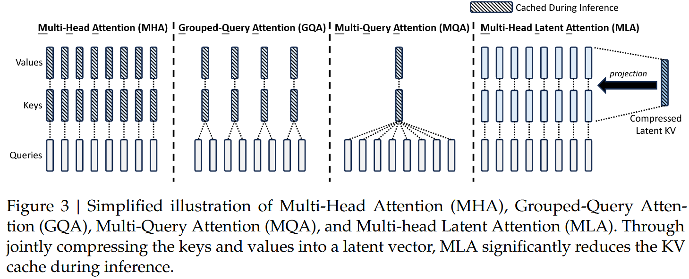
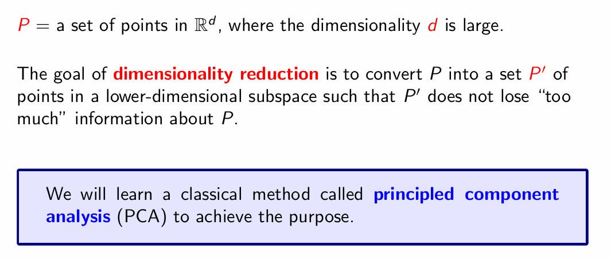
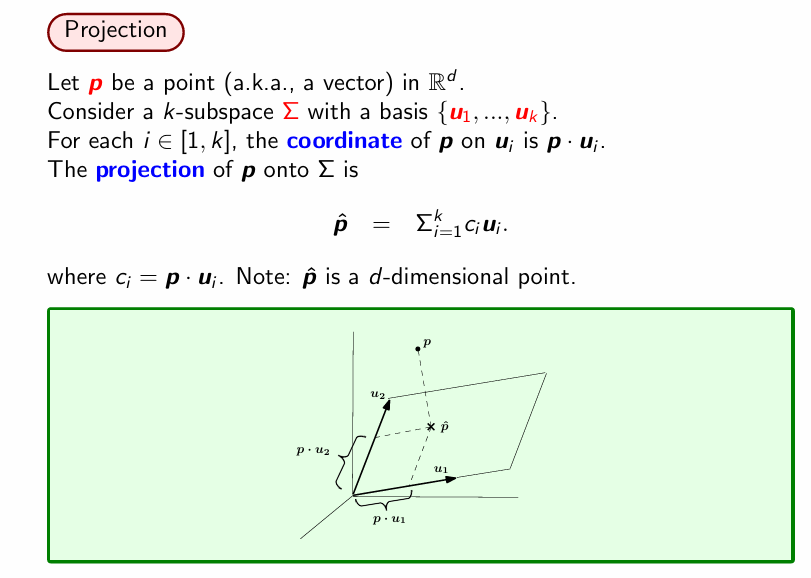
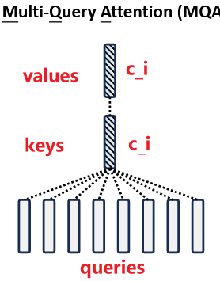
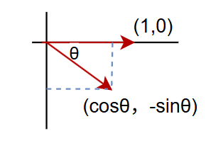
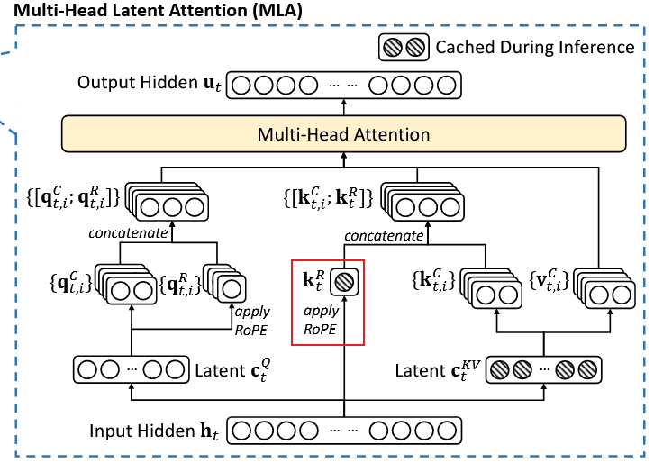

# Understand DeepSeek Multi-Head Latent Attention (MLA)

> DeepSeek-V2: A Strong, Economical, and Efficient Mixture-of-Experts Language Model
>
> [缓存与效果的极限拉扯：从MHA、MQA、GQA到MLA](https://spaces.ac.cn/archives/10091)

[TOC]

## Overview

有了MHA、MQA、GQA的铺垫，我们理解MLA（**M**ulti-head **L**atent **A**ttention）就相对容易一些了。DeepSeek-V2的技术报告里是从低秩投影的角度引入MLA的。

> Conventional Transformer models usually adopts **Multi-Head Attention (MHA)** (Vaswani et al., 2017), but during generation, its heavy Key-Value (KV) cache will become the bottleneck that limit the inference efficiency. In order to reduce the KV cache, **Multi-Query Attention (MQA)** (Shazeer, 2019) and **Grouped-Query Attention (GQA)** (Ainslie et al., 2023) are proposed. They require a smaller magnitude of KV cache, but their performance does not match MHA (we provide the ablation of MHA, GQA and MQA in Appendix D.1).  
>
> For DeepSeek-V2, we design an innovative attention mechanism called **Multi-head Latent Attention (MLA)**. Equipped with **low-rank key-value joint compression**, MLA achieves better performance than MHA, but requires a significantly smaller amount of KV cache.

然而，笔者认为低秩投影这个角度并不贴近本质，因为要说低秩投影的话，事实上只要我们将GQA的所有K、V叠在一起，就会发现GQA也相当于在做低秩投影：
$$
\begin{equation}\underbrace{\left[\boldsymbol{k}_i^{(1)},\cdots,\boldsymbol{k}_i^{(g)},\boldsymbol{v}_i^{(1)},\cdots,\boldsymbol{v}_i^{(g)}\right]}_{\boldsymbol{c}_i\in\mathbb{R}^{g(d_k+d_v)}} = \boldsymbol{x}_i \underbrace{\left[\boldsymbol{W}_k^{(1)},\cdots,\boldsymbol{W}_k^{(g)},\boldsymbol{W}_v^{(1)},\cdots,\boldsymbol{W}_v^{(g)}\right]}_{\boldsymbol{W}_c\in\mathbb{R}^{d\times g(d_k+d_v)}}\end{equation}
$$

> 低秩投影:**把原始矩阵中的数据“投影”到一个低维空间中**，从而得到一个秩较低的近似矩阵 
>
> (recall : Principal  Component Analysis, PCA)
>
> 
>
> 

这里我们将所有k_i,v_i拼在一起记为c_i，相应的投影矩阵也拼在一起记为W_c，注意到一般都有dc = g * (dk+dv)<d，所以x_i到c_i的变换就是一个低秩投影。所以，MLA的本质改进不是低秩投影，而是低秩投影之后的工作。

## Part 1

GQA在投影之后做了什么呢？首先它将向量对半分为两份分别作为K、V，然后每一份又均分为g份，每一份复制h/g次，以此来“凑”够h个Attention Head所需要的K、V。

> 这里说的“将向量对半分为两份分别作为K、V”实际上已经采用了前述低秩投影的视角来看GQA这个方法。这个“向量”指的就是c_i

我们知道分割、复制都是简单的**线性变换**，所以MLA的第一个想法是将这些**简单的线性变换**换成**一般的线性变换**，以增强模型的能力：
$$
\begin{equation} 
\begin{gathered} 
\boldsymbol{o}_t = \left[\boldsymbol{o}_t^{(1)}, \boldsymbol{o}_t^{(2)}, \cdots, \boldsymbol{o}_t^{(h)}\right] \\[10pt] 
\boldsymbol{o}_t^{(s)} = Attention\left(\boldsymbol{q}_t^{(s)}, \boldsymbol{k}_{\leq t}^{(s)} ,\boldsymbol{v}_{\leq t}^{(s)}\right)\triangleq\frac{\sum_{i\leq t}\exp\left(\boldsymbol{q}_t^{(s)} \boldsymbol{k}_i^{(s)}{}^{\top}\right)\boldsymbol{v}_i^{(s)}}{\sum_{i\leq t}\exp\left(\boldsymbol{q}_t^{(s)} \boldsymbol{k}_i^{(s)}{}^{\top}\right)} \\[15pt] 
\boldsymbol{q}_i^{(s)} = \boldsymbol{x}_i\boldsymbol{W}_q^{(s)}\in\mathbb{R}^{d_k},\quad \boldsymbol{W}_q^{(s)}\in\mathbb{R}^{d\times d_k}\\ 
\boldsymbol{k}_i^{(s)} = \boldsymbol{\color{red}{c}_i}\boldsymbol{W}_k^{(s)}\in\mathbb{R}^{d_k},\quad \boldsymbol{W}_k^{(s)}\in\mathbb{R}^{d_c\times d_k} \\ 
\boldsymbol{v}_i^{(s)} = \boldsymbol{\color{red}{c}_i}\boldsymbol{W}_v^{(s)}\in\mathbb{R}^{d_v},\quad \boldsymbol{W}_v^{(s)}\in\mathbb{R}^{d_c\times d_v} \\[10pt] 
\color{red}{\boldsymbol{c}_i = \boldsymbol{x}_i \boldsymbol{W}_c\in\mathbb{R}^{d_c},\quad \boldsymbol{W}_c\in\mathbb{R}^{d\times d_c}}
\end{gathered} 
\end{equation}
$$

> **线性变换（Linear Transformation）**
>
> - **定义**
>    一个映射
>   $$
>   T:\mathbb{R}^n\to\mathbb{R}^m
>   $$
>   称为线性，如果对所有向量 x,y和标量 a,b 都满足 T(ax+by)=aT(x)+bT(y)
>
> - **矩阵表达**
>    任何线性变换都可以写成矩阵乘法T(x)=A x，其中：
>   $$
>   A\in\mathbb{R}^{m\times n}
>   $$
>
> 反过来，只要是矩阵乘法，它一定满足线性定义。
>
> **分割（Select / Slice）**
>
> 把向量 (x1,x2,…,xn)截取一部分（例如取前 k个元素）称为分割/选择。这可以用 *选择矩阵* 表示。例如n=4，k = 2：
> $$
> A_{\text{sel}}= \begin{bmatrix} 1&0&0&0\\ 0&1&0&0 \end{bmatrix}, \qquad y=A_{\text{sel}} x= \begin{bmatrix} x_1\\x_2 \end{bmatrix}.
> $$
> 验证线性条件显然成立 ⇒ **分割是线性变换**。
>
> **复制（Duplicate / Tile）**
>
> 把同一个向量复制到更高维空间也能写成矩阵。例如
> $$
> x\in\mathbb{R}^2
> $$
>  复制两份得到
> $$
> y\in\mathbb{R}^4
> $$
>
> $$
> A_{\text{dup}}= \begin{bmatrix} 1&0\\ 0&1\\ 1&0\\ 0&1 \end{bmatrix}, \qquad y=A_{\text{dup}} x= \begin{bmatrix} x_1\\x_2\\x_1\\x_2 \end{bmatrix}.
> $$

然而，理论上这样是能增加模型能力，但别忘了GQA的主要目的是减少KV Cache，出于**节省计算和通信成本**的考虑，我们一般会缓存的是投影后的k_i,v_i而不是投影前的c_i或x_i

> KV cache本身就是为了减少attention操作过程中的redundant recalculation，所以显然是缓存计算后的K和V。

而MLA的这个做法，通过不同的投影矩阵再次让**所有的K、V Head**都变得**各不相同**，那么KV Cache的大小就恢复成跟MHA一样大了，违背了GQA的初衷。

> 
> $$
> \begin{equation} 
> \begin{gathered} 
> \boldsymbol{q}_i^{(s)} = \boldsymbol{x}_i\boldsymbol{W}_q^{(s)}\in\mathbb{R}^{d_k},\quad \boldsymbol{W}_q^{(s)}\in\mathbb{R}^{d\times d_k}\\ 
> \boldsymbol{k}_i^{(s)} = \boldsymbol{\color{red}{c}_i}\boldsymbol{W}_k^{(s)}\in\mathbb{R}^{d_k},\quad \boldsymbol{W}_k^{(s)}\in\mathbb{R}^{d_c\times d_k} \\ 
> \boldsymbol{v}_i^{(s)} = \boldsymbol{\color{red}{c}_i}\boldsymbol{W}_v^{(s)}\in\mathbb{R}^{d_v},\quad \boldsymbol{W}_v^{(s)}\in\mathbb{R}^{d_c\times d_v} \\[10pt] 
> \color{red}{\boldsymbol{c}_i = \boldsymbol{x}_i \boldsymbol{W}_c\in\mathbb{R}^{d_c},\quad \boldsymbol{W}_c\in\mathbb{R}^{d\times d_c}}
> \end{gathered} 
> \end{equation}
> $$
> Note: i = i-th token, s = s-th head
>
> 由于各个head的W_k和W_V不相同，所以这样算出来的k和v就各不相同（注意到，c_i = x_i * W_c都是一样的因为W_c是所有head共享的）又回到了MHA的情况

对此，MLA发现，我们可以结合Dot-Attention的具体形式，通过一个简单但不失巧妙的**恒等变换**来规避这个问题。首先，在训练阶段还是照常进行，此时优化空间不大；然后，**在推理阶段**，我们利用
$$
\begin{equation}\boldsymbol{q}_t^{(s)} \boldsymbol{k}_i^{(s)}{}^{\top} = \left(\boldsymbol{x}_t\boldsymbol{W}_q^{(s)}\right) \left(\boldsymbol{c}_i\boldsymbol{W}_k^{(s)}\right){}^{\top} = \boldsymbol{x}_t\left(\boldsymbol{W}_q^{(s)}\boldsymbol{W}_k^{(s)}{}^{\top}\right)\boldsymbol{c}_i^{\top} \end{equation}
$$
这意味着推理阶段，我们可以将
$$
\boldsymbol{W}_q^{(s)}\boldsymbol{W}_k^{(s)}{}^{\top}
$$

合并起来作为 Q 的投影矩阵，那么c_i则取代了原本的k_i，同理，在o_t后面我们还有一个投影矩阵，于是:
$$
\boldsymbol{v}_i^{(s)} = \boldsymbol{c}_i\boldsymbol{W}_v^{(s)}
$$
也可以**吸收**到后面的投影矩阵中去。

> **矩阵吸收（matrix absorption）**：是一种线性代数层面的“把多个线性变换提前合并（re-parameterize）来减少推理时 FLOPs / 显存”的技巧。
>
> 本质就是矩阵乘法的结合律：(BA)x=B(Ax)

于是等效地v_i也可以用c_i代替。也就是说**此时KV Cache只需要存下所有的c_i就行**，而不至于存下所有的k_i^(s)、v_i^(s)。

> 当然我们做推理阶段的计算还需要W_q，W_k和W_v——但它们是**模型参数**，在推理阶段也是会被加载到显存里面的，不要混淆！

注意到c_i跟s无关，也就是说**是所有头共享的**，即**MLA在推理阶段可以恒等变换为一个MQA**。

再次强调，本文的主题是一直都是减少KV Cache，那到目前为止，MLA做到了什么呢？答案是:

- 通过不同的投影矩阵来增强了GQA的能力

- 并且推理时可以保持同样大小的KV Cache

  > 确实是保持同样大小的KV Cache而不是更小。要把GQA也看成低秩投影再跟MLA比！

那么反过来，如果我们只需要跟GQA相近的能力，那么是不是就可以再次减少KV Cache了？换言之，**dc没必要取g(dk+dv)，而是取更小的值**（DeepSeek-V2取了512），从而进一步压缩KV Cache，这就是MLA的核心思想。

> GQA的低秩投影：d-dim的input token x_i --> g(dk+dv)-dim的c_i，推理阶段需要cache的所有keys & values可以等效地拼接成下面这个c_i。
> $$
> \begin{equation}\underbrace{\left[\boldsymbol{k}_i^{(1)},\cdots,\boldsymbol{k}_i^{(g)},\boldsymbol{v}_i^{(1)},\cdots,\boldsymbol{v}_i^{(g)}\right]}_{\boldsymbol{c}_i\in\mathbb{R}^{g(d_k+d_v)}}\end{equation}
> $$
> (current)MLA的低秩投影：d-dim的input token x_i-->dc-dim的c_i，推理阶段需要cache的是下面这个dc-dim的向量c_i。
> $$
> \boldsymbol{c}_i = \boldsymbol{x}_i \boldsymbol{W}_c\in\mathbb{R}^{d_c},\quad \boldsymbol{W}_c\in\mathbb{R}^{d\times d_c}
> $$

**补充说明：**

1、WqWk^⊤合并成一个矩阵的恒等变换，理论上只有在无限精度下才成立，实际上如果我们使用单精度尤其是BF16的话，经过变换后的精度损失往往还是挺明显的，经过多层累积后可能放大到比较可观的程度；

2、实际上我们一般不按照xt(WqWk^⊤)来**计算Q**，而是按照(xt * Wq)Wk^⊤来计算，这样虽然是串行的，但在低秩假设下计算量更少，并且理论精度的损失也更少，不过在文章中，我们仍按照WqWk^⊤合并成一个矩阵来介绍。

> Q是推理阶段计算的，c_i是缓存着的

## Part 2

一切似乎都很完美，看上去一个又好又省的理想设计就要出炉了。不过别急，当我们再深入思考一下就会发现，到目前为止的MLA有一个难以绕开的缺陷——不兼容[RoPE（旋转位置编码）](https://spaces.ac.cn/archives/8265)。

> [A Visual Understanding of Positional Encoding in Transformers](https://medium.com/data-science-collective/a-visual-understanding-of-positional-encoding-in-transformers-3585d1c409d9)

刚才我们说了，MLA之所以能保持跟GQA一样大小的KV Cache，其关键一步是“将Wq * Wk^⊤合并成一个（跟位置无关的）矩阵作为Q的投影矩阵”，但如果加了RoPE的话，这一步就无法实现了。

这是因为RoPE是一个**跟位置相关的**、dk×dk的分块对角矩阵R_m，满足
$$
\boldsymbol{\mathcal{R}}_m\boldsymbol{\mathcal{R}}_n^{\top}=\boldsymbol{\mathcal{R}}_{m-n}
$$

> recall : 计算机图形学中的**二维旋转矩阵**，
>
> 把一个向量按角度θ做逆时针的旋转：
> $$
> \begin{bmatrix}1 & 0\end{bmatrix} \times
> \begin{bmatrix}\cos\theta &-\sin\theta\\ \sin\theta &\;\cos\theta\end{bmatrix} = 
> \begin{bmatrix}\cos\theta & -\sin\theta\end{bmatrix}
> $$
> 
>
> 不同之处在于 **RoPE 把这样的 2×2小块复制成一个 dk×dk的大“分块对角矩阵”，并且角度 θ 随 token 位置线性增长（不同频率、交替排布）**，目的是让注意力天然获得“相对位置信息”

MLA加入RoPE之后会让Wq * Wk^⊤之间多插入了一项R_(t−i)：

> t = current token, i∈[1, t-1]

$$
\begin{equation} 
\boldsymbol{q}_i^{(s)} = \boldsymbol{x}_i\boldsymbol{W}_q^{(s)}{\color{red}{\boldsymbol{\mathcal{R}}_i}}\quad,\quad\boldsymbol{k}_i^{(s)} = \boldsymbol{c}_i\boldsymbol{W}_k^{(s)}{\color{red}{\boldsymbol{\mathcal{R}}_i}} \\  
\end{equation}
$$

$$
\boldsymbol{q}_t^{(s)} \boldsymbol{k}_i^{(s)}{}^{\top} = \left(\boldsymbol{x}_t\boldsymbol{W}_q^{(s)}{\color{red}{\boldsymbol{\mathcal{R}}_t}}\right) \left(\boldsymbol{c}_i\boldsymbol{W}_k^{(s)}{\color{red}{\boldsymbol{\mathcal{R}}_i}}\right){}^{\top} = \boldsymbol{x}_t\left(\boldsymbol{W}_q^{(s)}{\color{red}{\boldsymbol{\mathcal{R}}_{t-i}}
\boldsymbol{W}_k^{(s)}{}^{\top}}\right)\boldsymbol{c}_i^{\top}
$$

这里的
$$
\boldsymbol{W}_q^{(s)}{\color{red}{\boldsymbol{\mathcal{R}}_{t-i}}}\boldsymbol{W}_k^{(s)}{}^{\top}
$$
就无法合并为一个**固定的**投影矩阵了（跟位置差t−i相关），从而MLA的想法无法结合RoPE实现。

> a RoPE matrix related to the currently generating token will lie between W_q and W_k and matrix multiplication does not obey a commutative law. **As a result, we must recompute the keys for all the prefix tokens during inference**, which will significantly hinder the inference efficiency.

最后发布的MLA，采取了一种混合的方法——每个Attention Head的Q、K新增drdr个维度用来添加RoPE，其中K新增的维度每个Head共享：
$$
\begin{equation} 
\begin{gathered} 
\boldsymbol{o}_t = \left[\boldsymbol{o}_t^{(1)}, \boldsymbol{o}_t^{(2)}, \cdots, \boldsymbol{o}_t^{(h)}\right] \\[10pt] 
\boldsymbol{o}_t^{(s)} = Attention\left(\boldsymbol{q}_t^{(s)}, \boldsymbol{k}_{\leq t}^{(s)} ,\boldsymbol{v}_{\leq t}^{(s)}\right)\triangleq\frac{\sum_{i\leq t}\exp\left(\boldsymbol{q}_t^{(s)} \boldsymbol{k}_i^{(s)}{}^{\top}\right)\boldsymbol{v}_i^{(s)}}{\sum_{i\leq t}\exp\left(\boldsymbol{q}_t^{(s)} \boldsymbol{k}_i^{(s)}{}^{\top}\right)} \\[15pt] 
\boldsymbol{q}_i^{(s)} = \left[\boldsymbol{x}_i\boldsymbol{W}_{qc}^{(s)}, \boldsymbol{x}_i\boldsymbol{W}_{qr}^{(s)}\color{#3ce2f7}{\boldsymbol{\mathcal{R}}_i}\right]\in\mathbb{R}^{d_k + d_r},\quad \boldsymbol{W}_{qc}^{(s)}\in\mathbb{R}^{d\times d_k},\boldsymbol{W}_{qr}^{(s)}\in\mathbb{R}^{d\times d_r}\\ 
\boldsymbol{k}_i^{(s)} = \left[\boldsymbol{c}_i\boldsymbol{W}_{kc}^{(s)}, \boldsymbol{x}_i\boldsymbol{W}_{kr}^{\color{#ccc}{\smash{\bcancel{(s)}}}}\color{#3ce2f7}{\boldsymbol{\mathcal{R}}_i}\right]\in\mathbb{R}^{d_k+d_r},\quad \boldsymbol{W}_{kc}^{(s)}\in\mathbb{R}^{d_c\times d_k}, \boldsymbol{W}_{kr}^{\color{#ccc}{\smash{\bcancel{(s)}}}}\in\mathbb{R}^{d\times d_r} \\ 
\boldsymbol{v}_i^{(s)} = \boldsymbol{c}_i\boldsymbol{W}_v^{(s)}\in\mathbb{R}^{d_v},\quad \boldsymbol{W}_v^{(s)}\in\mathbb{R}^{d_c\times d_v} \\[10pt] 
\boldsymbol{c}_i = \boldsymbol{x}_i \boldsymbol{W}_c\in\mathbb{R}^{d_c},\quad \boldsymbol{W}_c\in\mathbb{R}^{d\times d_c} 
\end{gathered} 
\end{equation}
$$
这样一来，没有RoPE的维度就可以重复“Part 1”的操作，在推理时KV Cache只需要存c_i，新增的带RoPE的维度就可以用来补充位置信息，并且由于所有Head共享，所以也就只有在K Cache这里增加了dr个维度，原论文取了dr=dk/2=64，相比原本的dc=512，增加的幅度不大。

## Part 3

最后有一个细节，就是MLA的最终版本，还将Q的输入也改为了低秩投影形式，这与减少KV Cache无关，主要是为了减少**训练期间**参数量和相应的梯度（原论文说的是激活值，个人表示不大理解）所占的显存
$$
\begin{equation} 
\begin{gathered} 
\boldsymbol{o}_t = \left[\boldsymbol{o}_t^{(1)}, \boldsymbol{o}_t^{(2)}, \cdots, \boldsymbol{o}_t^{(h)}\right] \\[10pt] 
\boldsymbol{o}_t^{(s)} = Attention\left(\boldsymbol{q}_t^{(s)}, \boldsymbol{k}_{\leq t}^{(s)} ,\boldsymbol{v}_{\leq t}^{(s)}\right)\triangleq\frac{\sum_{i\leq t}\exp\left(\boldsymbol{q}_t^{(s)} \boldsymbol{k}_i^{(s)}{}^{\top}\right)\boldsymbol{v}_i^{(s)}}{\sum_{i\leq t}\exp\left(\boldsymbol{q}_t^{(s)} \boldsymbol{k}_i^{(s)}{}^{\top}\right)} \\[15pt] 
\boldsymbol{q}_i^{(s)} = \left[\boldsymbol{c}_i'\boldsymbol{W}_{qc}^{(s)}, \boldsymbol{c}_i'\boldsymbol{W}_{qr}^{(s)}\color{#3ce2f7}{\boldsymbol{\mathcal{R}}_i}\right]\in\mathbb{R}^{d_k + d_r},\quad \boldsymbol{W}_{qc}^{(s)}\in\mathbb{R}^{d_c'\times d_k},\boldsymbol{W}_{qr}^{(s)}\in\mathbb{R}^{d_c'\times d_r}\\ 
\boldsymbol{k}_i^{(s)} = \left[\boldsymbol{c}_i\boldsymbol{W}_{kc}^{(s)}, \boldsymbol{x}_i\boldsymbol{W}_{kr}^{\color{#ccc}{\smash{\bcancel{(s)}}}}\color{#3ce2f7}{\boldsymbol{\mathcal{R}}_i}\right]\in\mathbb{R}^{d_k+d_r},\quad \boldsymbol{W}_{kc}^{(s)}\in\mathbb{R}^{d_c\times d_k}, \boldsymbol{W}_{kr}^{\color{#ccc}{\smash{\bcancel{(s)}}}}\in\mathbb{R}^{d\times d_r} \\ 
\boldsymbol{v}_i^{(s)} = \boldsymbol{c}_i\boldsymbol{W}_v^{(s)}\in\mathbb{R}^{d_v},\quad \boldsymbol{W}_v^{(s)}\in\mathbb{R}^{d_c\times d_v} \\[10pt] 
\boldsymbol{c}_i' = \boldsymbol{x}_i \boldsymbol{W}_c'\in\mathbb{R}^{d_c'},\quad \boldsymbol{W}_c'\in\mathbb{R}^{d\times d_c'} \\ 
\boldsymbol{c}_i = \boldsymbol{x}_i \boldsymbol{W}_c\in\mathbb{R}^{d_c},\quad \boldsymbol{W}_c\in\mathbb{R}^{d\times d_c} \\ 
\end{gathered} 
\label{eq:mla-mha}\end{equation}
$$
解码阶段的MLA则改为MQA形式:
$$
\begin{equation} 
\begin{gathered} 
\boldsymbol{o}_t = \left[\boldsymbol{o}_t^{(1)}\boldsymbol{W}_v^{(1)}, \boldsymbol{o}_t^{(2)}\boldsymbol{W}_v^{(2)}, \cdots, \boldsymbol{o}_t^{(h)}\boldsymbol{W}_v^{(h)}\right] \\[10pt] 
\boldsymbol{o}_t^{(s)} = Attention\left(\boldsymbol{q}_t^{(s)}, \boldsymbol{k}_{\leq t}^{\color{#ccc}{\smash{\bcancel{(s)}}}} ,\boldsymbol{c}_{\leq t}\right)\triangleq\frac{\sum_{i\leq t}\exp\left(\boldsymbol{q}_t^{(s)} \boldsymbol{k}_i^{\color{#ccc}{\smash{\bcancel{(s)}}}}{}^{\top}\right)\boldsymbol{c}_i}{\sum_{i\leq t}\exp\left(\boldsymbol{q}_t^{(s)} \boldsymbol{k}_i^{\color{#ccc}{\smash{\bcancel{(s)}}}}{}^{\top}\right)} \\[15pt] 
\boldsymbol{q}_i^{(s)} = \left[\boldsymbol{c}_i'\boldsymbol{W}_{qc}^{(s)}\boldsymbol{W}_{kc}^{(s)}{}^{\top}, \boldsymbol{c}_i'\boldsymbol{W}_{qr}^{(s)}\color{#3ce2f7}{\boldsymbol{\mathcal{R}}_i}\right]\in\mathbb{R}^{d_c + d_r}\\ 
\boldsymbol{k}_i^{\color{#ccc}{\smash{\bcancel{(s)}}}} = \left[\boldsymbol{c}_i, \boldsymbol{x}_i\boldsymbol{W}_{kr}^{\color{#ccc}{\smash{\bcancel{(s)}}}}\color{#3ce2f7}{\boldsymbol{\mathcal{R}}_i}\right]\in\mathbb{R}^{d_c+d_r}\\ 
\boldsymbol{W}_{qc}^{(s)}\in\mathbb{R}^{d_c'\times d_k},\boldsymbol{W}_{kc}^{(s)}\in\mathbb{R}^{d_c\times d_k},\boldsymbol{W}_{qr}^{(s)}\in\mathbb{R}^{d_c'\times d_r},\boldsymbol{W}_{kr}^{\color{#ccc}{\smash{\bcancel{(s)}}}}\in\mathbb{R}^{d\times d_r} \\[10pt] 
\boldsymbol{c}_i' = \boldsymbol{x}_i \boldsymbol{W}_c'\in\mathbb{R}^{d_c'},\quad \boldsymbol{W}_c'\in\mathbb{R}^{d\times d_c'} \\ 
\boldsymbol{c}_i = \boldsymbol{x}_i \boldsymbol{W}_c\in\mathbb{R}^{d_c},\quad \boldsymbol{W}_c\in\mathbb{R}^{d\times d_c} \\ 
\end{gathered} 
\label{eq:mla-mqa}\end{equation}
$$
此时Q、K的Head Size变成了dc+dr，V的Head Size 则变成了dc，按照原论文的设置，这是dk、dv的4倍。所以实际上MLA在解码阶段做的这个转换，虽然能**有效减少KV Cache**，但其**解码的计算量是增加的**。

那为什么还能提高推理效率呢？这又回到“瓶颈”一节所讨论的问题了，我们可以将LLM的推理分两部分：第一个Token的生成（Prefill）和后续每个Token的生成（Generation），Prefill阶段涉及到对输入所有Token的并行计算，然后把对应的KV Cache存下来，这部分对于计算、带宽和显存都是瓶颈，我们可以用MLA的MHA形式[(10)](https://spaces.ac.cn/archives/10091#mjx-eqn-eq%3Amla-mha)来算；但是Generation阶段由于每步只计算一个Token，实际上它更多的是带宽瓶颈和显存瓶颈，此时我们可以用MLA的MQA形式[(12)](https://spaces.ac.cn/archives/10091#mjx-eqn-eq%3Amla-mqa)来算，从而明显提高Generation的速度。

还有一个细节充分体现了这个特性。**一般的LLM架构参数满足h×dk=d，即num_heads * head_size = hidden_size**，但DeepSeek-V2不一样，它dk=128,d=5120，但h=128，是一般设置的3倍！**这是因为MLA的KV Cache大小跟h无关，增大h只会增加计算量和提升模型能力，但不会增加KV Cache，所以不会带来速度瓶颈。**

> 原文地址：https://spaces.ac.cn/archives/10091