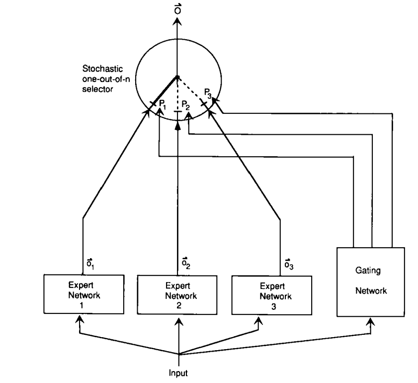
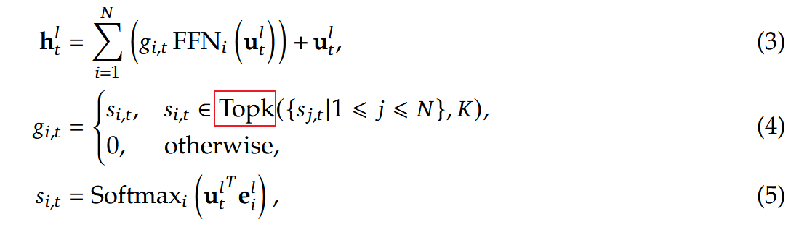
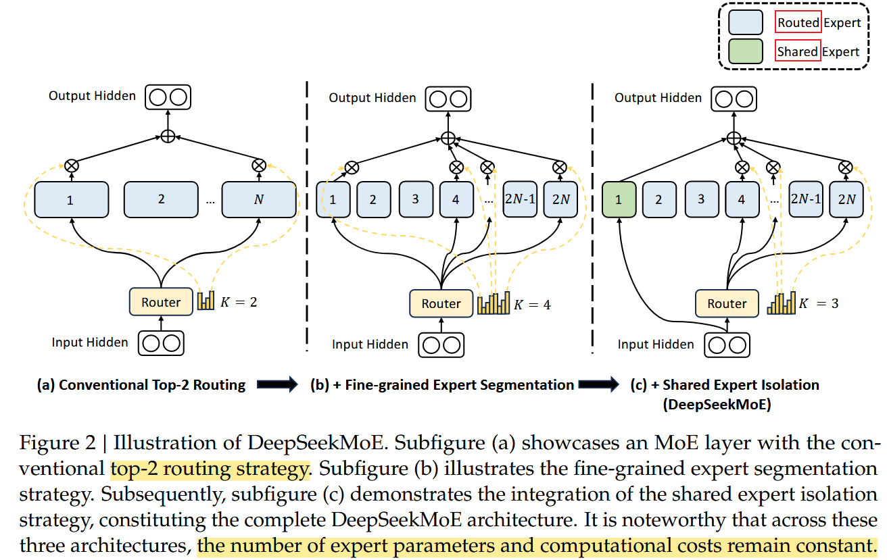
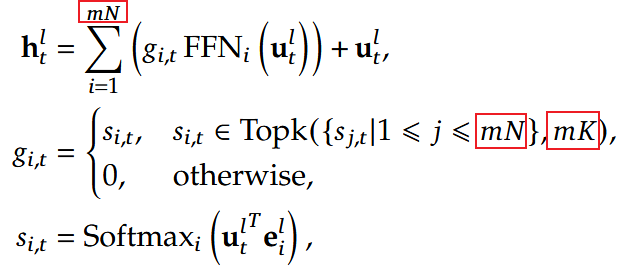
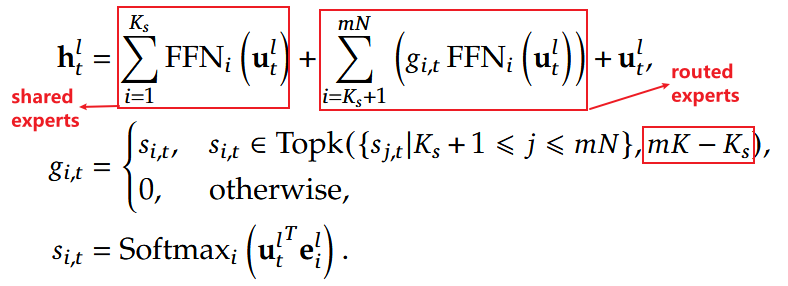

# Understand DeepSeek MoE

[TOC]

## MoE Overview

Mixture-of-Experts (MoE) is a supervised learning procedure for systems composed of many separate networks, each of which learns to handle a subset of the complete set of training cases.

Each expert is a feed-forward network and all experts receive the same input and have the same number of outputs. 

**The gating network** is also feed-forward, and typically receives the same input as the expert networks. It has normalized outputs 
$$
p_j = \frac{\exp(x_j)}{\sum_{i} \exp(x_i)}
$$
where `x_j` is the total weighted input received by output unit j of the gating network. 

**The selector** acts like a multiple input, single output stochastic switch; the probability that the switch will select the output from expert j is `p_j`

> Adaptive Mixtures of Local Experts

## Mixture-of-Experts for Transformers

A typical practice to construct an MoE language model usually **substitutes FFNs in a Transformer with MoE layers** at specified intervals. 

> https://arxiv.org/abs/2101.03961

> https://www.dailydoseofds.com/p/transformer-vs-mixture-of-experts-in-llms/
>
> router ≈ (gating network + selector) in original MoE paper

An MoE layer is composed of multiple experts, where each expert is structurally identical to a standard FFN. Then, each token will be assigned to one or two experts. If the l-th FFN is substituted with an MoE layer, the computation for its output hidden state hl,t is expressed as:

where:

- `N` denotes the total number of experts
- `FFN_i (·)` is the i-th expert FFN
- `gi,t` denotes the gate value for the i-th expert
- `si,t` denotes the token-to-expert affinity
- `Topk(·, K)` denotes the set comprising K highest affinity scores among those calculated for the t-th token and all N experts
- `el,i` is the centroid of the i-th expert in the l-th layer

Note that `gi,t` is **sparse**, indicating that **only K out of N gate values are nonzero**. This sparsity property ensures computational efficiency within an MoE layer, i.e., each token will be assigned to and computed in only K experts.

## DeepSeekMoE

> DeepSeekMoE: Towards Ultimate Expert Specialization in Mixture-of-Experts Language Models

### Motivation

Existing MoE architectures potentially suffer from issues of **knowledge hybridity** and **knowledge redundancy**, which limit the **expert specialization**, i.e., each expert acquires non-overlapping and focused knowledge. 

(1) **Knowledge Hybridity**: existing MoE practices often employ **a limited number of experts** (e.g., 8 or 16), and thus tokens assigned to a specific expert will be likely to cover diverse knowledge. Consequently, the designated expert will intend to assemble vastly different types of knowledge in its parameters, which are hard to utilize simultaneously. 

> Expert数量不够多，不够specialize

(2) **Knowledge Redundancy**: tokens assigned to different experts may require common knowledge. As a result, **multiple experts may converge in acquiring shared knowledge in their respective parameters**, thereby leading to redundancy in expert parameters. These issues collectively hinder the expert specialization in existing MoE practices, preventing them from reaching the theoretical upper-bound performance of MoE models.

> 不同expert间有共享的“知识”，导致参数冗余

### Contribution

In response to the aforementioned issues, we introduce DeepSeekMoE, an innovative MoE architecture specifically designed towards ultimate expert specialization. Our architecture involves two principal strategies: 

(1) **Fine-Grained Expert Segmentation**: while maintaining the number of parameters constant, we **segment the experts into a finer grain by splitting the FFN intermediate hidden dimension**. Correspondingly, keeping a constant computational cost, we also activate more fine-grained experts to enable a more flexible and adaptable combination of activated experts. Fine-grained expert segmentation allows diverse knowledge to be decomposed more finely and be learned more precisely into different experts, where each expert will retain a higher level of specialization. In addition, the increased flexibility in combining activated experts also contributes to a more accurate and targeted knowledge acquisition. 

(2) **Shared Expert Isolation**: we isolate certain experts to serve as shared experts that are **always activated**, aiming at capturing and consolidating common knowledge across varying contexts. **Through compressing common knowledge into these shared experts, redundancy among other routed experts will be mitigated.** This can enhance the parameter efficiency and ensure that each routed expert retains specialized by focusing on distinctive aspects. 

These architectural innovations in DeepSeekMoE offer opportunities to train a parameter-efficient MoE language model **where each expert is highly specialized.**(ultimate goal)

**Figure 2(a) --> Figure 2(b)**

To be specific, on top of a typical MoE architecture shown in Figure 2(a), we **segment each expert FFN into m smaller experts** by reducing the FFN intermediate hidden dimension to **1/m times its original size**. Since each expert becomes smaller, in response, we also increase the number of activated experts to m times to keep the same computation cost, as illustrated in Figure 2(b). With the fine-grained expert segmentation, the output of an MoE layer can be expressed as:

**Figure 2(b) --> Figure 2(c)**

With a conventional routing strategy, tokens assigned to different experts may necessitate some common knowledge or information. As a result, multiple experts may converge in acquiring shared knowledge in their respective parameters, thereby resulting in redundancy in expert parameters. However, if there are shared experts **dedicated to capturing and consolidating common knowledge across varying contexts**, the parameter redundancy among other routed experts will be alleviated.

Towards this objective, in addition to the fine-grained expert segmentation strategy, we further isolate `K_s` experts to serve as shared experts. **Regardless of the router module, each token will be deterministically assigned to these shared experts.**

Finally, in DeepSeekMoE, the number of shared expert is Ks, the total number of routed experts is mN − `K_s`, and the number of nonzero gates is mK − `K_s`.

## Development

DeepSeek在MoE方面创新和演进过程

- V1版(DeepSeekMoE)为了兼顾对通用知识和细粒度领域知识的建模，引入了**共享专家（Shared Expert）和细粒度专家（Fine-Grained Expert）。**同时为了平衡各个专家的计算负载，引入了专家级负载loss （Expert-Level Balance Loss）和 设备级负载loss（Device-Level Balance Loss）。
- V2版主要在通信负载上做了些优化，通过引入**设备受限的专家路由机制**和**通信负载均衡loss**确保设备输入、输出的通信负载均衡。
- V3版考虑负载loss对主模型的优化会有影响，将辅助负载loss做了精简，通过在门控权重增加一个可调的bias来解决通信和计算的负载。也引入了一个更细粒度的sequence负载均衡loss。同时考虑随着路由专家增到256个，在门控权重计算上选择了值域更宽、打分差异更显著的sigmoid函数替换了原来的softmax函数。