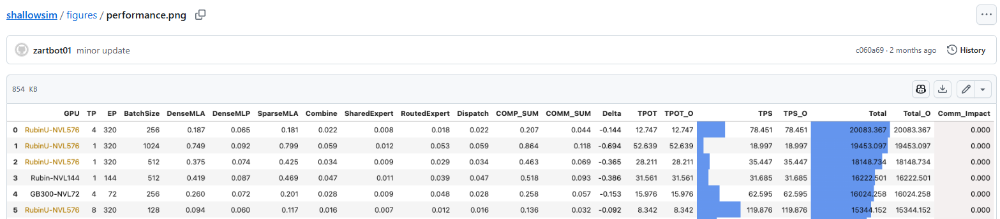

# ShallowSim Performance Metrics for LLM Inference

[TOC]


## Prefill

DeepSeek-V3/R1默认配置（From huggingface）：

- 3层dense transformer block
- 58层Sparse(MoE) transformer block

|           GPU | Layers | DGX-B300 |  DGX-B200 |      H200 |      H800 | 解释                  |
| ------------: | -----: | -------: | --------: | --------: | --------: | --------------------- |
|           MLA |    3.0 | 1.534450 |  2.310493 |  5.848370 |  5.857117 | Dense层MLA耗时        |
|      DenseMLP |    3.0 | 0.357764 |  0.574656 |  2.527005 |  2.545534 | Dense层MLP耗时        |
|        TP_MLA |   58.0 | 0.526944 |  0.720955 |  1.683756 |  1.881772 | MoE层MLA耗时          |
| Shared Expert |   58.0 | 0.013798 |  0.020595 |  0.077915 |  0.079974 | Shared Expert计算时间 |
|       Combine |   58.0 | 0.578740 |  0.578740 |  1.107479 |  1.107479 | MoE all2all           |
|      Overlap1 |   58.0 | 0.037997 | -0.162811 | -0.654192 | -0.854267 | combine阶段通信剩余   |
| Routed Expert |   58.0 | 0.110385 |  0.164760 |  0.623321 |  0.639792 | Routed Expert计算时间 |
|      Dispatch |   58.0 | 0.182185 |  0.182185 |  0.314370 |  0.314370 | MoE all2all           |
|      Overlap2 |   58.0 | 0.071799 |  0.017425 | -0.308951 | -0.325422 | dispatch阶段通信剩余  |

## Decode



### Meta Data

| Name          | Explanation                                                 | Unit | Comment                                                      |
| ------------- | ----------------------------------------------------------- | ---- | ------------------------------------------------------------ |
| **GPU**       | 使用的加速卡／机柜型号（例：*Rubin-NVL576*、*GB300-NVL72*） | ——   | “NVLxxx”里的数字≈机柜中 **总 GPU 数**，对照 NVIDIA 公开路线图：NVL72 = Blackwell-Ultra（72 GPU），NVL576 = Rubin-Ultra（576 GPU）等。 |
| **BatchSize** | 每次decode的并发样本/句子数                                 | 条   | 直接影响流水线并行度与 KV-Cache 大小。                       |

### Parallelism

| Name   | Explanation              | Unit      | Comment                                                      |
| ------ | ------------------------ | --------- | ------------------------------------------------------------ |
| **TP** | *Tensor Parallel* 分片数 | #GPU 分片 | 决定同一权重矩阵被切成几块在不同 GPU 上并行乘。              |
| **EP** | *Expert Parallel* 分片数 | #GPU 分片 | 一般等于 **活跃专家数 × Router 并行度**。DeepSeek-V3/R1 默认 8 路活跃路由专家，EP 会随硬件/映射策略变化。 |

### Simulation

| 字段             | 一句话含义                                                   | 计算公式 & 来源                                              | 单位  |
| ---------------- | ------------------------------------------------------------ | ------------------------------------------------------------ | ----- |
| **DenseMLA**     | *Dense 区* 每层 Multi-Head-Attn 时延（含 KV 读带宽）         | 原 `DenseMLA + LoadKV`                                       | ms    |
| **DenseMLP**     | Dense 区每层 FFN 时延                                        | `_decode_dense_mlp` 输出                                     | ms    |
| **SparseMLA**    | *Sparse 区*（MoE 区）每层 Attn 时延（含 KV 读带宽 + TP 并行） | `SparseMLA + LoadKV`                                         | ms    |
| **SharedExpert** | MoE 里 **共享专家** 的单层耗时                               | `_decode_moe` 输出                                           | ms    |
| **RoutedExpert** | MoE 里 **路由专家** 的单层耗时                               | 同上                                                         | ms    |
| **Dispatch**     | Token → 专家 的 All-to-All（FP4/8）                          | `_decode_alltoall` 输出                                      | ms    |
| **Combine**      | 专家 → Token 的 All-to-All（FP16）                           | 同上                                                         | ms    |
| **COMP_SUM**     | Sparse 区单层“纯计算”总和                                    | `SparseMLA + SharedExpert + RoutedExpert`                    | ms    |
| **COMM_SUM**     | Sparse 区单层两次通信总和                                    | `Dispatch + Combine`                                         | ms    |
| **Delta**        | 每层 **通信时长超过可并行计算部分的剩余量**                  | `Delta = COMM_SUM − (SparseMLA + SharedExpert)`              | ms    |
| **TPOT_O**       | Time Per Output Token，每个输出token 的延迟（不含首个Token）TPOT_O是**理想耗时**（假设通信全被计算隐藏） | Dense 区：`(DenseMLA + DenseMLP) × n_dense`Sparse 区：`(SparseMLA + Shared + Routed) × n_sparse` | ms    |
| **TPOT**         | **真实耗时**，若 Δ > 0，则需补偿不可重叠通信                 | `overlap_adjust()` 见下                                      | ms    |
| **TPS_O**        | Token Per Second, 理想 token/s                               | `1000 / TPOT_O`                                              | tok/s |
| **TPS**          | 真实 token/s                                                 | `1000 / TPOT`                                                | tok/s |
| **Total_O**      | 理想总吞吐 (batch×TPS_O)                                     | `TPS_O × BatchSize`                                          | tok/s |
| **Total**        | 真实总吞吐                                                   | `TPS × BatchSize`                                            | tok/s |
| **Comm_Impact**  | 通信对总体吞吐的削弱比例(**Comm_Impact** = 如果把通信优化到极致，仍可再快 X%) | `(Total_O − Total) / Total_O`                                | —     |

> **n_dense_layers = args.n_dense_layers**，
>  **n_sparse_layers = args.n_layers − n_dense_layers**

### Overlap判定与补偿

1. **并行假设**
   - 在 *Sparse* 层，计算（SparseMLA + Shared）与通信（Dispatch + Combine）在时间线上并行发起。
   - 若 `COMM_SUM ≤ (SparseMLA + Shared)`，通信完全置于计算覆盖区间内，流程不被延迟。
2. **剩余通信量**
   - 若 `COMM_SUM > (SparseMLA + Shared)`，超出的部分 Δ 在计算完成后仍在进行，需串行等待。
3. **层序列累积**
   - 因 *Sparse* 区共有 `n_sparse` 层，每层都可能出现同样的剩余通信量，故总补偿为 Δ × `n_sparse`。

此逻辑由函数 `overlap_adjust` 承载：

```python
if Delta > 0:
    TPOT = TPOT_O + Delta × n_sparse
else:
    TPOT = TPOT_O
```

### 单位换算和吞吐

1. `1000 / TPOT` → 把「每步耗时 ms」倒数成 **token/s**。
2. 乘 `BatchSize` 得 **总 token/s**。
3. `Comm_Impact` 给出通信导致吞吐下降的百分比。

