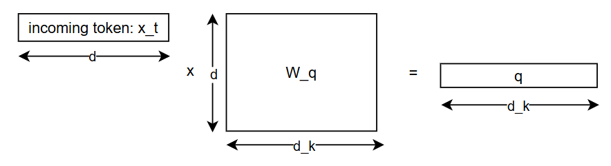
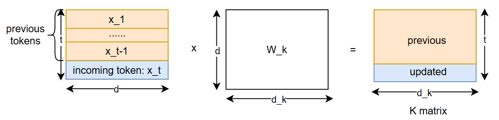
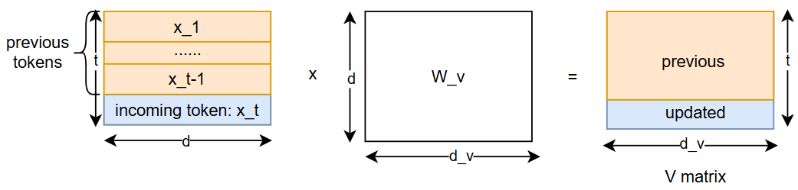
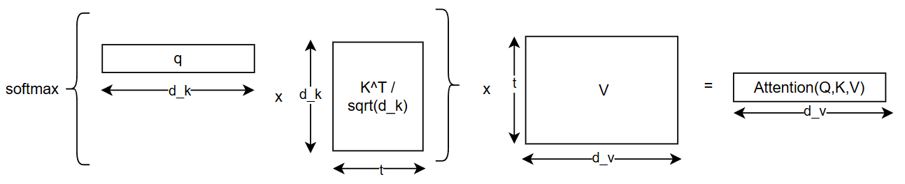
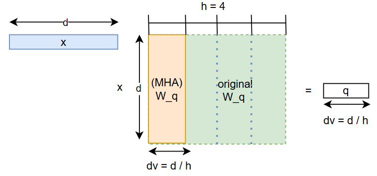
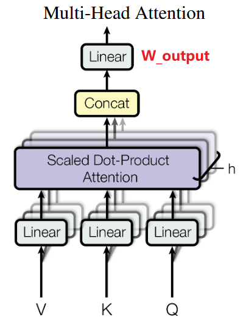
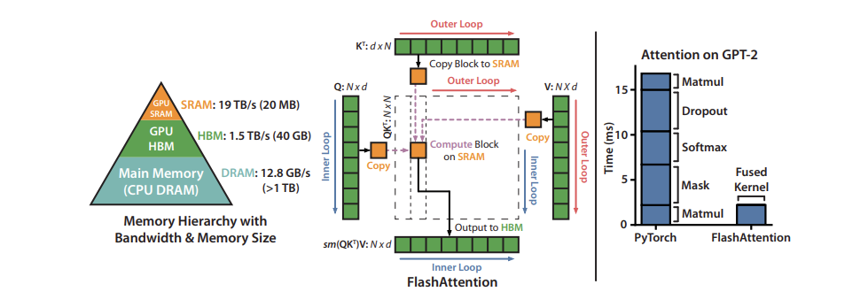

# Different Attention for LLM inference

[TOC]

> KV cache optimization

## Scaled Dot-Product Attention

$$
% Scaled dot-product attention
\text{Attention}(\mathbf{Q}, \mathbf{K}, \mathbf{V}) =
  \operatorname{softmax}\!\left(
    \frac{\mathbf{Q}\mathbf{K}^\top}{\sqrt{d_k}}
  \right)\mathbf{V}
$$

> sqrt{d_k} is called the **scaling factor**

Word embedding: **d-dim** row vector x_i

`l` word embedding vectors make a input sequence:
$$
\boldsymbol{x}_1,\boldsymbol{x}_2,\cdots,\boldsymbol{x}_l, \boldsymbol{x}_t\in\mathbb{R}^d,t\in[1,l]
$$
Q(query) = x_t * W_q 

> actually Q has multiple rows. we process multiple token at the same time. we use a mask(i.e. casual attention to ensure that the attention calculation of token x_t is only related to the ones previous to itself(from x_1 to x_t-1))



K(key) = x(1~t) * W_k



V(value) = x(1~t) * W_k



> The query vector represents the new token in the decoding step. It only contains information about the last token.
>
> The K and V matrix represents all the previous context that the model should pay attention to.

Attention:



> $$
> \mathbf x = (x_1,\dots,x_d)   \Longrightarrow   \operatorname{softmax}(\mathbf x) =\Bigl(p_1,\dots,p_d\Bigr),\; p_j = \frac{e^{x_j}}{\sum_{i=1}^{d} e^{x_i}},\; \sum_{j=1}^{d}p_j=1
> $$


## Multi Head attention (MHA)

Instead of performing a single attention function with d-dimensional keys, values and queries, we found it beneficial to linearly **project the queries, keys and values h times** with different, learned linear projections to d_k, d_k and d_v dimensions, respectively. 




> now we have d_k = d_v = d / h, h is the number of headers !
>
> 在线性代数里，“投影”一般指把向量映到某个子空间。但在深度学习论文里，**它通常就是“乘一个可学习的矩阵”**——也就是全连接（Linear）层。
>
> 假设词向量长度是 d。用一个大小为 d × dₖ 的矩阵 Wᵩ，把向量 *q* 变成新向量 *q′*：
>
>   *q′ = q · Wᵩ*
>
> 这一步就叫 “把 query 线性投影到 dₖ 维”。keys、values 也各有自己的矩阵 Wₖ、Wᵥ。
>
> 所以，“线性投影”≠“正交投影”之类的严格几何概念，而只是 **一次线性变换**。
>
> MHA的intuition就像你对一个问题不是只看一个角度，而是从 h 个不同的角度看（每个角度是一个 projection，不同head的Wq,Wv,Wk是独立学习的，是“异质”的），最后把这些角度的观察结果拼接起来看得更全面。不考虑Wo的话，MHA的参数量并不一定比Scaled Dot-Product Attention大。

On each of these projected versions of queries, keys and values we then perform the attention function in parallel, yielding d_v-dimensional output values. (now d_v = d / h)



These are concatenated and once again projected (i.e. the Wo), resulting in the final values
$$
\text{MultiHead}(Q,K,V)\;=\;
\operatorname{Concat}\!\bigl(\text{head}_1,\dots,\text{head}_h\bigr)\,W^{O}
$$

$$
\text{head}_i \;=\;
\text{Attention}\!\bigl(Q\,W^{Q}_{i},\;K\,W^{K}_{i},\;V\,W^{V}_{i}\bigr)
$$

And we have:
$$
W^{Q}_{i}\in\mathbb R^{d\times d_{k}},\quad
W^{K}_{i}\in\mathbb R^{d\times d_{k}},\quad
W^{V}_{i}\in\mathbb R^{d\times d_{v}},\quad
W^{O}\in\mathbb R^{h d_{v}\times d}
$$
The concatenated result `MultiHead(Q,K,V)` has d_v * h = d dimensions.


## Multi-query attention (MQA)

Multi-query attention (MQA) is an approach to shrinking the size of the KV-cache, invented by [Noam Shazeer in 2019](https://arxiv.org/pdf/1911.02150).

In typical multi-head attention, we process multiple heads for queries, keys, and values. In MQA, we instead only use multiple heads for queries, keeping only one head of size *head_dim* for the keys and values.

$$
\begin{equation}\require{cancel} 
\begin{gathered} 
\boldsymbol{o}_t = \left[\boldsymbol{o}_t^{(1)}, \boldsymbol{o}_t^{(2)}, \cdots, \boldsymbol{o}_t^{(h)}\right] \\[10pt] 
\boldsymbol{o}_t^{(s)} = Attention\left(\boldsymbol{q}_t^{(s)}, \boldsymbol{k}_{\leq t}^{\color{#ccc}{\smash{\bcancel{(s)}}}} ,\boldsymbol{v}_{\leq t}^{\color{#ccc}{\smash{\bcancel{(s)}}}}\right)\triangleq\frac{\sum_{i\leq t}\exp\left(\boldsymbol{q}_t^{(s)} \boldsymbol{k}_i^{\color{#ccc}{\smash{\bcancel{(s)}}}}{}^{\top}\right)\boldsymbol{v}_i^{\color{#ccc}{\smash{\bcancel{(s)}}}}}{\sum_{i\leq t}\exp\left(\boldsymbol{q}_t^{(s)} \boldsymbol{k}_i^{\color{#ccc}{\smash{\bcancel{(s)}}}}{}^{\top}\right)} \\[15pt] 
\boldsymbol{q}_i^{(s)} = \boldsymbol{x}_i\boldsymbol{W}_q^{(s)}\in\mathbb{R}^{d_k},\quad \boldsymbol{W}_q^{(s)}\in\mathbb{R}^{d\times d_k}\\ 
\boldsymbol{k}_i^{\color{#ccc}{\smash{\bcancel{(s)}}}} = \boldsymbol{x}_i\boldsymbol{W}_k^{\color{#ccc}{\smash{\bcancel{(s)}}}}\in\mathbb{R}^{d_k},\quad \boldsymbol{W}_k^{\color{#ccc}{\smash{\bcancel{(s)}}}}\in\mathbb{R}^{d\times d_k} \\ 
\boldsymbol{v}_i^{\color{#ccc}{\smash{\bcancel{(s)}}}} = \boldsymbol{x}_i\boldsymbol{W}_v^{\color{#ccc}{\smash{\bcancel{(s)}}}}\in\mathbb{R}^{d_v},\quad \boldsymbol{W}_v^{\color{#ccc}{\smash{\bcancel{(s)}}}}\in\mathbb{R}^{d\times d_v} 
\end{gathered} 
\end{equation}
$$
Here is some code annotating how MQA works:

```python
X = torch.randn(B, T, D) # Input, shape (B, T, D) B = batch size, T = tokens, D = word embedding dimension
W_q = torch.randn(D, D) # Query projection weights, shape (D, D)
W_k = torch.randn(D, head_dim) # Key projection weights, shape (D, head_dim)
W_v = torch.randn(D, head_dim) # Value projection weights, shape (D, head_dim)
Q = X @ W_q # Queries, shape (B, T, D)
K = X @ W_k # Keys, shape (B, T, head_dim)
V = X @ W_v # Values, shape (B, T, head_dim)

# Reshape Q to (B, n_heads, T, head_dim)
Q = Q.view(B, T, n_heads, head_dim).transpose(1, 2)
qkt = Q @ K.transpose(-2, -1) # Attention matrix, shape (B, n_heads, T, T)

#... assume we do some scaling, masking and softmax here

o = qkt @ v # Output is (B, n_heads, T, head_dim)
o = o.transpose(1, 2).view(B, T, D) # Reshape
```

MQA **shrinks** **the size of the KV cache by a factor of n_heads**, since we have just **one** key/value vector of size **head_dim** per layer. MQA has been found to not significantly compromise model quality compared to the memory savings, leading to its popularity. 

**Effectiveness.** So far, the observed performance drop on most tasks is fairly small, and MQA advocates believe that additional training can claw back much of that loss.
 **Parameter count.** Because MQA shares the **K** and **V** projections across all heads, the number of parameters in the attention block is cut by **almost half**. To keep the *total* parameter budget unchanged, practitioners usually enlarge the FFN / GLU layers, which also helps recover part of the lost accuracy.
 *(Example: with **h = 8** heads and head_dim = d / h, standard multi-head attention uses 3 d² parameters for W₍Q,K,V₎, whereas MQA needs only d² + 2 d² / h = 1.25 d², a ≈ 58 % reduction—close to “half.”)*

## Grouped-query attention (GQA)

Grouped-query attention (GQA), [invented at Google Research in 2023](https://arxiv.org/pdf/2305.13245), is an extension of MQA that gives the model higher capacity while still cutting the size of the KV cache.

Instead of taking the extreme approach of only having one key/value shared across all the heads in a layer, GQA instead divides all heads into g groups (where g is a divisor of h). Heads within the same group share a single pair of key and value projections.
$$
\begin{equation} 
\begin{gathered} 
\boldsymbol{o}_t = \left[\boldsymbol{o}_t^{(1)}, \boldsymbol{o}_t^{(2)}, \cdots, \boldsymbol{o}_t^{(h)}\right] \\[10pt] 
\boldsymbol{o}_t^{(s)} = Attention\left(\boldsymbol{q}_t^{(s)}, \boldsymbol{k}_{\leq t}^{\color{red}{(\lceil sg/h\rceil)}} ,\boldsymbol{v}_{\leq t}^{\color{red}{(\lceil sg/h\rceil)}}\right)\triangleq\frac{\sum_{i\leq t}\exp\left(\boldsymbol{q}_t^{(s)} \boldsymbol{k}_i^{\color{red}{(\lceil sg/h\rceil)}}{}^{\top}\right)\boldsymbol{v}_i^{\color{red}{(\lceil sg/h\rceil)}}}{\sum_{i\leq t}\exp\left(\boldsymbol{q}_t^{(s)} \boldsymbol{k}_i^{\color{red}{(\lceil sg/h\rceil)}}{}^{\top}\right)} \\[15pt] 
\boldsymbol{q}_i^{(s)} = \boldsymbol{x}_i\boldsymbol{W}_q^{(s)}\in\mathbb{R}^{d_k},\quad \boldsymbol{W}_q^{(s)}\in\mathbb{R}^{d\times d_k}\\ 
\boldsymbol{k}_i^{\color{red}{(\lceil sg/h\rceil)}} = \boldsymbol{x}_i\boldsymbol{W}_k^{\color{red}{(\lceil sg/h\rceil)}}\in\mathbb{R}^{d_k},\quad \boldsymbol{W}_k^{\color{red}{(\lceil sg/h\rceil)}}\in\mathbb{R}^{d\times d_k} \\ 
\boldsymbol{v}_i^{\color{red}{(\lceil sg/h\rceil)}} = \boldsymbol{x}_i\boldsymbol{W}_v^{\color{red}{(\lceil sg/h\rceil)}}\in\mathbb{R}^{d_v},\quad \boldsymbol{W}_v^{\color{red}{(\lceil sg/h\rceil)}}\in\mathbb{R}^{d\times d_v} 
\end{gathered} 
\end{equation}
$$
where ⌈⋅⌉ denotes the ceiling operator.

GQA gives a smooth continuum between Multi-Head Attention (MHA) and Multi-Query Attention (MQA):

- when g=h it reduces to standard MHA;
- when g=1 it becomes MQA;
- for 1<g<h it compresses the KV-cache by the factor g/h

Although this compression is weaker than MQA’s, it leaves more modeling freedom and therefore tends to preserve performance better.

**Notable adopters of GQA** include Meta’s open-source **Llama 2-70B** and the entire **Llama 3** family. Other GQA-based models are **TigerBot, DeepSeek-V1, StarCoder 2, Yi, ChatGLM 2, ChatGLM 3**, and more. In fact, GQA is now used more widely than pure MQA— even though the ChatGLM papers call themselves “MQA,” they actually employ GQA with g=2.

## Multi-Head Latent Attention (MLA)

see this [link](./DeepSeek-MLA.md)

## Sliding window attention (SWA)

[Sliding-window attention](https://arxiv.org/abs/2004.05150), invented by AI2, takes a different approach than the previous two methods. Recall that the expression for the size of the KV cache is O(*n_layers \* seq_length \* n_heads \* head_dim \* b)*. MQA and GQA seek to reduce *n_heads*. Sliding-window attention, however, tries to **reduce the seq_length term** by **fixing the number of tokens that each token attends to**.

Typically, a token in an autoregressive transformer will attend to every single token before it. In sliding-window attention, we define a fixed-size window of attention, beyond which tokens are not attended to. So, for a window size of 500, for example, **each token can only attend to the preceding 500 tokens**.


**SWA makes the \*seq_length\* term a constant, allowing us to scale to larger context windows while keeping the KV cache size fixed.** Every time we generate a new token, we remove the key/value vector for the token that just went out of the sliding window. **This sort of resembles an LRU cache**!

The biggest question that remains is: how does this **affect the capacity of the model**? One of the main advantages of the transformer architecture is that attention is a global operation, which can learn distant relationships in the input sequence. Haven’t we just limited this?

SWA is able to still model distant relationships between tokens as information propagates further down the network. Say that the 1,000th token in a certain sequence is heavily related to the very first token. Now imagine our window size is 500. During the first layer, this relationship does not get modeled by the network, because only the 500th token in the sequence can attend to the 1st token. But in the second layer, the 500th token now contains some information from the 1st token, and the 1000th token can attend to the 500th token. This means it can model its relationship with the 1st token! Over the course of the model, **the last token has taken information from the token \*w \* n_layers\* tokens behind it. ** However, this information transfer won’t be as powerful as it would be if tokens could attend to each other at each layer, leading to **a small decrease** in model capacity.

Sliding window attention is **orthogonal** to MQA and GQA, meaning you can implement both MQA/GQA and sliding window attention at the same time in your network.

## PagedAttention

> more efficient memory management

[Paged Attention](https://arxiv.org/abs/2309.06180), invented by UC Berkeley researchers, seeks **not to reduce the size of the KV cache**, but **make its storage more efficient in memory**.

The motivation for PagedAttention comes from the way that the KV cache is stored in systems that see high inference throughput. The researchers noticed that the default implementations for the KV cache would allocate a pre-determined size of contiguous memory based on the maximum sequence length of the inference request. This is wasteful:

- It causes **internal fragmentation**, because often the decoding does not take up the entire reserved sequence length. All of the extra memory is wasted.
- It causes **external fragmentation**, since different requests might have different pre-determined sequence lengths.

> recall: OS external / internal fragmentation problem !

PagedAttention draws from the virtual memory concepts used in modern operating systems. **Instead of allocating a pre-determined chunk of contiguous memory for each request, it divides the KV cache into pages, which can be non-contiguous, and then creates a page table that stores which tokens’ keys and values are located on which page.** This virtualized approach allows the size of the KV cache to grow and shrink dynamically and prevents both internal and external fragmentation.

The improved memory utilization allows LLM systems to process many more requests at a time, increasing **throughput**. It is also **orthogonal to MQA/GQA and SWA**, meaning it can be applied on top of these architectures. PagedAttention is the core innovation behind the popular open-source library [vLLM](https://github.com/vllm-project/vllm), and has become widely adopted.


## Flash attention

Another way of optimizing the attention mechanism is to **modify the ordering of certain computations** to take better advantage of the **memory hierarchy of GPUs**. Neural networks are generally described in terms of layers, and most implementations are laid out that way as well, with one kind of computation done on the input data at a time in sequence. This doesn’t always lead to optimal performance, **since it can be beneficial to do more calculations on values that have already been brought into the higher, more performant levels of the memory hierarchy**. 

**Fusing multiple layers together** during the actual computation can enable minimizing the number of times the GPU needs to read from and write to its memory and to **group together calculations that require the same data**, even if they are parts of different layers in the neural network. 

One very popular fusion is FlashAttention, an **I/O aware** exact attention algorithm, as detailed in [FlashAttention: Fast and Memory-Efficient Exact Attention with IO-Awareness](https://arxiv.org/abs/2205.14135). *Exact attention* means that it is mathematically identical to the standard multi-head attention (with variants available for multi-query and grouped-query attention), and so can be swapped into an existing model architecture or even an already-trained model with no modifications. 

*I/O aware* means it takes into account some of the memory movement costs previously discussed when fusing operations together. **In particular, FlashAttention uses “tiling” to fully compute and write out a small part of the final matrix at once, rather than doing part of the computation on the whole matrix in steps, writing out the intermediate values in between.**

Below shows the tiled FlashAttention computation pattern and the memory hierarchy on a 40 GB GPU. The chart on the right shows the relative speedup that comes from fusing and reordering the different components of the Attention mechanism. 

