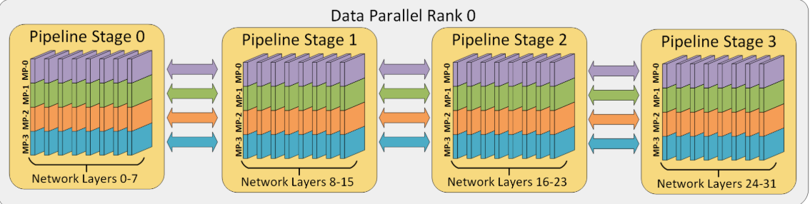
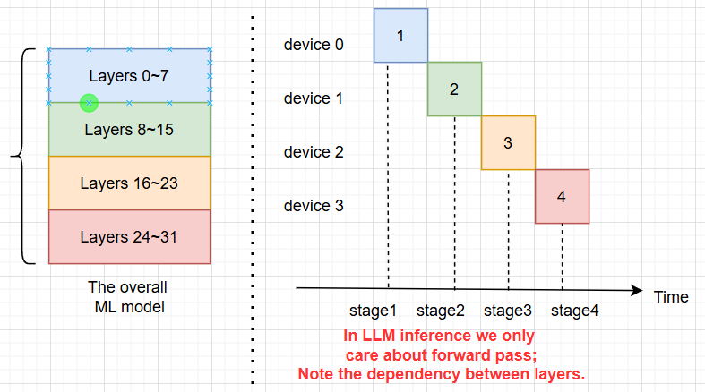
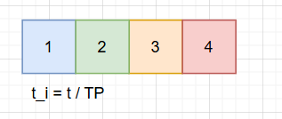
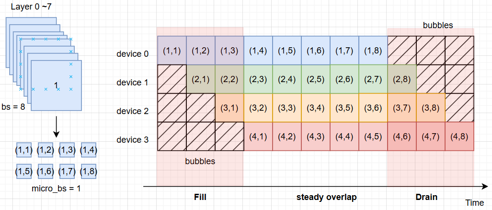
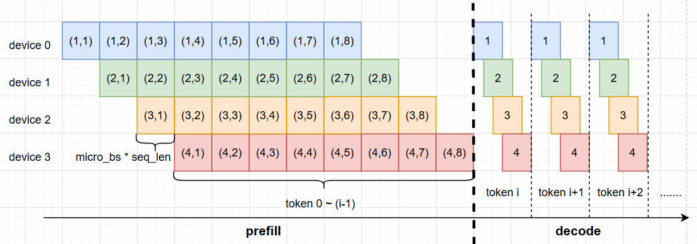

# Parallelism Strategies in LLM Inference

[TOC]

Large Language Models (LLMs) often require splitting computation across multiple devices to meet memory and speed requirements. Below we explain four key parallelism strategies in LLM *inference*—**Data Parallelism**, **Tensor Parallelism**, **Sequence Parallelism**, and **Expert Parallelism**—detailing how each works, with ASCII diagrams and toy examples. We also note how each achieves parallelism, its typical hardware use (GPU vs CPU), and real-world frameworks that implement them.

## Data Parallelism

**Concept:** Data parallelism involves replicating the entire model on multiple processors (e.g. GPUs) and splitting the input data among them. Each device processes a different portion of the data using an identical model copy. For inference, this usually means serving multiple inputs or batches simultaneously on separate devices, thus increasing throughput.

**How it works:** All devices have the full model weights. An incoming batch of requests is divided so that each device handles a subset of the inputs independently. After processing, results from all devices are gathered. There is no need for devices to communicate during forward inference since each handles its own data chunk; they operate in parallel on different data. (In training, gradients would be averaged, but in pure inference, models don’t need to sync parameters.)

**ASCII Diagram – Splitting a batch across 2 GPUs:**

```text
Input Batch: [ Sentence1, Sentence2 ]   # Two inputs to process
                   |
                   | Split batch into two parts
                  / \ 
GPU0 (Model copy)    GPU1 (Model copy)   # Each GPU has the full LLM
   processes            processes
  Sentence1            Sentence2         # Each GPU handles one input
                  \  /
      (Parallel outputs are collected)
Output: [ Result1, Result2 ]            # Both results returned together
```

**Toy Example:** Imagine two user queries to an LLM. With data parallelism, we load one copy of the model on GPU0 and another on GPU1. GPU0 generates the answer for Query1 while GPU1 simultaneously generates the answer for Query2. Each GPU works independently on its query, doubling overall throughput compared to using one GPU. This achieves parallelism because the workload (different inputs) is *embarrassingly parallel* – there are no dependencies between processing different requests.

**Applicability (GPU vs CPU):** Data parallelism can be used on both GPU and CPU clusters. It doesn’t reduce single-model memory usage (each device must fit the whole model), so it’s mainly useful when the model *can* fit in one device’s memory but you want to serve many requests concurrently. For smaller or moderate-size models, you can scale out with many CPUs or GPUs each running a copy. (For extremely large models that can’t fit in one device, data parallelism alone won’t help.)

**Real-world use:** Data parallelism is common in distributed training (e.g. PyTorch’s `DistributedDataParallel`) and in inference serving systems for throughput. Many serving frameworks (like TensorFlow Serving, Ray Serve, or Hugging Face Accelerate) allow launching multiple model replicas on different devices or machines. For example, running 4 replicas of a chatbot model on 4 GPUs can handle roughly 4× the queries per second of a single GPU. This straightforward approach is widely supported in most deep learning libraries.

## Tensor Parallelism

**Concept:** Tensor parallelism is a form of *model parallelism* where each layer’s internal tensors (weights and activations) are split across multiple devices. Instead of copying the entire model to each device, each device holds a *partition* of the model’s parameters. During inference, devices work together on the same forward pass: each computes a partial result on its shard of the weights, and these partial results are combined (synchronized) to produce the full output. This allows a single very large model to be *sharded* across multiple GPUs, both fitting in memory and sharing the compute load.

**How it works:** In each layer (e.g. a large matrix multiplication), the weight matrix is divided among N devices. A common scheme is to split a weight matrix by columns or rows. All devices receive the same input activations; each device multiplies the input by its chunk of the weight to produce a partial output. The partial outputs are then aggregated (concatenated or summed, depending on how the split was done) to form the complete output for that layer. The model’s forward pass proceeds with these collective computations at every split layer, requiring communication (like all-reduce or all-gather operations) between devices to assemble results. By dividing the weight and computation, each GPU does only 1/N of the work for that layer, in parallel.

**ASCII Diagram – One layer split across 2 GPUs:**

```text
Layer Weight (W) split into two parts horizontally:
W = [ W_part1 | W_part2 ]    # e.g., split a matrix's columns into 2 halves
        GPU0        GPU1     # GPU0 holds W_part1, GPU1 holds W_part2

Input X is broadcast to both GPUs.
 GPU0 computes X * W_part1 -> Y_part1   # Partial output on GPU0
 GPU1 computes X * W_part2 -> Y_part2   # Partial output on GPU1

Combine Y_part1 and Y_part2 (e.g. concatenate) -> Full output Y
(Communication needed to gather partial outputs from GPUs)
```

**Toy Example:** Suppose an LLM has a fully-connected layer with a weight matrix of size 1024×4096 (input dim 1024, output dim 4096). This weight has ~4 million parameters, too large for one GPU in our scenario. We split the weight into two 1024×2048 matrices. GPU0 holds the first half of the outgoing features, and GPU1 holds the second half. When a 1×1024 input vector comes in, both GPUs get this vector. GPU0 multiplies it by its 1024×2048 weight chunk, producing a 1×2048 partial result. GPU1 does the same with its chunk, also outputting 1×2048. We then concatenate these two partial results to get a 1×4096 output vector (as if the full 1024×4096 weight had been applied). The two GPUs effectively performed a single large matrix multiply in parallel. They achieved this by each handling different columns of the weight matrix concurrently, then sharing their pieces of the result. This cuts both the computation per GPU and memory per GPU roughly in half (aside from communication overhead), enabling a model twice as large to run.

**Achieving Parallelism:** Tensor parallelism parallelizes *within* a single model’s layer. The work for one operation (e.g. multiplying by a huge weight matrix, or computing attention scores) is partitioned so that each GPU does a portion simultaneously. This contrasts with data parallelism (which runs separate inputs in parallel) – tensor parallelism runs *one* input’s computation on multiple devices at the same time. The trade-off is that it introduces synchronization points: after each partial computation, devices must exchange data to assemble the full result. Therefore, high-bandwidth interconnects (like NVLink or InfiniBand between GPUs) are important to avoid slowing down the join step.

**Applicability:** Tensor parallelism is primarily used with GPUs (or other high-speed accelerators). The technique relies on fast communication between devices to combine results; GPUs in the same server or cluster often have specialized links for this. While in theory one could shard a model across multiple CPUs or machines, the network overhead on a CPU cluster would likely dominate any speedup (except for extremely large models where memory is the bottleneck). In practice, tensor parallelism is a go-to strategy for multi-GPU inference when a single GPU’s memory or compute is insufficient for a giant model.

**Real-world implementations:** NVIDIA’s *Megatron-LM* introduced a form of 1D tensor parallelism (sharding each layer) to train and serve very large Transformers. This approach is widely adopted in many frameworks. For instance, Hugging Face’s Text Generation Inference (TGI) and NVIDIA’s FasterTransformer/TensorRT-LLM can automatically shard model weights across several GPUs and use tensor parallelism for inference. PyTorch and JAX also allow manual model sharding. These frameworks handle the necessary communication (all-reduce or all-gather operations) under the hood. Tensor parallelism is often combined with pipeline or sequence parallelism for further scaling (e.g. some systems use 2-way tensor splitting *and* 2-way pipeline splitting to run on 4 GPUs). Overall, tensor parallelism is a key technique to deploy models that would not otherwise fit into a single GPU’s memory.

## Sequence Parallelism

**Concept:** Sequence parallelism splits the *input sequence* itself across multiple devices, rather than splitting the model. It partitions the tokens of a long sequence among GPUs, so that different tokens (or different positions in the sequence) are processed in parallel. Each GPU still holds a full copy of the model parameters (much like data parallelism), but instead of each GPU getting a different batch, they get different parts of the *same* sequence. This is especially useful for very long sequences (contexts) that would be memory- or compute-intensive to process on a single device.

**How it works:** Suppose you have a sequence of $T$ tokens to feed into an LLM’s transformer. In sequence parallelism with N devices, each device is responsible for roughly $T/N$ of those tokens. For example, GPU0 might handle tokens 1–50, GPU1 handles tokens 51–100, etc. During the forward pass (e.g. computing the transformer layers), each GPU runs the model on its assigned tokens. However, because transformer layers (like self-attention) create dependencies between tokens, the GPUs must exchange information at certain points. Typically, after each layer or at least during the attention computation, the partial results are shared so that each token can attend to tokens handled on other GPUs. In practice, this involves **all-gather** communications of embeddings or attention states between the sequence-parallel GPUs, ensuring that even though tokens were split, the model’s computations (like attention scores) account for the full sequence context. Once the layer’s computations are done collectively, the sequence is still partitioned, so the next layer can again be computed in partitioned fashion. At the end (e.g. before the final output layer), the pieces are gathered to produce the final result for the whole sequence.

**ASCII Diagram – Splitting a sequence’s tokens across 2 GPUs:**

```text
Sequence tokens (positions): [ T1, T2, T3, T4 ]   # e.g., a 4-token input
                      |
             Split sequence into two parts
            /                                   \
GPU0 (full model) processes [T1, T2]   GPU1 (full model) processes [T3, T4]
 |                                        |
 |-- computes outputs for T1,T2           |-- computes outputs for T3,T4
 |   using attention on (T1,T2,T3,T4)     |   using attention on (T1,T2,T3,T4)
 \___________________|___________________/    (GPUs communicate to share context)
             \               /
        Combine token outputs from both GPUs -> [Output_T1, Output_T2, Output_T3, Output_T4]
```

**Toy Example:** Imagine a single very long sentence with 100 tokens that you want to feed into GPT-like model. One GPU might struggle with the memory required for the attention matrices of 100 tokens. With sequence parallelism, you could use 2 GPUs: GPU0 handles tokens 1–50 and GPU1 handles tokens 51–100. In the embedding layer, each GPU embeds its tokens. When the model applies self-attention, each GPU initially computes attention *within* its half, but to get full-context attention, they exchange key/value information so that tokens 1–50 can attend to 51–100 and vice versa. For example, token 60 (on GPU1) can attend to token 30 (on GPU0) because GPU0 shares the necessary data for that computation. After each layer, the hidden states for tokens 1–50 remain on GPU0 and 51–100 on GPU1. By parallelizing along the sequence length, both GPUs work simultaneously on different positions. This reduces per-GPU memory usage (each GPU handles half the sequence length in this example) and can speed up processing long inputs, as two halves are processed in parallel.

**Achieving Parallelism:** Sequence parallelism essentially parallelizes the token dimension. It leverages the fact that much of the computation for each token (like feed-forward transformations) is independent of other tokens, so those can be done concurrently. The challenging part is handling the interactions between tokens (e.g. attention and cross-token dependencies) efficiently. Research proposals such as *Ring Self-Attention (RSA)* and *distributed attention* algorithms explore ways to minimize the overhead and load-imbalance when splitting tokens, since later tokens might have more to attend to than earlier ones. In practice, sequence parallelism is often combined with tensor parallelism: the model is sharded across devices, and *each* shard further splits the sequence to maximize utilization. This 2D parallel approach (split by model *and* sequence) was used in some large-scale training setups (e.g. NVIDIA’s Megatron-LM has an option for sequence parallelism in training) and can be applied in inference for very long sequences.

**Applicability:** Sequence parallelism is mainly a multi-GPU strategy. It targets scenarios like long text generation or processing, where a single GPU’s memory might be the bottleneck due to long context. On CPU, one usually has large RAM for long sequences, so splitting sequence over CPUs isn’t common (and CPU-to-CPU communication would be slow). Thus, sequence parallelism is primarily used on GPUs or similar accelerators with limited memory but high-speed links. It’s particularly useful in the **prefill** stage of LLM inference (when reading a long prompt and computing its hidden states in one go). Note that in the *generation* stage (decoding one token at a time), sequence parallelism offers little benefit unless multiple generation requests are batched (since only one new token is produced at a time for a single sequence).

**Real-world implementations:** Sequence parallelism is a newer strategy seen in research and specialized systems. Libraries like **Colossal-AI** and **NVIDIA Megatron-LM (later versions)** have introduced sequence parallel support to split input tokens across GPUs. AWS’s Inferentia Neuron SDK also supports sequence parallelism for LLM inference, recommending it for long sequences in combination with tensor parallelism. While not as ubiquitous as data or tensor parallelism, sequence parallelism is gaining traction to push context lengths further. It allows serving models with very long contexts (e.g. 8K or 32K tokens) by distributing the sequence load. In practice, engineering sequence parallel inference is complex due to the communications required, so it’s often hidden behind frameworks – you might enable a flag for sequence parallelism and the library will handle how to split the input and orchestrate the computations.

## Expert Parallelism

**Concept:** Expert parallelism is a strategy used in *Mixture-of-Experts (MoE)* models, where the model consists of many sparsely-activated sub-networks called “experts.” The idea is to distribute these experts across different devices. During inference, only a few experts are activated for a given input, so each input only uses a fraction of the model’s total parameters. By placing different experts on different GPUs (or machines), the workload is split such that each device handles the computations for the experts it hosts. This allows very large models (with many experts) to be served, as no single inference will use all experts at once – each input “picks” a route through the model.

**How it works:** In an MoE layer, a special gating network (router) examines each input token or example and decides which expert(s) should process it (for example, “Expert 5 and 7” out of 16 experts). With expert parallelism, the experts themselves are fully allocated to different devices. For instance, GPU0 might store Experts 1–4, GPU1 has Experts 5–8, and so on. When a token arrives at the MoE layer, the router directs it to the appropriate expert. The token’s data (its hidden state) is sent to the GPU that hosts that expert, and that GPU runs the expert’s sub-network forward pass. Since different tokens in a batch may go to different experts, the work is naturally split among GPUs. If the router selects multiple experts for a single token (e.g. top-2 gating), that token’s hidden state will be broadcast to two GPUs to be processed by two experts in parallel, and their outputs are combined. Once the expert(s) compute their outputs, the results are sent back and merged into the model’s next layer input. In summary, each GPU only computes the portions of the MoE layer corresponding to the experts it owns, and many experts (on different GPUs) can process different tokens simultaneously.

**ASCII Diagram – MoE with experts on different GPUs:**

```text
              [ Router decides which expert(s) to use for each input ]
               /       |       \ 
Input Token -> E1      E2      E3    ...    E4    (E1, E2 on GPU0; E3, E4 on GPU1)
              (Inactive experts are skipped for this token)
                \___________  ___________/
                            \/
            Selected expert(s) output -> Merge -> Token's output continues in model
```

*Diagram:* In this example, we have 4 experts spread across 2 GPUs (Experts 1 & 2 on GPU0, Experts 3 & 4 on GPU1). The router directs an input token to, say, Expert 3 (on GPU1) as the most relevant expert. Only Expert 3 runs for that token (Experts 1,2,4 are inactive for it). Another token might be routed to Expert 1 on GPU0, etc. Each GPU only runs the experts it contains.

**Toy Example:** Consider a large MoE version of an LLM where instead of one big feed-forward layer, there are 10 small feed-forward “expert” layers, of which the router will pick 2 for each input. Suppose we have 2 GPUs and assign 5 experts to each GPU. If a given sentence’s token is routed to Expert 7 and Expert 2, the system will send the token’s data to GPU1 (if Expert 7 lives there) and GPU0 (for Expert 2) at the same time. GPU1 runs Expert 7’s computation, GPU0 runs Expert 2’s computation – in parallel. They then send their outputs back and combine them (for example, averaged or summed) to produce the token’s final output for that MoE layer. Because only 2 out of 10 experts ran, the token’s inference skipped 8 experts entirely (saving computation). And because Expert 2 and 7 were on different GPUs, those computations were truly concurrent. If another token in the batch was routed to some other experts, those would run on whichever GPUs host them. The net effect is that the full set of experts is distributed across GPUs, and each token only engages a subset of them, enabling parallel processing and reducing per-token computation load.

**Achieving Parallelism:** Expert parallelism gets its speed and memory advantage from *sparsity* – at run-time, each input only “activates” a few experts rather than the whole network. By distributing experts, it ensures no single device has to compute all experts’ outputs. Many tokens can be processed by different experts on different GPUs concurrently (especially if their routed experts differ). Even for a single token that uses multiple experts, those expert computations can happen simultaneously on separate devices. This strategy scales well for “wide” models (lots of neurons/experts in parallel) as opposed to “deep” sequential models. The main overhead comes from routing and moving data between devices: after the router picks experts, the chosen token embeddings must be sent over the interconnect to the respective expert’s GPU, and then results sent back to continue the model. Thus, efficient communication and load balancing (ensuring experts are equally utilized) are key challenges for expert parallelism.

**Applicability:** Expert parallelism is primarily used with multi-GPU setups (or even multi-node clusters) because MoE models are usually extremely large (tens or hundreds of billions of parameters). It shines in GPU scenarios where each GPU can host a few experts and you have a fast network to shuttle tokens between them. The concept could apply to CPU clusters too, but the slow inter-CPU communication would make fine-grained token dispatch inefficient. In practice, MoE models like GPT-MoE, GLaM, or Switch Transformer are deployed on GPU clusters with expert parallelism. This strategy doesn’t necessarily reduce the *total* memory needed (all experts combined still use a lot of memory), but it ensures each individual device only loads a fraction of the model (one slice of experts). It’s most applicable when you need to serve a single gigantic model that exceeds one device’s memory, and you expect different requests to use different parts of the model’s capacity.

**Real-world implementations:** Expert parallelism has been implemented in frameworks like **DeepSpeed** (DeepSpeed-MoE) and **Megatron-LM** for training and inference of MoE models. For example, DeepSpeed’s MoE library allows specifying an “expert parallelism degree” to spread experts across GPUs, and uses a fast router to dispatch tokens. Google’s **GShard** (for the Switch Transformer) was an early implementation of expert slicing across devices. NVIDIA’s TensorRT-LLM and AWS SageMaker model parallel library also support expert parallelism for serving MoE models. These systems handle the complex communication under the hood: they route token embeddings to the correct GPU, run the expert forward, and gather results. In practice, if you use an MoE-based LLM with thousands of experts, you’d rely on these libraries to manage expert parallelism, since doing it manually would be very complex. Notably, expert parallelism can be combined with other parallel strategies (e.g., you could also shard each expert’s weights via tensor parallelism, though some frameworks treat these as mutually exclusive for simplicity). This approach has enabled models with trillions of parameters (comprised of many experts) to be deployed with reasonable inference speed, as only a small fraction of those parameters are active per input.

**Conclusion:** All these parallelism strategies can be combined in various ways to serve large models efficiently. For instance, one could use data parallelism to handle many requests at once, while using tensor+sequence parallelism to shard a single model across GPUs, and expert parallelism if the model itself is an MoE. The choice of strategy depends on the model architecture and inference scenario. Data parallelism is simple and great for throughput (if the model fits on one device). Tensor and sequence parallelism address *scaling a single model* beyond one device’s limits (model size or sequence length). Expert parallelism enables scaling model *capacity* by using sparse activation. Modern LLM systems often employ a hybrid of these techniques to achieve both low latency and high throughput on specialized hardware. Each strategy comes with trade-offs in complexity and communication overhead, but together they make it feasible to deploy today’s enormous LLMs in practical settings.

## Pipeline parallelism

> a nice demonstration: fig 5 in paper *The Llama 3 Herd of Models* page 11

Pipeline parallelism involves **sharding the model (vertically) into chunks**, where each chunk comprises **a subset of layers** that is executed on a separate device. Figure 2a is an illustration of four-way pipeline parallelism, where the model is sequentially partitioned and a quarter subset of all layers are executed on each device. **The outputs of a group of operations on one device are passed to the next**, which continues executing the subsequent chunk.  and  indicate forward and *backward* passes respectively on device n. The memory requirement for storing model weights on each device is effectively quartered.

> Training?

The main limitation of this method is that, due to the sequential nature of the processing, **some devices or layers may remain idle while waiting for the output** (activations, gradients) of previous layers. This results in inefficiencies or “**pipeline bubbles**” in both the forward and backward passes. In Figure 2b, the white empty areas are the large pipeline bubbles with naive pipeline parallelism where devices are idle and underutilized.

**Microbatching** can mitigate this to some extent, as shown in Figure 2c. **The global batch size of inputs is split into sub-batches**, which are processed one by one, with gradients being accumulated at the end. Note that  and  indicate forward and backward passes respectively on device  with microbatch . This approach shrinks the size of pipeline bubbles, but it does not completely eliminate them.

> Two new parameters
>
> - pipeline degree/depth;(four-way pipeline parallelism --> degree = 4)
> - micro-batch size




Pipeline Parallel是指将模型按layer切分成多个不同的*stage*，并将不同的stage放在不同的GPU卡(*device*)上。当一张卡完成自己stage的计算之后，将计算结果发送到下一张卡，进行下一个stage的计算。

> 对比：
>
> - TP:层内并行
> - PP:层间并行

### Naive pipeline parallelism



> 无pipeline parallelism，有TP（假设device num >= TP）:
>
> 

但上述的native Pipeline Parallel方式会导致GPU空闲问题：当GPU1在计算F1的时候，其他的GPU只能空闲等待。改进方式是如下图所示的default Pipeline Parallel：除了进行模型切分之外，还进行数据的切分。将一个Batch的数据切分成多个microbatch，不同的device可以同时进行不同microbatch的不同stage计算，从而让各个device的计算overlap起来，提高流水线效率。

> 同一pipeline stage(可能包含数个Layers)不同的batch之间不存在数据依赖关系，所以可以并行计算。但Layer 8~15（后面的层）的计算显然依赖于Layer 0~7（前面的层）的计算结果。

### Default pipeline parallelism

假设batch size = 8, micro batch size = 1.那么，每个pipeline stage被切成8份。



| 概念                            | 符号        | 作用                                                      |
| ------------------------------- | ----------- | --------------------------------------------------------- |
| **Global Batch Size (bs)**      | `B`         | /                                                         |
| **Micro-Batch Size (micro_bs)** | `b`         | /                                                         |
| **Pipeline Chunks**             | `K = B / b` | 也叫 *micro-batch count* 或 *gradient accumulation steps* |
| **Pipeline Stages**             | `P`         | 把模型切成几段                                            |

推理时设置K=2~4P比较合适。

| K/P 比 | Speedup ≈ | 占理论极限 |
| ------ | --------- | ---------- |
| 1      | P/2       | 50 %       |
| 2      | 0.67 × P  | 67 %       |
| 4      | 0.80 × P  | 80 %       |
| 8      | 0.89 × P  | 89 %       |
| 16     | 0.94 × P  | 94 %       |

 如图P = 4, K = 8 = 2P

### Pipeline Parallelism for Prefill or Decode 

Pipeline parallelism is not typically efficient in decode phase. 

> See the introduction of paper *SARATHI: Efficient LLM Inference by Piggybacking Decodes with Chunked Prefills* for some details.

为什么 **Pipeline Parallelism (PP)** 对 *推理-decode 阶段* 帮助有限？

> **一句话**：生成 **每 1 个新 token** 都要重新把全部 pp 个stage 串一次——填充、排空的 “bubble” 每轮都出现，几乎抵消了stage 重叠带来的收益。

**1 · Prefill vs Decode 调度对比**

| 步骤           | Prefill（一次性推完整个 prompt）   | Decode（逐 token 生成）        |
| -------------- | ---------------------------------- | ------------------------------ |
| **填充 fill**  | 只发生 **一次**                    | **每个 token** 都要再填        |
| **稳态重叠**   | `micro_batches – 1` 个周期真正并行 | 只有 0 或 1 个 token；重叠极少 |
| **排空 drain** | 只发生 **一次**                    | 同样每 token 一次              |

**2 · 直观示意**



*Prefill*：方块开始重叠后，GPU 利用率接近 100 %。

*Decode*：一旦排空，“下一 token” 又从头开始填；4 张 GPU 中有 ¾ 时间在等结果 → 加速几乎被泡沫抵消。

**理论分析**

| 场景                     | 总时长公式                          | Comment               |
| ------------------------ | ----------------------------------- | --------------------- |
| **串行执行**（没有 PP）  | T_serial = P · M · T                |                       |
| **Pipeline Parallelism** | T_pipe= 2 * (P-1) * T + (M-P+1) * T | fill + drain + steady |

- **P** = `stage_num` ( 4-way pipeline ⇒ P = 4 )
- **M** = chunk 数 (`pp_chunks`, = bs / micro_bs)，把全局 batch 切成 M 片
- **T** = *单个 stage* 处理 **一片** micro-batch 的时长（假设 p 个 stage 时长相近）

Speedup
$$
\text{Speed-up} = \frac{T_\text{serial}}{T_\text{pipe}} = \frac{P·M}{M + P - 1}
$$

> M-->∞，speed-up --> P 

对于Prefill阶段和decode阶段这个公式实际上是一样的，只是T不同。prefill阶段每个chunk的计算时间显然比decode 1个token长；decode要算总时间的话需要乘以T_pipe * seq_len.

> vanilla的T_serial要算TP吗？

