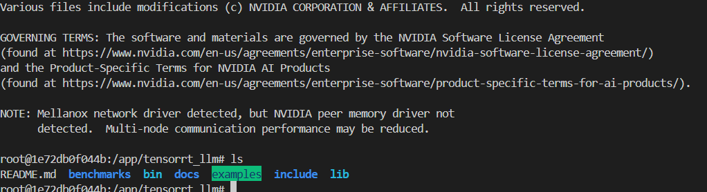
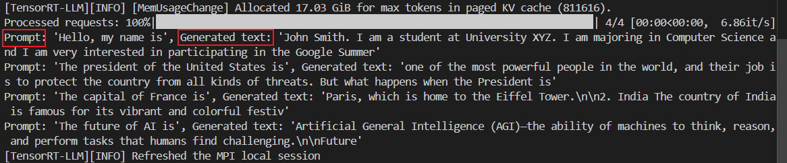
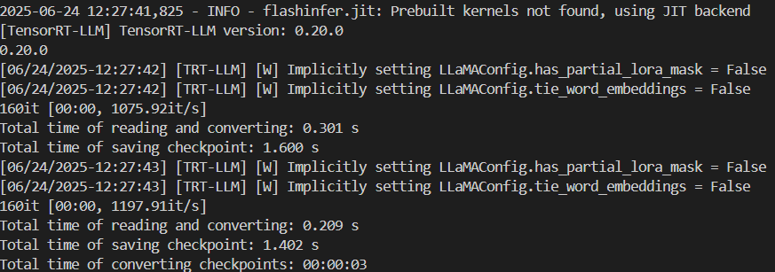
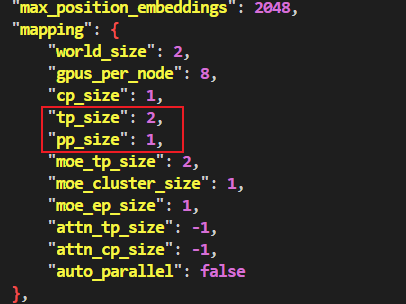
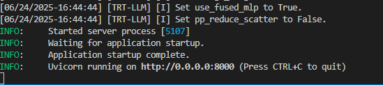
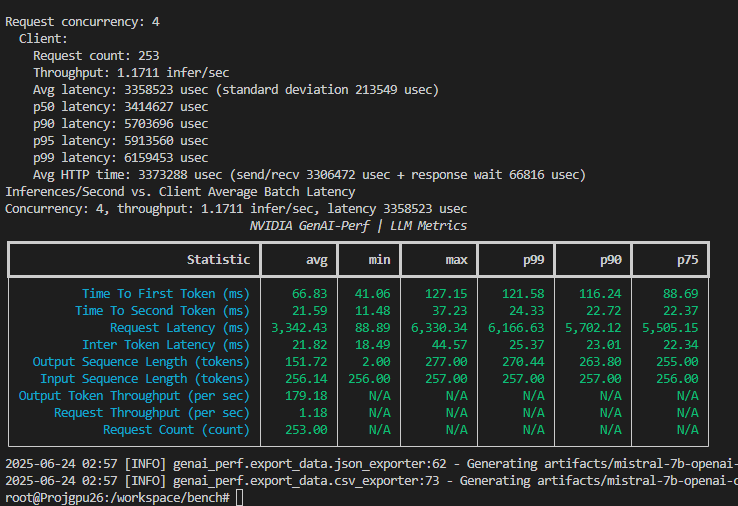
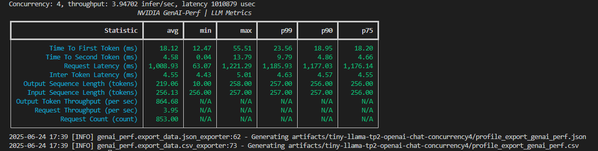

# Evaluation

[TOC]

## LLM serving准备

(1)命令行登录huggingface

```bash
pip install -U "huggingface_hub[cli]"
# Log in to huggingface-cli
# You can get your token from huggingface.co/settings/token
huggingface-cli login --token *****
```

(2)下载权重到指定目录

```bash
huggingface-cli download "TinyLlama/TinyLlama-1.1B-Chat-v1.0" --local-dir /home/boyingchen/model-weight/TinyLlama-1.1B-Chat-v1.0
```

## 使用TGI进行LLM inference

```bash
model=teknium/OpenHermes-2.5-Mistral-7B # change
volume=$PWD/data

docker run --gpus all --shm-size 64g -p 8080:80 -v $volume:/data \
    ghcr.io/huggingface/text-generation-inference:3.3.4 \
    --model-id $model
```

进入容器命令行

```bash
# 找到容器 ID 或名字
docker ps --format "table {{.Names}}\t{{.Image}}"

# 进入 shell
docker exec -it hopeful_jemison /bin/bash

# 在容器里随意用 CLI
text-generation-launcher --help
text-generation-server   --help
exit
```

使用服务（Consuming Text Generation Inference）

首先：`pip install openai`

```python
from openai import OpenAI

# init the client but point it to TGI
client = OpenAI(
    base_url="http://localhost:8080/v1/",
    api_key="-"
)

chat_completion = client.chat.completions.create(
    model="tgi",
    messages=[
        {"role": "system", "content": "You are a helpful assistant." },
        {"role": "user", "content": "What is deep learning?"}
    ],
    stream=True
)

# iterate and print stream
for message in chat_completion:
    print(message)
```

> No EP/PP. discarded

## 使用TensorRT-LLM + Triton Inference Server进行LLM inference

### TensorRT-LLM从docker安装

```
sudo docker run -it --rm \
  --gpus all \
  --ipc=host --shm-size=32g \
  --ulimit memlock=-1:-1 --ulimit stack=67108864:67108864 \
  -v /home/boyingchen/workspace:/app/tensorrt_llm/user_ws \
  -w /app/tensorrt_llm/user_ws \
  nvcr.io/nvidia/tensorrt-llm/release:0.20.0 \
  bash
```

> https://catalog.ngc.nvidia.com/orgs/nvidia/teams/tensorrt-llm/containers/release



Sanity check the installation by running the following in Python (tested on Python 3.12):

```python
from tensorrt_llm import LLM, SamplingParams

def main():

    prompts = [
        "Hello, my name is",
        "The president of the United States is",
        "The capital of France is",
        "The future of AI is",
    ]
    sampling_params = SamplingParams(temperature=0.8, top_p=0.95)

    llm = LLM(model="TinyLlama/TinyLlama-1.1B-Chat-v1.0")#使用LLM类自动构建engine

    outputs = llm.generate(prompts, sampling_params)

    # Print the outputs.
    for output in outputs:
        prompt = output.prompt
        generated_text = output.outputs[0].text
        print(f"Prompt: {prompt!r}, Generated text: {generated_text!r}")


# The entry point of the program need to be protected for spawning processes.
if __name__ == '__main__':
    main()
```

效果：



### 构建 TensorRT Engine

> https://blog.csdn.net/scgaliguodong123_/article/details/142531182

(1)定义模型路径和引擎输出路径

这个 HF_MODEL_DIR 就是上次自动下载的路径

```bash
HF_MODEL_DIR="/root/.cache/huggingface/hub/models--TinyLlama--TinyLlama-1.1B-Chat-v1.0/snapshots/fe8a4ea1ffedaf415f4da2f062534de366a451e6"

WEIGHT_DIR="/app/tensorrt_llm/tinyllama_weight" # 转换后的权重

ENGINE_DIR="/app/tensorrt_llm/tinyllama_engine" 
```

(2)创建输出目录

```bash
mkdir -p ${WEIGHT_DIR}
mkdir -p ${ENGINE_DIR}
```

(3)将HF格式的权重转换为TensorRT-LLM格式

```bash
python /app/tensorrt_llm/examples/models/core/llama/convert_checkpoint.py \
       --model_dir ${HF_MODEL_DIR} \
       --output_dir ${WEIGHT_DIR} \
       --dtype float16 \
       --pp_size 1  \
       --tp_size 2 
       # expert parallelism: --moe_ep_size(default = 1)
```

输出：



编译出的产物为新的配置文件`config.json`与权重`rank0.safetensors`、`rank1.safetensors`。配置文件中包含了模型的结构信息以及并行配置（**TP/EP/PP均支持！**）



(4)运行 `trtllm-build` 命令将模型编译为TensorRT engine

```bash
trtllm-build --checkpoint_dir ${WEIGHT_DIR} \
--output_dir ${ENGINE_DIR} \
--max_num_tokens 10000 \
--max_input_len 1024 \
--max_batch_size 256            
```

常见参数说明：

- `--gpt_attention_plugin`：默认启用 GPT 注意力插件，使用高效的Kernel并支持 KV 缓存的 in-place 更新。它会减少内存消耗，并删除不需要的内存复制操作（与使用 concat 运算符更新 KV 缓存的实现相比）。
- `--context_fmha`：默认启用融合多头注意力，将触发使用单个Kernel执行 MHA/MQA/GQA 块的Kernel。
- `--gemm_plugin`： GEMM 插件利用 NVIDIA cuBLASLt 执行 GEMM 运算。在 FP16 和 BF16 上，建议启用它，以获得更好的性能和更小的 GPU 内存使用量。在 FP8 上，建议禁用。如果通过 --gemm_plugin fp8 启用。尽管可以正确推断具有较大批量大小的输入，但性能可能会随着批量大小的增加而下降。因此，目前该功能仅推荐用于在小批量场景下的降低延迟。
- `--use_custom_all_reduce`：启用自定义 AllReduce 插件。在基于 NVLink 的节点上，建议启用，在基于 PCIE 的节点上，不建议启用。自定义 AllReduce 插件为 AllReduce 运算激活延迟优化算法，而不是原生的 NCCL 算子。然而，在基于 PCIE 的系统上可能看不到性能优势。当限制为单个设备，自定义AllReduce将被禁用。因为其Kernel依赖于对对等设备的P2P访问，当只有一个设备可见时这是不允许的。
- `--reduce_fusion enable`：当自定义 AllReduce 已启用时，此功能旨在将 AllReduce 之后的 ResidualAdd 和 LayerNorm Kernel 融合到单个Kernel中，从而提高端到端性能。注意：目前仅 llama 模型支持此功能。
- `--paged_kv_cache`：默认启用分页KV缓存。分页 KV 缓存有助于更有效地管理 KV 缓存的内存。它通常能使批量大小增加和效率提高。
- `--workers`：并行构建的worker数。
- `--use_paged_context_fmha`：启用分页上下文注意力。
- `--multiple_profiles`：在内置引擎中启用多个 TensorRT 优化配置文件，这将有利于性能，尤其是在禁用 GEMM 插件时，因为更多优化配置文件有助于 TensorRT 有更多机会选择更好的 Kernel。然而，它会增加引擎的构建时间。

构建完成之后生成了引擎文件以及配置文件，其中，引擎文件除了模型配置以外，还有很多引擎相关的配置，如：

```json
"build_config": {
        "max_input_len": 1024,
        "max_seq_len": 2048,
        "opt_batch_size": 8,
        "max_batch_size": 256,
        "max_beam_width": 1,
......
```

### LLM serving with `trtllm-serve`

(1) 使用trtllm-serve进行模型部署

```bash
docker run -d --name trtllm_tmp \
  --gpus all \
  --ipc=host --shm-size=32g \
  -p 8000:8000 -p 8001:8001 -p 8002:8002 \
  -v /home/boyingchen/workspace:/app/tensorrt_llm/user_ws \
  -w /app/tensorrt_llm/user_ws \
  nvcr.io/nvidia/tensorrt-llm/release:0.20.0 \
  trtllm-serve /app/tensorrt_llm/user_ws/tinyllama_engine \
      --tp_size 2 --pp_size 1 \ # can also set --ep_size
      --tokenizer /app/tensorrt_llm/user_ws/model-weight/TinyLlama-1.1B-Chat-v1.0 \
      --host 0.0.0.0 --port 8000
```



(2) 检查：

```
curl http://localhost:8000/v1/models
```

返回

```json
{"object":"list","data":[{"id":"tinyllama_engine","object":"model","created":1750784198,"owned_by":"tensorrt_llm"}]}
```

对话：

```bash
curl http://localhost:8000/v1/chat/completions \
    -H "Content-Type: application/json" \
    -d '{
        "model": "TinyLlama-1.1B-Chat-v1.0",
        "messages":[{"role": "system", "content": "You are a helpful assistant."},
                    {"role": "user", "content": "Where is New York?"}],
        "max_tokens": 16,
        "temperature": 0
    }'
```

返回

```json
{"id":"chatcmpl-871134b6f5d24e7290586f35f2bdc749","object":"chat.completion","created":1750784404,"model":"TinyLlama-1.1B-Chat-v1.0","choices":[{"index":0,"message":{"role":"assistant","content":"New York is a city located in the northeastern part of the United","reasoning_content":null,"tool_calls":[]},"logprobs":null,"finish_reason":"length","stop_reason":null,"disaggregated_params":null}],"usage":{"prompt_tokens":36,"total_tokens":52,"completion_tokens":16}}
```


## 使用GenAI-Perf进行性能测试

When building LLM-based applications, it is critical to understand the performance characteristics of these models on a given hardware. This serves multiple purposes: 

- Identifying the bottleneck and potential optimization opportunities
- Identifying the quality of service and throughput tradeoff
- Infrastructure provisioning

As a client-side LLM-focused benchmarking tool, [NVIDIA GenAI-Perf](https://docs.nvidia.com/deeplearning/triton-inference-server/user-guide/docs/perf_analyzer/genai-perf/README.html) provides key metrics: 

- Time to first token (TTFT)
- Inter-token latency (ITL)
- Tokens per second (TPS)
- Requests per second (RPS)
- …and more

> https://developer.nvidia.com/blog/llm-performance-benchmarking-measuring-nvidia-nim-performance-with-genai-perf/
>
> https://docs.nvidia.com/nim/benchmarking/llm/latest/step-by-step.html
>
> https://docs.nvidia.com/deeplearning/triton-inference-server/user-guide/docs/perf_analyzer/genai-perf/README.html

### 安装

```bash
export RELEASE="25.01"

docker run -it --net=host --gpus=all  nvcr.io/nvidia/tritonserver:${RELEASE}-py3-sdk

# Validate the genai-perf command works inside the container:
genai-perf --help
```

### 测试

**基于TGI的LLM推理性能**

> 在另一个终端运行TGI的容器

```bash
genai-perf profile \
  -m mistral-7b \
  --service-kind openai \
  --endpoint-type chat \
  -u http://localhost:8080 \
  --concurrency 4 \
  --synthetic-input-tokens-mean 256 \
  --output-tokens-mean 256 \
  --measurement-interval 60000 \
  --streaming \
  -v
```

结果：



**基于TensorRT-LLM的LLM推理性能**

> LLM inference服务已经按照前文所述部署好

```bash
mkdir -p $PWD/benchmark           # 存CSV/JSON

sudo docker run --rm --name genai --net=host \
  -v /home/boyingchen/benchmark:/workspace/usr_ws \
  nvcr.io/nvidia/tritonserver:25.01-py3-sdk \
  genai-perf profile \
      -m tiny-llama-tp2 \
      --service-kind openai \
      --endpoint-type chat \
      -u http://localhost:8000 \
      --concurrency 4 \
      --synthetic-input-tokens-mean 256 \
      --output-tokens-mean 256 \
      --measurement-interval 60000 \
      --streaming \
      --artifact-dir /workspace/usr_ws/artifacts
```

结果：



## 对比与联系

| 角色                                | 对应比喻                                | 你要交给它的东西                                             | 它产出的东西                                  | 典型命令                                                     |
| ----------------------------------- | --------------------------------------- | ------------------------------------------------------------ | --------------------------------------------- | ------------------------------------------------------------ |
| **TensorRT-LLM**(builder + SDK)     | C/C++ 的 **编译器 / 链接器 (g++/nvcc)** | PyTorch / HF 权重 (`.safetensors`) + 并行策略 (TP/PP/EP) + 精度 (FP16/INT4…) | **`.engine` / `.plan`** —— GPU 专用二进制     | `trtllm-build …`                                             |
| **Triton Inference Server**         | Linux 的 **运行时 loader + systemd**    | 由 TensorRT-LLM 生成的 plan 文件（model repo）               | **HTTP/gRPC 端口**；自动批处理、监控、热加载  | `tritonserver --model-repository …`                          |
| **TGI (Text-Generation-Inference)** | 一个 **自带模型、自己跑的 Web 服务**    | 直接给它 HuggingFace 模型名(它内部用→ bitsandbytes、Flash-Attn、vLLM kernel) | **HTTP (OpenAI 风格) 端口**；Rust-Router 拼批 | `docker run ghcr.io/huggingface/text-generation-inference …` |

```
          HF 权重
             │
         (convert)
             ▼
      ┌──────────────┐
      │ TensorRT-LLM │  ← 编译/量化/切分
      └──────┬───────┘
             │ plan
   ┌─────────┴─────────┐
   │     Triton        │  ← Router+批处理+监控
   └─────────┬─────────┘
             │ HTTP/gRPC
   ┌─────────┴─────────┐
   │ genAI-Perf / NIM  │  ← 客户端压测 / 商业包装
   └────────────────────┘

TGI 走的是另一条支线：
HF 权重 → Python Kernel (FlashAttn/vLLM) → Rust Router → HTTP
```

